# SelfAssess.id

> Platform Self-Assessment Multi-Standar untuk Organisasi Modern

[](https://vuejs.org/) [](https://laravel.com/) [](https://www.typescriptlang.org/) [](https://tailwindcss.com/)

> 🔑 **Default Login:** `superadmin@example.com` / `password` | 🌐 **Live Demo:** https://SelfAssess.id

---

## 🎯 Apa itu SelfAssess.id?

**SelfAssess.id** adalah platform manajemen self-assessment berbasis standar kualitas yang memungkinkan organisasi untuk mengevaluasi diri mereka sendiri berdasarkan berbagai standar internasional maupun standar internal.

Platform ini dirancang untuk **fleksibel** - tidak terbatas pada satu jenis standar. Organisasi dapat menggunakan SelfAssess.id untuk berbagai kebutuhan assessment:

- **IIA Standards** - Internal Audit Quality Assessment
- **ISO Standards** - ISO 9001, ISO 27001, ISO 31000, dll
- **Regulatory Standards** - SOX, GDPR, HIPAA, Basel III
- **Best Practices** - ITIL, COBIT, NIST CSF
- **Mini ICoFR** - Internal Control over Financial Reporting
- **Standar Internal** - Kebijakan dan prosedur organisasi

---

## ✨ Fitur Utama

### 📋 Manajemen Multi-Standar

- Kelola berbagai jenis standar dalam satu platform
- Hierarki fleksibel: Standard → Section → Domain → Element → Requirement
- Template reusable untuk assessment berulang

### 🏢 Multi-Organisasi (Multi-Tenant)

- Setiap organisasi memiliki data yang terisolasi
- Super Admin mengelola standar global
- Organisation Admin mengelola assessment organisasi mereka

### 📝 Assessment Workflow

Platform menggunakan **2-level approval system**:

#### **Level 1: Requirement Response** (Individual)

```
active → pending_review → reviewed
```

Setiap requirement di-review individual sebelum assessment bisa disubmit.

#### **Level 2: Assessment** (Parent)

```
draft → active → pending_review → reviewed → pending_finish → finished
```

Assessment mengalir melalui approval hierarchy sebelum finalisasi.

### 📎 Evidence Management

- Upload dokumen bukti (PDF, gambar, dokumen)
- Organisasi file berbasis koleksi
- Download aman dengan otorisasi

### ✅ Action Plans

- Buat rencana tindak lanjut untuk temuan
- Assign PIC dan due date
- Tracking progress perbaikan

### 👥 Role-Based Access Control

- **Super Admin** - Kelola sistem global
- **Organization Admin** - Kelola user dan assessment organisasi - Review dan finalisasi assessment
- **Regular User** - Isi assessment dan upload bukti

---

## 📋 Business Logic

### 2-Level Approval System

Platform menggunakan sistem approval hierarkis: **setiap requirement harus di-review** sebelum assessment bisa disubmit.


### Quick Reference

| Requirement Status | Assessment Status | Who Can Action |
| ------------------ | ----------------- | -------------- |
| `active` → `reviewed` | - | Org User, Admin |
| - | `draft` → `finished` | Org Admin, Super Admin |
| **ALL reviewed** | `active` → `pending_review` | Org User, Admin |

### Roles & Permissions

| Action | Org User | Org Admin | Super Admin |
| ------ | -------- | --------- | ----------- |
| Fill requirements | ✅ | ✅ | ❌ |
| Review requirements | ❌ | ✅ | ✅ |
| Submit assessment | ✅ | ✅ | ✅ |
| Finalize assessment | ❌ | ❌ | ✅ |

> 🔑 **Critical:** Assessment hanya bisa disubmit jika **SEMUA requirements = `reviewed`**

### Compliance Status

| Status | Deskripsi |
| ------ | --------- |
| `fully_compliant` | Memenuhi seluruh requirement |
| `partially_compliant` | Memenuhi sebagian |
| `non_compliant` | Tidak memenuhi |
| `not_applicable` | Tidak berlaku |

---

## 🚀 Tech Stack

### Frontend

- **Vue 3** dengan Composition API
- **TypeScript** untuk type safety
- **Tailwind CSS** untuk styling
- **Pinia** untuk state management
- **TanStack Query** untuk data fetching
- **shadcn-vue** untuk UI components

### Backend

- **Laravel 12** dengan PHP 8.2+
- **Domain-Driven Design** architecture
- **JWT Authentication** untuk API security
- **Spatie Permission** untuk RBAC
- **PostgreSQL** sebagai primary database

---

## 📦 Instalasi

### Prerequisites

- PHP 8.2+
- Composer
- Node.js 18+
- PostgreSQL / MySQL

### Quick Start

```bash
# Clone repository
git clone <repository-url>
cd selfassess-id

# Setup Backend
cd backend
cp .env.example .env
composer install
php artisan key:generate
php artisan jwt:secret
php artisan migrate --seed

# Setup Frontend
cd ../frontend
npm install
cp .env.example .env

# Jalankan development server
npm run dev
```

Akses aplikasi di `http://localhost:5173`

### Default Credentials

```
Email: superadmin@example.com
Password: password
```

> ⚠️ **Penting:** Ganti default credentials di production!

---

## 📚 Dokumentasi

Dokumentasi teknis tersedia per domain:

| Dokumen                       | Deskripsi                  |
| ----------------------------- | -------------------------- |
| [`backend/README.md`](backend/README.md) | Setup & dokumentasi backend Laravel |
| [`frontend/README.md`](frontend/README.md) | Setup & dokumentasi frontend Vue 3 |

> **Catatan:** Setiap domain di `backend/app/Domain/{DomainName}/README.md` memiliki dokumentasi business rules spesifik untuk domain tersebut.

---

## 🏗️ Arsitektur

```mermaid
graph TB
    subgraph Frontend["FRONTEND (Vue 3 + TypeScript)"]
        F1[Features<br/>assessment, auth, dashboard, etc]
        F2[Components<br/>shadcn-vue UI]
        F3[Stores<br/>Pinia + TanStack Query]
    end

    subgraph Backend["BACKEND (Laravel 12 + DDD)"]
        B1["🔐 Auth"]
        B2["👤 User"]
        B3["🏢 Organization"]
        B4["📋 Assessment"]
        B5["📐 Standard"]
        B6["👑 Role"]
        B7["📎 Attachment"]
        B8["📊 Dashboard"]
    end

    F1 --> F2
    F2 --> F3
    F3 -->|REST API<br/>JWT Auth| Backend

    B1 --> B2
    B2 --> B3
    B3 --> B4
    B5 --> B4
    B6 --> B2
    B7 --> B4
    B8 --> B3
```



---

## 🤝 Contributing

Kami menerima kontribusi dari komunitas! Silakan ikuti langkah berikut:

1. Fork repository
2. Buat branch feature (`git checkout -b feature/nama-fitur`)
3. Commit perubahan (`git commit -m 'feat: deskripsi fitur'`)
4. Push ke branch (`git push origin feature/nama-fitur`)
5. Buat Pull Request

---

## 📝 License

[MIT License](LICENSE)

---

## 💬 Support

Untuk pertanyaan atau issue, silakan:

- Buka [GitHub Issues](https://github.com/your-org/selfassess-id/issues)
- Hubungi tim development: bakhas@diso.my.id

---

<p align="center">
  <strong>SelfAssess.id</strong> - Flexible Self-Assessment Platform for Multiple Quality Standards
</p>
