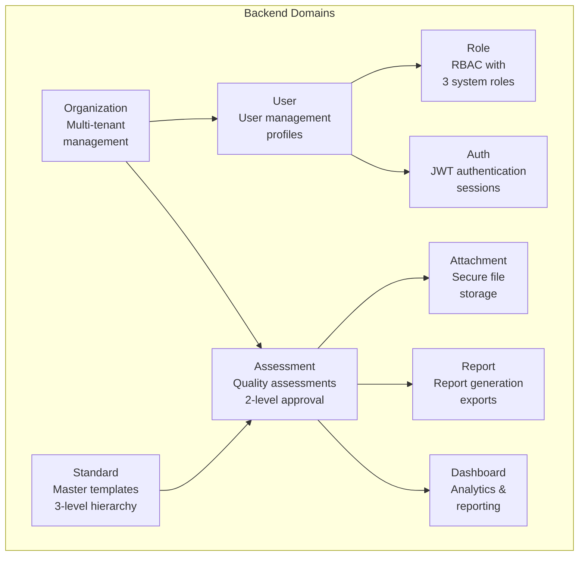
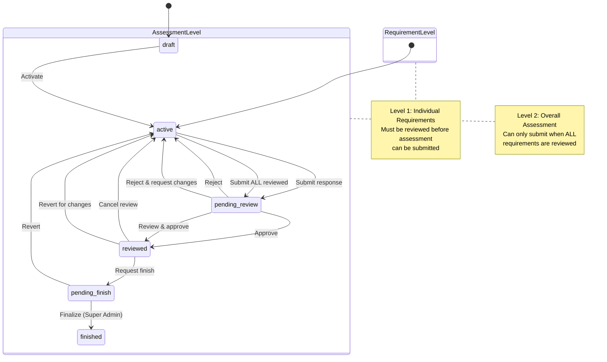

# SelfAssess.id Backend API

## Overview

SelfAssess.id is a flexible multi-standard assessment platform enabling organizations to conduct systematic quality assessments based on various standards (IIA, ISO, GDPR, etc.). The system implements a 2-level approval workflow with hierarchical review processes, multi-tenant architecture, and comprehensive audit trails for compliance tracking.

## Tech Stack

- **Laravel 12** - Modern PHP framework
- **PHP 8.2+** - Latest PHP with enhanced features
- **PostgreSQL** - Primary database (UUIDv7 primary keys)
- **JWT Auth** - Stateless authentication via `php-open-source-saver/jwt-auth`
- **Spatie Permission** - Role-based access control (RBAC)
- **Pest PHP** - Elegant testing framework

## Architecture

### Domain-Driven Design Structure

The backend follows Domain-Driven Design (DDD) principles with clear separation of business capabilities:



### 2-Level Approval System

The platform uses a hierarchical approval workflow where individual requirements must be reviewed before the overall assessment can proceed:



**Critical Rule**: Assessment can only be submitted to `pending_review` when **ALL** requirement responses have status `reviewed`.

## Quick Start

```bash
# Install dependencies
composer install

# Setup environment
cp .env.example .env
php artisan key:generate
php artisan jwt:secret

# Setup database
php artisan migrate:fresh --seed

# Start development server
php artisan serve

# Run tests
./vendor/bin/pest

# Start queue worker (for background jobs)
php artisan queue:listen
```

## Domain Overview

| Domain | Purpose |
|--------|---------|
| **Assessment** | Quality assessments with 2-level approval workflow, responses, action plans |
| **Standard** | Master templates with 3-level hierarchy (Standard → Section → Requirement) |
| **Organization** | Multi-tenant management with data isolation |
| **User** | User management, profiles, organization assignments |
| **Role** | RBAC with 3 system roles (Super Admin, Org Admin, Org User) |
| **Auth** | JWT authentication, login/logout, token refresh |
| **Attachment** | Secure file storage with evidence management |
| **Dashboard** | Analytics, reporting, and visualization |
| **Report** | Report generation and exports |

## API Structure

The API follows RESTful conventions with domain-based routing:

- **Base URL**: `/api`
- **Authentication**: JWT Bearer tokens
- **Format**: JSON (camelCase for request/response)
- **Pagination**: Cursor-based with metadata
- **CRUD**: Standard HTTP verbs (GET, POST, PUT/PATCH, DELETE)

**Example Endpoints**:
```
POST   /api/auth/login              - Authenticate user
GET    /api/assessments             - List assessments
POST   /api/assessments             - Create assessment
POST   /api/assessments/{id}/submit - Submit for review
GET    /api/standards               - List standards
GET    /api/users                   - List users (org-scoped)
```

## Key Features

- **Multi-Standard Support** - IIA, ISO, GDPR, and custom quality standards
- **Multi-Tenancy** - Organization isolation with scoped data access
- **2-Level Approval** - Hierarchical review (requirement → assessment)
- **Role-Based Permissions** - Granular access control via Spatie
- **Secure File Management** - Attachment system with audit trails
- **Action Plans** - Track improvement initiatives for non-compliant items
- **Comprehensive Audit** - Full audit trail for all operations
- **UUIDv7 Keys** - Distributed-friendly primary keys with ordering

## Testing

```bash
# Run all tests
./vendor/bin/pest

# Run specific test
./vendor/bin/pest --filter test_assessment_submission

# Run with coverage
./vendor/bin/pest --coverage

# Run in parallel (faster)
./vendor/bin/pest --parallel
```

## Default Credentials

After running `php artisan migrate:fresh --seed`:

```
Email: superadmin@example.com
Password: password
Role: Super Admin
```

Additional seeded accounts:
- Organization Admin: `orgadmin@example.com` / `password`
- Organization User: `orguser@example.com` / `password`

## Development Guidelines

- **UUIDv7 Primary Keys**: Always use `HasUuids` trait for models
- **Controllers are Thin**: Delegate business logic to Action classes
- **Never Modify Existing Migrations**: Edit original migration files
- **Use Domain Resources**: Transform data to camelCase in API Resources
- **Policies for Authorization**: Use Spatie's `can()` method
- **Status Enums**: Separate enums for Assessment vs AssessmentResponse
- **Always Update Seeders**: When adding new domains or schema changes

## License

MIT License - see LICENSE file for details.
