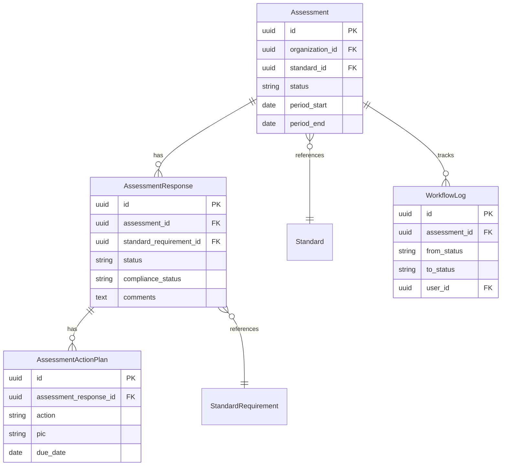
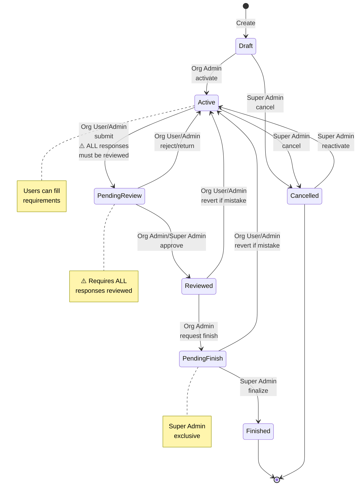
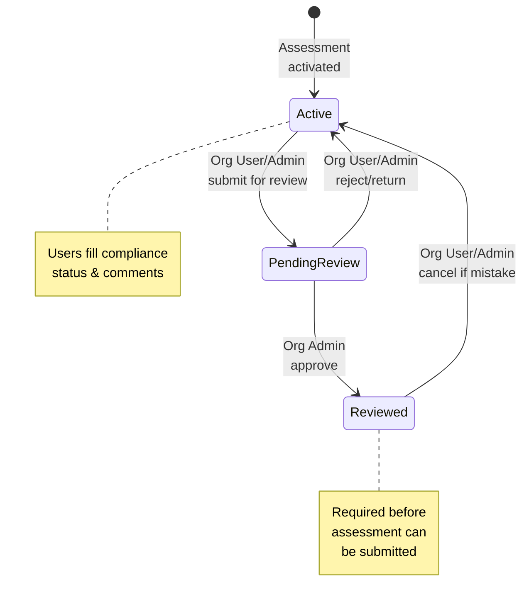

# Assessment Domain

Quality self-assessments for organizations with a **2-level approval system** where individual requirements must be reviewed before the overall assessment can proceed.

## Core Business Logic

### The 2-Level Approval System

The platform enforces a hierarchical review workflow:

**Level 1 - Requirement Response Review:**
- Each requirement is evaluated individually
- Must be marked as `reviewed` before assessment can proceed
- Status: `active` (0%) → `pending_review` (50%) → `reviewed` (100%)

**Level 2 - Assessment Review:**
- Overall assessment approval happens AFTER all requirements are reviewed
- Status: `draft` → `active` → `pending_review` → `reviewed` → `pending_finish` → `finished`

**Critical Rule:** Assessment can only be submitted to `pending_review` when **ALL** AssessmentResponse statuses are `reviewed`.

---

## Entity Relationships



---

## Assessment Workflow

### State Diagram



### Status Definitions

| Status | Description | Can Edit? |
|--------|-------------|-----------|
| `draft` | Initial state | Org Admin |
| `active` | In progress - users filling requirements | Org User |
| `pending_review` | Submitted for org admin review | - |
| `reviewed` | Approved by org admin | Org Admin |
| `pending_finish` | Waiting super admin finalization | - |
| `finished` | Complete and locked | - |
| `cancelled` | Cancelled by super admin | - |

### Role Permissions

| Transition | Org User | Org Admin | Super Admin |
|-----------|----------|-----------|-------------|
| draft → active | ❌ | ✅ | ✅ |
| active → pending_review | ✅ | ✅ | ✅ |
| pending_review → reviewed | ❌ | ✅ | ✅ |
| pending_review → active (reject) | ✅ | ✅ | ✅ |
| reviewed → pending_finish | ❌ | ✅ | ✅ |
| reviewed → active (revert) | ✅ | ✅ | ✅ |
| pending_finish → finished | ❌ | ❌ | ✅ |
| pending_finish → active (revert) | ✅ | ✅ | ✅ |
| Any → cancelled | ❌ | ❌ | ✅ |

---

## Requirement Response Workflow

### State Diagram



### Status Definitions

| Status | Description | Can Edit? |
|--------|-------------|-----------|
| `active` | In progress - user filling compliance data | Org User |
| `pending_review` | Submitted for review | - |
| `reviewed` | Approved by org admin | - |

### Compliance Status (Separate from Workflow)

Compliance status is the **result** of the assessment, independent of workflow status:

- `fully_compliant`: Meets all requirements
- `partially_compliant`: Partially meets (needs action plan)
- `non_compliant`: Does not meet (needs action plan)
- `not_applicable`: Requirement doesn't apply

---

## Critical Validation Rules

### Assessment Submission (active → pending_review)

The system validates that **ALL** of these conditions are met:

1. ✅ Every `AssessmentResponse` has status `reviewed`
2. ✅ Assessment status is `active`
3. ✅ User has permission to submit

```php
// Validation logic
if ($assessment->assessmentResponses()
    ->where('status', '!=', AssessmentResponseStatus::REVIEWED)
    ->exists()) {
    throw ValidationException::withMessages([
        'status' => ['Cannot submit until all requirements are reviewed']
    ]);
}
```

### Status Auto-Sync

When assessment transitions to `active`, all response statuses are automatically set to `active`:

```php
// In ActivateAssessment action
$assessment->assessmentResponses()->update([
    'status' => AssessmentResponseStatus::ACTIVE
]);
```

---

## Domain Structure

```
Domain/Assessment/
├── Enums/
│   ├── AssessmentStatus.php          # Main workflow enum
│   └── AssessmentResponseStatus.php  # Requirement workflow enum
├── Models/
│   ├── Assessment.php                 # Parent entity
│   ├── AssessmentResponse.php         # Individual requirement
│   ├── AssessmentActionPlan.php       # Improvement actions
│   └── WorkflowLog.php                # Audit trail
├── Actions/
│   ├── Assessments/
│   │   ├── ActivateAssessment.php
│   │   ├── SubmitForReview.php
│   │   ├── StartReview.php
│   │   ├── RequestChanges.php
│   │   ├── RequestFinish.php
│   │   ├── FinalizeAssessment.php
│   │   └── CancelAssessment.php
│   └── Responses/
│       ├── SubmitResponseForReview.php
│       ├── ReviewResponse.php
│       └── ReturnResponse.php
├── Controllers/
│   ├── AssessmentController.php
│   ├── AssessmentResponseController.php
│   └── AssessmentActionPlanController.php
├── Policies/
│   ├── AssessmentPolicy.php
│   └── AssessmentResponsePolicy.php
└── Resources/
    ├── AssessmentResource.php
    └── AssessmentResponseResource.php
```

---

## Key Implementation Notes

### Workflow Actions Pattern

Each status transition is a dedicated Action class:

```php
class SubmitForReview
{
    public function handle(Assessment $assessment): Assessment
    {
        // 1. Validate current state
        throw_if(
            $assessment->status !== AssessmentStatus::ACTIVE->value,
            new ValidationException(['status' => 'Must be active'])
        );

        // 2. Validate business rules
        throw_if(
            !$this->allResponsesReviewed($assessment),
            new ValidationException(['status' => 'All responses must be reviewed'])
        );

        // 3. Perform transition
        $assessment->status = AssessmentStatus::PENDING_REVIEW->value;
        $assessment->save();

        // 4. Log workflow
        $assessment->workflowLogs()->create([
            'from_status' => AssessmentStatus::ACTIVE->value,
            'to_status' => AssessmentStatus::PENDING_REVIEW->value,
            'user_id' => auth()->id(),
        ]);

        return $assessment;
    }
}
```

### API Endpoints

```php
// Assessment workflow
POST   /api/assessments/{id}/activate
POST   /api/assessments/{id}/submit
POST   /api/assessments/{id}/review
POST   /api/assessments/{id}/request-changes
POST   /api/assessments/{id}/request-finish
POST   /api/assessments/{id}/finalize
POST   /api/assessments/{id}/cancel

// Response workflow
POST   /api/responses/{id}/submit
POST   /api/responses/{id}/review
POST   /api/responses/{id}/return
```

---

## Compliance Scoring

When assessment is `finished`, system calculates overall compliance:

```php
$total = $assessment->assessmentResponses()->count();
$fullyCompliant = $assessment->assessmentResponses()
    ->where('compliance_status', ComplianceStatus::FULLY_COMPLIANT)
    ->count();

$score = ($fullyCompliant / $total) * 100;
```

This score is displayed on reports and dashboards.

---

## Action Plans

Created for non-compliant requirements:

- Generated when `compliance_status` is `partially_compliant` or `non_compliant`
- Linked to specific `AssessmentResponse`
- Tracks corrective actions with PIC and due dates
- Required before assessment can be finalized

---
