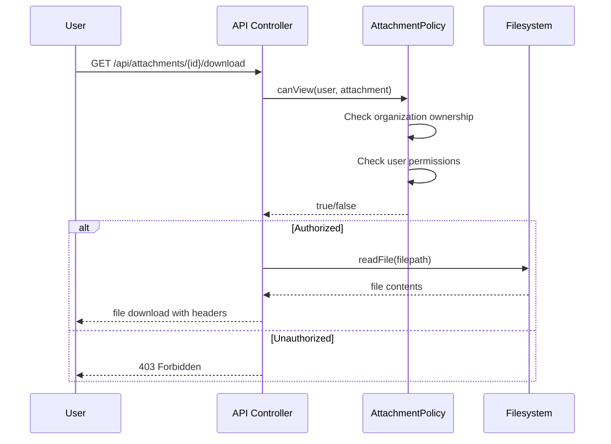
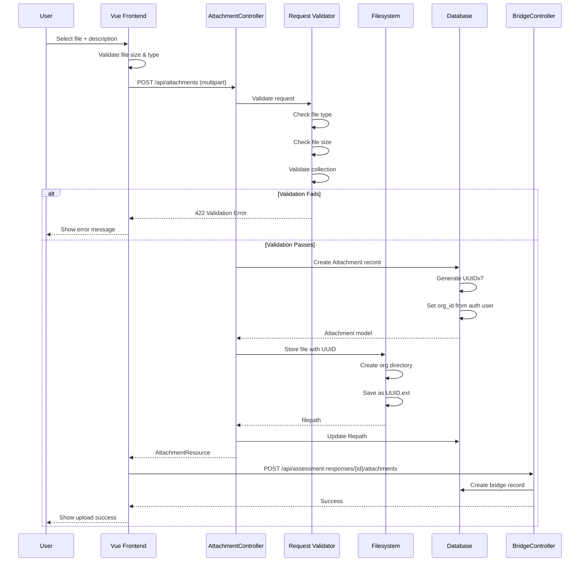

# Attachment Domain

## Overview

The Attachment Domain provides centralized file management for the entire SelfAssess.id system. It handles secure file uploads, storage, retrieval, and linking to various domain entities (AssessmentResponses, StandardRequirements).

## Purpose

- Centralized file storage and management
- Support multiple attachment types (evidence, reference materials, policies)
- Link files to different entities via bridge tables
- Organize files by collections for logical grouping
- Secure file access with organization scoping
- Evidence upload for assessment compliance

---

## Entity Relationships

```mermaid
erDiagram
    ATTACHMENT ||--o{ STANDARD_ATTACHMENT : links
    ATTACHMENT ||--o{ ASSESSMENT_ATTACHMENT : links
    ATTACHMENT }o--|| ORGANIZATION : belongs to
    STANDARD_ATTACHMENT }o--|| STANDARD_REQUIREMENT : references
    ASSESSMENT_ATTACHMENT }o--|| ASSESSMENT_RESPONSE : provides evidence

    ATTACHMENT {
        uuid id PK
        uuid organization_id FK
        string filename
        string filepath
        integer filesize
        string mimetype
        string collection
        text description
        timestamp created_at
        timestamp updated_at
    }

    STANDARD_ATTACHMENT {
        uuid attachment_id FK
        uuid standard_requirement_id FK
        timestamp created_at
    }

    ASSESSMENT_ATTACHMENT {
        uuid attachment_id FK
        uuid assessment_response_id FK
        timestamp created_at
    }

    ORGANIZATION {
        uuid id PK
        string name
    }

    STANDARD_REQUIREMENT {
        uuid id PK
        string display_code
        string title
    }

    ASSESSMENT_RESPONSE {
        uuid id PK
        uuid assessment_id FK
        uuid standard_requirement_id FK
        string status
        string compliance_status
    }
```

---

## Business Rules

### 1. File Upload Rules

#### Evidence Upload for AssessmentResponse

**Primary Use Case**: Organization users upload evidence files to support their compliance assessment.

**Business Rules**:
- Evidence can only be uploaded to `active` or `pending_review` AssessmentResponses
- Once AssessmentResponse status is `reviewed`, no new uploads allowed (only Org Admin can revert)
- Files must be linked via `assessment_attachments` bridge table
- Upload automatically creates Attachment record + bridge relationship

**Valid Statuses for Upload**:
```php
// AssessmentResponse statuses that allow uploads
AssessmentResponseStatus::ACTIVE
AssessmentResponseStatus::PENDING_REVIEW
```

**Prohibited Statuses**:
```php
AssessmentResponseStatus::REVIEWED // Must be reverted by Org Admin
```

#### File Validation Rules

**File Type Restrictions**:
- **Documents**: PDF, DOC, DOCX, XLS, XLSX, PPT, PPTX, ODT, ODS
- **Images**: JPG, JPEG, PNG, GIF, WebP
- **Archives**: ZIP, RAR, 7Z (max 10MB)
- **Text**: TXT, CSV, MD, JSON, XML

**Prohibited Files**:
- Executables: EXE, BAT, SH, APP, DLL
- Scripts: PHP, JS, VBS, PS1
- Databases: SQL, DB, MDB
- System files: SYS, DLL, COM

**File Size Limits**:
- Documents: Max 5MB
- Images: Max 3MB
- Archives: Max 10MB
- Total per assessment: 100MB

**Validation Implementation**:
```php
// In StoreAttachmentRequest
'max:5120', // 5MB for documents
'mimes:pdf,doc,docx,xls,xlsx,ppt,pptx,odt,ods,jpg,jpeg,png,gif,webp,txt,csv,md,json,xml'
```

### 2. Secure File Storage with UUID

**Storage Strategy**:
- Files stored with UUIDv7 filenames (not original filenames)
- Original filename preserved in `filename` column
- Physical path stored in `filepath` column
- Organization-based directory structure: `storage/app/attachments/{org_id}/{uuid}.{ext}`

**Example Storage Structure**:
```
storage/app/attachments/
├── 01234567-89ab-cdef-0123-456789abcdef/
│   ├── 01890000-0000-0000-0000-000000000001.pdf
│   └── 01890000-0000-0000-0000-000000000002.jpg
└── fedcba98-7654-3210-fedc-ba9876543210/
    └── 01890000-0000-0000-0000-000000000003.xlsx
```

**Security Benefits**:
- UUID filenames prevent enumeration attacks
- Organization isolation at directory level
- No direct public URL access
- Original filename never exposed in filesystem

### 3. Collection-Based Organization

**Collections**:
Collections provide logical grouping for files within an organization.

**Standard Collections**:
- `evidence` - Assessment evidence files (linked to AssessmentResponse)
- `reference` - Standard reference materials (linked to StandardRequirement)
- `policy` - Organization policy documents
- `report` - Generated assessment reports
- `template` - Document templates

**Collection Rules**:
- Collection is set during upload (required field)
- Can be filtered when querying attachments
- Helps organize files by purpose
- Used in UI for grouping and filtering

**Example**:
```php
// Upload evidence for assessment
POST /api/attachments
{
  "file": <binary>,
  "collection": "evidence",
  "description": "ISO procedure document"
}

// Upload reference material
POST /api/attachments
{
  "file": <binary>,
  "collection": "reference",
  "description": "ISO 27001 reference guide"
}
```

### 4. Download Authorization

**Secure Download Flow**:


**Authorization Rules**:
- User must belong to same organization as attachment
- Super Admin can download any organization's files
- No direct URL access to storage files
- Session/token validated on every download
- Audit log created for each download

---

## Upload Flow Sequence



---

## Database Schema

### Tables

#### `attachments`

Main file storage table with UUIDv7 primary key.

**Schema**:
```php
Schema::create('attachments', function (Blueprint $table) {
    $table->uuid('id')->primary();
    $table->uuid('organization_id');
    $table->string('filename');       // Original filename
    $table->string('filepath');       // Storage path (UUID-based)
    $table->integer('filesize');      // Size in bytes
    $table->string('mimetype');       // File MIME type
    $table->string('collection');     // Logical grouping
    $table->text('description')->nullable();
    $table->timestamps();

    $table->foreign('organization_id')
        ->references('id')
        ->on('organizations')
        ->onDelete('cascade');
});
```

**Indexes**:
- Primary key: `id` (UUIDv7)
- Foreign key: `organization_id`
- Query optimization: `collection`, `mimetype`

#### `standard_attachments`

Bridge table linking attachments to StandardRequirements.

**Schema**:
```php
Schema::create('standard_attachments', function (Blueprint $table) {
    $table->uuid('standard_requirement_id');
    $table->uuid('attachment_id');
    $table->timestamps();

    $table->foreign('standard_requirement_id')
        ->references('id')
        ->on('standard_requirements')
        ->onDelete('cascade');

    $table->foreign('attachment_id')
        ->references('id')
        ->on('attachments')
        ->onDelete('cascade');

    $table->primary(['standard_requirement_id', 'attachment_id']);
});
```

**Purpose**: Reference materials for requirements (Super Admin manages).

#### `assessment_attachments`

Bridge table linking attachments to AssessmentResponses.

**Schema**:
```php
Schema::create('assessment_attachments', function (Blueprint $table) {
    $table->uuid('assessment_response_id');
    $table->uuid('attachment_id');
    $table->timestamps();

    $table->foreign('assessment_response_id')
        ->references('id')
        ->on('assessment_responses')
        ->onDelete('cascade');

    $table->foreign('attachment_id')
        ->references('id')
        ->on('attachments')
        ->onDelete('cascade');

    $table->primary(['assessment_response_id', 'attachment_id']);
});
```

**Purpose**: Evidence files for assessment responses (Organization users upload).

---

## Architecture

### Models

#### `Attachment`

**Relationships**:
```php
class Attachment extends Model
{
    use HasUuids;

    // Belongs to organization
    public function organization()
    {
        return $this->belongsTo(Organization::class);
    }

    // Polymorphic: Linked to requirements
    public function standardRequirements()
    {
        return $this->belongsToMany(
            StandardRequirement::class,
            'standard_attachments'
        );
    }

    // Polymorphic: Linked to assessment responses
    public function assessmentResponses()
    {
        return $this->belongsToMany(
            AssessmentResponse::class,
            'assessment_attachments'
        );
    }
}
```

**Scopes**:
```php
// Organization scope (automatic)
public function scopeForOrganization($query, $organizationId)
{
    return $query->where('organization_id', $organizationId);
}

// Collection filter
public function scopeInCollection($query, string $collection)
{
    return $query->where('collection', $collection);
}

// File type filter
public function scopeOfType($query, string $mimetype)
{
    return $query->where('mimetype', 'LIKE', $mimetype . '%');
}
```

### Request Classes

#### `StoreAttachmentRequest`

**Validation Rules**:
```php
public function rules(): array
{
    return [
        'file' => [
            'required',
            'file',
            'max:5120', // 5MB
            'mimes:pdf,doc,docx,xls,xlsx,ppt,pptx,odt,ods,' .
                   'jpg,jpeg,png,gif,webp,' .
                   'zip,rar,7z,' .
                   'txt,csv,md,json,xml'
        ],
        'collection' => 'required|string|in:evidence,reference,policy,report,template',
        'description' => 'nullable|string|max:1000',
    ];
}
```

**Security Features**:
- MIME type validation (not just extension)
- File size limits
- Collection whitelist
- Sanitizes description text

#### `UploadAssessmentAttachmentRequest`

Specialized request for evidence uploads with assessment context.

**Additional Rules**:
```php
public function rules(): array
{
    return [
        'file' => ['required', 'file', 'max:5120', 'mimes:pdf,doc,docx,jpg,png'],
        'assessment_response_id' => ['required', 'uuid', 'exists:assessment_responses,id'],
        'description' => ['nullable', 'string', 'max:1000'],
    ];
}

public function withValidator($validator)
{
    $validator->after(function ($validator) {
        $response = AssessmentResponse::find($this->assessment_response_id);

        // Check if response allows uploads
        if (!in_array($response->status, [
            AssessmentResponseStatus::ACTIVE,
            AssessmentResponseStatus::PENDING_REVIEW
        ])) {
            $validator->errors()->add('assessment_response_id',
                'Cannot upload to reviewed response');
        }

        // Check organization access
        if ($response->assessment->organization_id !== auth()->user()->organization_id) {
            $validator->errors()->add('assessment_response_id',
                'Access denied to this assessment');
        }
    });
}
```

### Resources

#### `AttachmentResource`

**Response Format**:
```php
public function toArray($request): array
{
    return [
        'id' => $this->id,
        'filename' => $this->filename,
        'filesize' => $this->filesize,
        'filesizeHuman' => $this->filesizeHuman(), // "2.5 MB"
        'mimetype' => $this->mimetype,
        'collection' => $this->collection,
        'description' => $this->description,
        'downloadUrl' => route('attachments.download', $this->id),
        'createdAt' => $this->created_at->toIso8601String(),
        'updatedAt' => $this->updated_at->toIso8601String(),
    ];
}
```

**Security Note**: Never expose `filepath` or internal storage paths.

---

## API Endpoints

### Attachment Management

#### List Attachments
```
GET /api/attachments
Query Parameters:
  - collection: string (filter by collection)
  - search: string (search filename/description)
  - sort: string (filename, filesize, created_at)
  - direction: asc|desc

Response: AttachmentCollection
```

#### Upload File
```
POST /api/attachments
Content-Type: multipart/form-data

Body:
  - file: (required) File binary
  - collection: (required) string
  - description: (optional) string

Response: AttachmentResource (201 Created)
```

#### Get Attachment Metadata
```
GET /api/attachments/{id}

Response: AttachmentResource
```

#### Update Metadata
```
PUT /api/attachments/{id}

Body:
  - description: string
  - collection: string

Response: AttachmentResource
```

#### Delete Attachment
```
DELETE /api/attachments/{id}

Response: 204 No Content
Note: Also deletes file from storage
```

#### Secure Download
```
GET /api/attachments/{id}/download

Response: File download with headers:
  - Content-Type: {mimetype}
  - Content-Disposition: attachment; filename="{filename}"
  - Content-Length: {filesize}

Authorization: User must own attachment or be Super Admin
```

### Bridge Operations

#### Standard Requirement Attachments (Reference Materials)

```
GET /api/standard-requirements/{id}/attachments
POST /api/standard-requirements/{id}/attachments
DELETE /api/standard-requirements/{id}/attachments/{attachmentId}
```

**Use Case**: Super Admin uploads reference materials to help assessors understand requirements.

#### Assessment Response Attachments (Evidence)

```
GET /api/assessment-responses/{id}/attachments
POST /api/assessment-responses/{id}/attachments
DELETE /api/assessment-responses/{id}/attachments/{attachmentId}
```

**Use Case**: Organization users upload evidence to prove compliance.

---

## File Upload Security

### 1. Server-Side Validation

**Multi-Layer Validation**:
```php
// Layer 1: Request validation (mimes, max)
'file' => ['required', 'file', 'max:5120', 'mimes:pdf,doc,docx']

// Layer 2: MIME type verification
$mimeType = $file->getMimeType();
if (!in_array($mimeType, $allowedMimeTypes)) {
    throw ValidationException::withMessages(['file' => 'Invalid file type']);
}

// Layer 3: File signature check (magic numbers)
// Prevents extension spoofing
```

### 2. Virus Scanning (Recommended)

**Integration with ClamAV**:
```php
// In Upload Action
$uploadedFile = $request->file('file');

// Scan for viruses
if (class_exists(\Xenolcoc\ClamAV\Facades\ClamAV::class)) {
    $isClean = ClamAV::scan($uploadedFile->getRealPath());

    if (!$isClean) {
        Storage::delete($uploadedFile->getRealPath());
        throw new Exception('File contains virus');
    }
}
```

### 3. File Execution Prevention

**Storage Directory Configuration**:
```php
// config/filesystems.php
'disks' => [
    'attachments' => [
        'driver' => 'local',
        'root' => storage_path('app/attachments'),
        'visibility' => 'private', // CRITICAL: Not public
        'throw' => true,
    ],
],

// .htaccess or web server config prevents execution
<Directory /storage/app/attachments>
    <FilesMatch "\.(php|phtml|php3|php4|php5)$">
        Order Allow,Deny
        Deny from all
    </FilesMatch>
    SetHandler default-handler
</Directory>
```

### 4. Rate Limiting

**Prevent Abuse**:
```php
// In routes/api.php
Route::middleware(['throttle:uploads'])->group(function () {
    Route::post('/attachments', [AttachmentController::class, 'store']);
});

// config/cache.php - Rate limit definition
'limits' => [
    'uploads' => [
        'max_attempts' => 10,  // 10 uploads
        'decay_seconds' => 60, // per minute per user
    ],
],
```

---

## Integration Points

### With Assessment Domain

**Evidence Upload Workflow**:
1. Organization user fills AssessmentResponse
2. User uploads evidence files
3. Files linked via `assessment_attachments` bridge
4. Reviewer can view evidence during review
5. Evidence becomes part of compliance record

**Query Example**:
```php
// Get all evidence for an assessment
$assessment->responses()
    ->with('attachments')
    ->get()
    ->pluck('attachments')
    ->flatten();

// Get evidence size for specific requirement
$response->attachments->sum('filesize');
```

### With Standard Domain

**Reference Materials**:
1. Super Admin creates StandardRequirement
2. Admin uploads reference documents (guides, templates)
3. Files linked via `standard_attachments` bridge
4. Assessors view reference when filling responses

**Query Example**:
```php
// Get reference materials for requirement
$requirement->attachments()
    ->where('collection', 'reference')
    ->get();
```

---

## Best Practices

### For Developers

1. **Always Use Collections**:
   - Group files logically
   - Helps with filtering and organization
   - Makes queries more efficient

2. **Set File Size Limits**:
   - Validate before upload (client-side)
   - Enforce on server-side
   - Show progress for large files

3. **Add Descriptions**:
   - Help users understand file purpose
   - Improves searchability
   - Required for evidence files

4. **Clean Up Unused Files**:
   - Delete orphaned attachments periodically
   - Remove temporary uploads
   - Monitor storage usage

5. **Secure Downloads**:
   - Never expose direct file paths
   - Always use secure download endpoint
   - Log all downloads for audit

6. **Handle Errors Gracefully**:
   - Show clear validation messages
   - Retry failed uploads
   - Maintain upload history

### For Users

1. **Use Descriptive Filenames**:
   - Original filename is preserved
   - Helps identify files later
   - Example: "ISO-27001-Audit-2024.pdf"

2. **Organize by Collection**:
   - Evidence → "evidence"
   - References → "reference"
   - Policies → "policy"

3. **Compress Large Files**:
   - PDF preferred over DOCX
   - Optimize images before upload
   - Use ZIP for multiple files

4. **Add Context**:
   - Describe what the file proves
   - Link to specific requirements
   - Include date/version info

---

## Common Queries

### Get all evidence files for an assessment

```php
$assessment->responses()
    ->with('attachments')
    ->get()
    ->pluck('attachments')
    ->flatten()
    ->where('collection', 'evidence');
```

### Get reference materials for a requirement

```php
$requirement->attachments()
    ->where('collection', 'reference')
    ->get();
```

### Calculate total storage usage for organization

```php
$organization->attachments()
    ->selectRaw('SUM(filesize) as total_bytes')
    ->first()
    ->total_bytes;
```

### Find duplicate files (by hash)

```php
// Add file_hash column to store SHA-256
Attachment::selectRaw('file_hash, COUNT(*) as count')
    ->groupBy('file_hash')
    ->having('count', '>', 1)
    ->get();
```

---

## Migration Reference

- **Attachments Table**: `database/migrations/0006_01_01_000003_create_attachments_table.php`
- **Standard Attachments Bridge**: `database/migrations/0006_01_01_000004_create_standard_attachments_table.php`
- **Assessment Attachments Bridge**: `database/migrations/0006_01_01_000005_create_assessment_attachments_table.php`

---

## Testing

### Upload Test Example

```php
// Pest test
it('uploads evidence for assessment response', function () {
    Storage::fake('attachments');

    $user = User::factory()->create();
    $response = AssessmentResponse::factory()
        ->for(Assessment::factory()->for($user->organization))
        ->create(['status' => AssessmentResponseStatus::ACTIVE]);

    $file = UploadedFile::fake()->create('evidence.pdf', 1000);

    actingAs($user)
        ->post("/api/assessment-responses/{$response->id}/attachments", [
            'file' => $file,
            'description' => 'Test evidence',
        ])
        ->assertStatus(201);

    Storage::disk('attachments')->assertExists($file->hashName('*/'));
});
```

### Download Authorization Test

```php
it('prevents unauthorized downloads', function () {
    $org1 = Organization::factory()->create();
    $org2 = Organization::factory()->create();

    $attachment = Attachment::factory()
        ->for($org1)
        ->create();

    $userOrg2 = User::factory()->for($org2)->create();

    actingAs($userOrg2)
        ->get("/api/attachments/{$attachment->id}/download")
        ->assertStatus(403);
});
```

---

## Troubleshooting

### Common Issues

**1. Upload Fails with "File Type Not Allowed"**
- Check file MIME type (not just extension)
- Verify allowed types in `StoreAttachmentRequest`
- Ensure MIME detection is working on server

**2. Download Returns 404**
- Check file exists in storage
- Verify filepath in database matches actual file
- Check disk configuration in `config/filesystems.php`

**3. Large Files Timeout**
- Increase PHP `max_execution_time`
- Configure Nginx/Apache timeouts
- Implement chunked uploads for very large files

**4. Storage Directory Permissions**
- Ensure storage directory is writable
- Check SELinux/AppArmor policies
- Verify owner:group permissions

**5. MIME Type Mismatch**
- Some browsers send incorrect MIME types
- Use fileinfo extension for server-side detection
- Add fallback logic for known types

---

## Future Enhancements

### Planned Features

1. **Image Thumbnails**:
   - Generate thumbnails for uploaded images
   - Store in `thumbnails/` subdirectory
   - Serve previews in UI

2. **File Versioning**:
   - Track file revisions
   - Maintain version history
   - Allow rollback to previous versions

3. **Document Preview**:
   - Generate PDF previews for office documents
   - Show first page as thumbnail
   - Embed preview in UI

4. **Bulk Upload**:
   - Drag-and-drop multiple files
   - Progress tracking for batch uploads
   - Queue processing for large batches

5. **File Sharing**:
   - Share files with other organizations
   - Temporary download links
   - Expiring access tokens

6. **Storage Optimization**:
   - Automatic compression for images
   - PDF optimization
   - Deduplication by file hash

---

## Summary

The Attachment Domain provides a secure, centralized file management system with:

- **Organization-scoped storage** with UUIDv7 filenames
- **Evidence uploads** for AssessmentResponse entities
- **Reference materials** for StandardRequirement entities
- **Collection-based organization** for logical grouping
- **Secure downloads** with authorization checks
- **Multi-format support** with validation
- **Bridge table pattern** for flexible linking

Key security features:
- No direct public URL access
- Organization isolation at directory level
- MIME type + file size validation
- Virus scanning capability
- Audit logging for downloads
- Rate limiting for uploads

This system ensures that all file uploads are secure, organized, and accessible only to authorized users within their organization scope.
