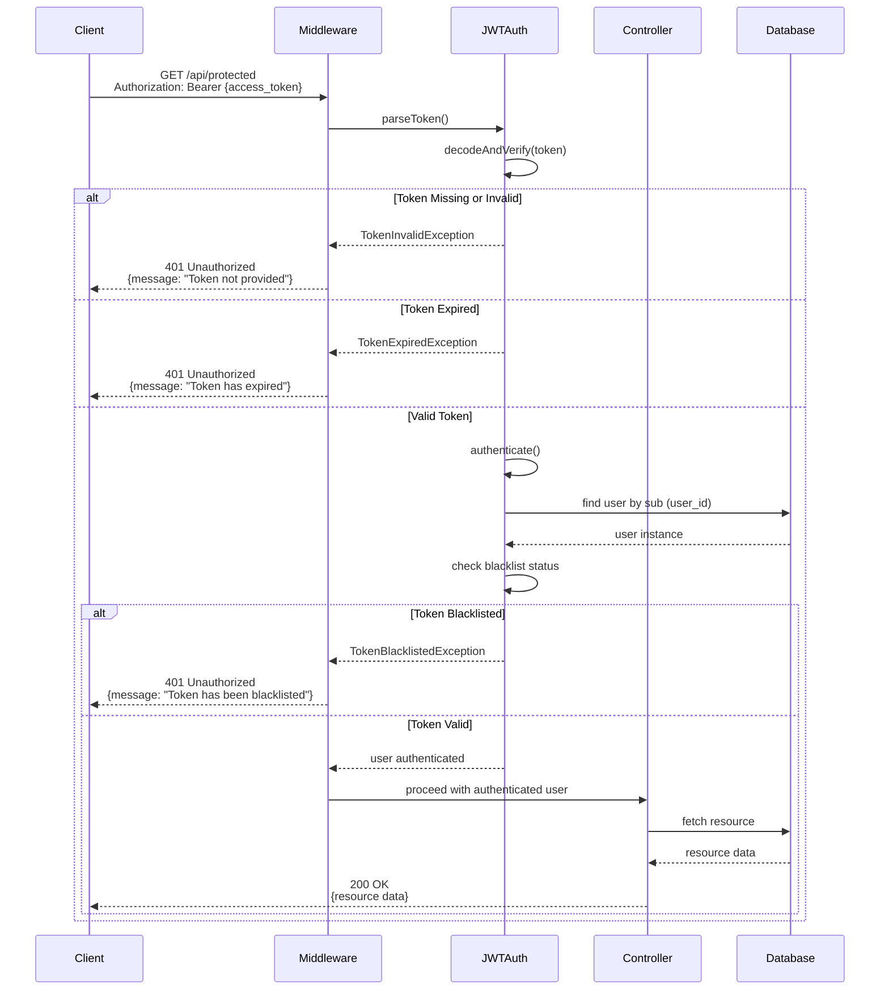

# Auth Domain Documentation

## Table of Contents

1. [Domain Overview](#domain-overview)
2. [Business Rules](#business-rules)
3. [Authentication Flows](#authentication-flows)
4. [Architecture Components](#architecture-components)
5. [API Documentation](#api-documentation)
6. [Security Considerations](#security-considerations)
7. [Dependencies & Integration](#dependencies--integration)
8. [Error Handling](#error-handling)
9. [Testing Guidelines](#testing-guidelines)
10. [Troubleshooting](#troubleshooting)
11. [Configuration](#configuration)

## Domain Overview

The Auth domain is a critical component of the SelfAssess.id system responsible for handling authentication, JWT token management, and user profile updates. It serves as the security gateway for all API endpoints, ensuring that only authenticated and authorized users can access system resources.

### Purpose and Responsibilities

- **User Authentication**: Validate user credentials and issue JWT tokens
- **Token Management**: Handle token issuance, refresh, and invalidation
- **Profile Management**: Allow authenticated users to update their profile information
- **Session Security**: Implement secure, stateless authentication using JWT

### Role in SelfAssess.id System Architecture

The Auth domain acts as the foundation of the security layer in the SelfAssess.id system. It integrates with:

- **User Domain**: For user data management and validation
- **Organization Domain**: For multi-tenant authentication
- **Permission System**: For role-based access control (Spatie Laravel Permission)

### Authentication Technology Stack

- **Package**: `php-open-source-saver/jwt-auth` (JWT authentication for Laravel)
- **Algorithm**: HS256 (HMAC-SHA256)
- **Token Storage**: HttpOnly, Secure cookies for refresh tokens
- **State Management**: Stateless JWT-based authentication

## Business Rules

### Authentication Rules

1. **Credential Validation**:
   - Users must provide valid email and password combination
   - Email must exist in the database and be unique
   - Password must match the hashed password stored in the database
   - User account must not be soft-deleted

2. **Organization Status Check**:
   - User's organization must be active (`is_active = true`)
   - Inactive organizations prevent login for all associated users

3. **Session Duration**:
   - **Remember Me Enabled**: Session expires after 30 days (43,200 minutes)
   - **Remember Me Disabled**: Session expires after 8 hours (480 minutes)
   - Access token expires after 60 minutes (configurable via `JWT_TTL`)

4. **Token Generation**:
   - Access token: Short-lived JWT (60 minutes) stored in memory/client
   - Refresh token: Long-lived JWT stored in HttpOnly cookie
   - Both tokens contain custom claims: `type` (access/refresh) and `rm` (remember me flag)

### Token Management Rules

1. **Access Token**:
   - Used for API authentication in Authorization header
   - Expires after TTL (default: 60 minutes)
   - Cannot be refreshed directly (use refresh token instead)
   - Contains user ID, organization ID, roles, and permissions

2. **Refresh Token**:
   - Stored in HttpOnly, Secure cookie (not accessible via JavaScript)
   - Must have `type: 'refresh'` claim to be valid
   - Automatically rotated on each refresh (old token invalidated)
   - Expires based on remember me setting (30 days or 8 hours)

3. **Token Invalidation**:
   - Logout adds both access and refresh tokens to blacklist
   - Blacklisted tokens cannot be used for authentication
   - Blacklist grace period: 0 seconds (no grace period)

### Login Action Rules

**Location**: [`backend/app/Domain/Auth/Actions/LoginAction.php`](backend/app/Domain/Auth/Actions/LoginAction.php:1)

**Preconditions**:
- User account must exist and be active
- User's organization must be active
- Credentials must be valid

**Postconditions**:
- Access token generated and returned in response
- Refresh token generated and set in HttpOnly cookie
- User's `last_login_at` timestamp updated
- Custom claims added to both tokens (`type`, `rm`)

**Constants**:
```php
REMEMBER_ME_TTL_MINUTES = 43200  // 30 days
SESSION_TTL_MINUTES = 480        // 8 hours
```

### Logout Action Rules

**Location**: [`backend/app/Domain/Auth/Controllers/AuthController.php`](backend/app/Domain/Auth/Controllers/AuthController.php:39)

**Preconditions**:
- Valid access token must be present in Authorization header

**Postconditions**:
- Current access token added to blacklist
- Refresh token cookie cleared (expired)
- User session terminated

### Refresh Token Action Rules

**Location**: [`backend/app/Domain/Auth/Actions/RefreshTokenAction.php`](backend/app/Domain/Auth/Actions/RefreshTokenAction.php:1)

**Preconditions**:
- Valid refresh token must be present in cookie
- Token must have `type: 'refresh'` claim
- User must exist and be active

**Postconditions**:
- Old refresh token invalidated (blacklisted)
- New access token generated
- New refresh token generated and rotated
- New refresh token set in HttpOnly cookie
- Remember me setting preserved from original token

**Token Rotation**:
- Each refresh generates a completely new token
- Old token immediately blacklisted
- Prevents token replay attacks

### Profile Update Rules

**Validation Constraints**:
- `name`: Optional, string, max 255 characters
- `email`: Optional, valid email, must be unique across all users
- `password`: Optional, min 8 characters, must match `password_confirmation`
- Organization cannot be changed
- Email change requires verification (if implemented)

## Authentication Flows

### 1. Login Flow

```mermaid
sequenceDiagram
    participant Client
    participant AuthController
    participant LoginAction
    participant JWTAuth
    participant User Model
    participant Database

    Client->>AuthController: POST /api/auth/login<br/>{email, password, rememberMe}
    AuthController->>LoginAction: execute(email, password, rememberMe)
    LoginAction->>JWTAuth: attempt(credentials)
    JWTAuth->>User Model: findByCredentials(email)
    User Model->>Database: SELECT * FROM users WHERE email = ?
    Database-->>User Model: user record
    User Model-->>JWTAuth: user instance
    JWTAuth->>JWTAuth: verifyPassword(password, hash)
    alt Invalid Credentials
        JWTAuth-->>LoginAction: false
        LoginAction-->>AuthController: InvalidCredentialsException
        AuthController-->>Client: 401 Unauthorized
    else Valid Credentials
        JWTAuth-->>LoginAction: access_token
        LoginAction->>User Model: update(['last_login_at' => now()])
        LoginAction->>JWTAuth: fromUser(user) with claims(type: refresh, rm: rememberMe)
        JWTAuth-->>LoginAction: refresh_token
        LoginAction->>LoginAction: createHttpOnlyCookie(refresh_token, ttl)
        LoginAction-->>AuthController: {token, user, expiresIn, cookie}
        AuthController-->>Client: 200 OK<br/>{accessToken, tokenType, expiresIn, user}<br/>Set-Cookie: refresh_token=...; HttpOnly; Secure
    end
```

**Flow Summary**:
1. Client submits credentials with remember me preference
2. System validates credentials against database
3. On success, generates access token (60 min TTL)
4. Generates refresh token (30 days or 8 hours based on remember me)
5. Sets refresh token in HttpOnly, Secure cookie
6. Returns access token and user data in response body
7. Updates user's last login timestamp

### 2. Protected Resource Access Flow



**Flow Summary**:
1. Client includes access token in Authorization header
2. Middleware validates token signature and expiration
3. System checks if token is blacklisted
4. If valid, authenticates user and proceeds to controller
5. Controller executes business logic with authenticated user

### 3. Token Refresh Flow

```mermaid
sequenceDiagram
    participant Client
    participant RefreshTokenAction
    participant Cookie
    participant JWTAuth
    participant User Model
    participant Database

    Client->>RefreshTokenAction: POST /api/auth/refresh<br/>(refresh_token in HttpOnly cookie)
    RefreshTokenAction->>Cookie: get('refresh_token')
    Cookie-->>RefreshTokenAction: refresh_token value
    alt No Refresh Token
        RefreshTokenAction-->>Client: 401 Unauthorized<br/>{message: "Invalid credentials"}
    else Refresh Token Found
        RefreshTokenAction->>JWTAuth: setToken(refresh_token)
        RefreshTokenAction->>JWTAuth: getPayload()
        JWTAuth-->>RefreshTokenAction: token payload
        RefreshTokenAction->>RefreshTokenAction: validate type === 'refresh'
        alt Invalid Token Type
            RefreshTokenAction-->>Client: 401 Unauthorized<br/>{message: "Invalid credentials"}
        else Valid Token Type
            RefreshTokenAction->>User Model: find(sub/user_id)
            User Model->>Database: SELECT * FROM users WHERE id = ?
            Database-->>User Model: user record
            User Model-->>RefreshTokenAction: user instance
            alt User Not Found
                RefreshTokenAction-->>Client: 401 Unauthorized<br/>{message: "Invalid credentials"}
            else User Found
                RefreshTokenAction->>JWTAuth: invalidate(old_refresh_token)
                JWTAuth->>JWTAuth: add to blacklist
                RefreshTokenAction->>JWTAuth: login(user)
                JWTAuth-->>RefreshTokenAction: new_access_token
                RefreshTokenAction->>JWTAuth: fromUser(user) with claims(type: refresh, rm: rememberMe)
                JWTAuth-->>RefreshTokenAction: new_refresh_token
                RefreshTokenAction->>RefreshTokenAction: createHttpOnlyCookie(new_refresh_token, ttl)
                RefreshTokenAction-->>Client: 200 OK<br/>{accessToken, tokenType, expiresIn}<br/>Set-Cookie: refresh_token=...; HttpOnly; Secure
            end
        end
    end
```

**Flow Summary**:
1. Client requests refresh (refresh token automatically sent via cookie)
2. System validates refresh token signature and claims
3. Verifies token type is 'refresh'
4. Checks user exists and is active
5. Invalidates old refresh token (blacklist)
6. Generates new access token
7. Generates new refresh token with rotation
8. Sets new refresh token in HttpOnly cookie
9. Returns new access token in response

### 4. Logout Flow

```mermaid
sequenceDiagram
    participant Client
    participant AuthController
    participant JWTAuth
    participant Blacklist

    Client->>AuthController: POST /api/auth/logout<br/>Authorization: Bearer {access_token}
    AuthController->>JWTAuth: logout()
    JWTAuth->>JWTAuth: invalidate(access_token)
    JWTAuth->>Blacklist: add token to blacklist
    Blacklist-->>JWTAuth: confirmation
    JWTAuth-->>AuthController: logout complete
    AuthController->>AuthController: create expired refresh_token cookie
    AuthController-->>Client: 200 OK<br/>{message: "Successfully logged out"}<br/>Set-Cookie: refresh_token=; Expires= past date
```

**Flow Summary**:
1. Client sends logout request with access token
2. System invalidates access token (adds to blacklist)
3. Clears refresh token cookie by setting expired cookie
4. Returns success message

## Architecture Components

### Controllers

#### AuthController

The main controller that handles all authentication-related HTTP requests.

**Location**: [`backend/app/Domain/Auth/Controllers/AuthController.php`](backend/app/Domain/Auth/Controllers/AuthController.php:1)

**Key Methods**:

- [`login()`](backend/app/Domain/Auth/Controllers/AuthController.php:21): Handles user authentication
- [`logout()`](backend/app/Domain/Auth/Controllers/AuthController.php:39): Invalidates the current token
- [`refresh()`](backend/app/Domain/Auth/Controllers/AuthController.php:49): Refreshes an expired token
- [`me()`](backend/app/Domain/Auth/Controllers/AuthController.php:61): Returns current user information
- [`updateProfile()`](backend/app/Domain/Auth/Controllers/AuthController.php:66): Updates user profile

**Constructor Injection**:
```php
public function __construct(
    private readonly LoginAction $loginAction,
    private readonly RefreshTokenAction $refreshTokenAction
) {}
```

### Actions

#### LoginAction

Encapsulates the core login logic and token generation.

**Location**: [`backend/app/Domain/Auth/Actions/LoginAction.php`](backend/app/Domain/Auth/Actions/LoginAction.php:1)

**Responsibilities**:
- Validate user credentials via JWTAuth
- Generate access token (short-lived)
- Generate refresh token (long-lived) with custom claims
- Update last login timestamp
- Create HttpOnly cookie for refresh token

**Key Implementation Details**:
```php
// TTL Constants
private const REMEMBER_ME_TTL_MINUTES = 43200; // 30 days
private const SESSION_TTL_MINUTES = 480;       // 8 hours

// Custom Claims
JWTAuth::claims([
    'type' => 'refresh',
    'rm' => $rememberMe,
])->fromUser($user);
```

#### RefreshTokenAction

Handles token refresh operations.

**Location**: [`backend/app/Domain/Auth/Actions/RefreshTokenAction.php`](backend/app/Domain/Auth/Actions/RefreshTokenAction.php:1)

**Responsibilities**:
- Validate refresh token from cookie
- Verify token type is 'refresh'
- Invalidate old refresh token (blacklist)
- Generate new access token
- Generate new refresh token (rotation)
- Set new refresh token in HttpOnly cookie

**Key Implementation Details**:
```php
// Token Type Validation
$tokenType = $payload->get('type');
if ($tokenType !== 'refresh') {
    throw new InvalidCredentialsException();
}

// Token Rotation
JWTAuth::invalidate(true); // Blacklist old token
$newRefreshToken = JWTAuth::claims([
    'type' => 'refresh',
    'rm' => $rememberMe,
])->fromUser($user);
```

### Requests

#### LoginRequest

Validates incoming login requests.

**Location**: [`backend/app/Domain/Auth/Requests/LoginRequest.php`](backend/app/Domain/Auth/Requests/LoginRequest.php:1)

**Validation Rules**:
```php
'email' => ['required', 'email'],
'password' => ['required', 'string', 'min:8'],
'rememberMe' => ['boolean'],
```

#### UpdateProfileRequest

Validates profile update requests.

**Location**: [`backend/app/Domain/Auth/Requests/UpdateProfileRequest.php`](backend/app/Domain/Auth/Requests/UpdateProfileRequest.php:1)

**Validation Rules**:
```php
'name' => ['string', 'max:255'],
'email' => ['email', 'unique:users,email,' . auth()->id()],
'password' => ['string', 'min:8', 'confirmed'],
```

### Resources

#### AuthUserResource

Transforms user data into a consistent JSON format for API responses.

**Location**: [`backend/app/Domain/Auth/Resources/AuthUserResource.php`](backend/app/Domain/Auth/Resources/AuthUserResource.php:1)

**Response Format**:
```json
{
  "id": "uuid",
  "organizationId": "uuid",
  "organizationName": "string",
  "organizationDescription": "string",
  "organizationIsActive": boolean,
  "name": "string",
  "email": "string",
  "emailVerifiedAt": "datetime",
  "roles": ["string"],
  "permissions": ["string"],
  "lastLoginAt": "datetime",
  "createdAt": "datetime",
  "updatedAt": "datetime"
}
```

### JWT Implementation Details

The Auth domain uses `php-open-source-saver/jwt-auth` package for JWT implementation.

**Configuration**:
- **Algorithm**: HS256 (HMAC-SHA256)
- **Access Token TTL**: 60 minutes (configurable via `JWT_TTL` env variable)
- **Refresh Token TTL**: Variable based on remember me setting
  - Remember Me: 43,200 minutes (30 days)
  - Standard: 480 minutes (8 hours)
- **Base Refresh TTL**: 20,160 minutes (14 days) from config
- **Blacklist**: Enabled for token invalidation

**Token Structure**:
```json
{
  "iss": "http://your-domain.com",
  "iat": 1234567890,
  "exp": 1234567890,
  "nbf": 1234567890,
  "sub": "user-uuid",
  "jti": "token-unique-id",
  "prv": "App\\\\Domain\\\\User\\\\Models\\\\User",
  "type": "refresh",
  "rm": true
}
```

### Token Lifecycle Management

1. **Issuance** (Login):
   - Access token created with 60-minute TTL
   - Refresh token created with 30-day or 8-hour TTL
   - Refresh token stored in HttpOnly cookie
   - Access token returned in response body

2. **Validation** (Protected Route Access):
   - Middleware validates token signature
   - Checks token expiration
   - Verifies token not blacklisted
   - Authenticates user from token subject

3. **Refresh** (Token Renewal):
   - Old refresh token validated and blacklisted
   - New access token generated
   - New refresh token generated (rotation)
   - Old refresh token cannot be reused

4. **Invalidation** (Logout):
   - Access token added to blacklist
   - Refresh token cookie expired
   - Session terminated

### Auth Middleware

**Location**: [`backend/app/Http/Kernel.php`](backend/app/Http/Kernel.php:1)

The authentication middleware guards protected routes:

```php
// config/auth.php
'guards' => [
    'api' => [
        'driver' => 'jwt',
        'provider' => 'users',
    ],
]
```

**Middleware Applied**:
- `auth:api` - JWT authentication guard
- `jwt.auth` - Verify JWT token validity
- `jwt.refresh` - Automatically refresh expired tokens (optional)

## API Documentation

### Authentication Endpoints

#### POST /api/auth/login

Authenticates a user with email and password credentials.

**Location**: [`backend/app/Domain/Auth/Routes/api.php`](backend/app/Domain/Auth/Routes/api.php:1)

**Request Headers**:
```
Content-Type: application/json
Accept: application/json
```

**Request Body**:
```json
{
    "email": "user@example.com",
    "password": "password123",
    "rememberMe": true
}
```

**Success Response (200 OK)**:
```json
{
    "accessToken": "eyJhbGciOiJIUzI1NiIsInR5cCI6IkpXVCJ9...",
    "tokenType": "bearer",
    "expiresIn": 3600,
    "rememberMe": true,
    "sessionDuration": 2592000,
    "user": {
        "id": "uuid",
        "organizationId": "uuid",
        "organizationName": "Organization Name",
        "organizationDescription": "Description",
        "organizationIsActive": true,
        "name": "User Name",
        "email": "user@example.com",
        "emailVerifiedAt": "2023-01-01T00:00:00.000Z",
        "roles": ["user"],
        "permissions": ["permission1", "permission2"],
        "lastLoginAt": "2023-01-01T12:00:00.000Z",
        "createdAt": "2023-01-01T00:00:00.000Z",
        "updatedAt": "2023-01-01T12:00:00.000Z"
    }
}
```

**Response Headers**:
```
Set-Cookie: refresh_token=eyJhbGciOiJIUzI1NiIsInR5cCI6IkpXVCJ9...; Path=/; HttpOnly; Secure; SameSite=Strict
```

**Error Response (401 Unauthorized)**:
```json
{
    "message": "Invalid credentials",
    "code": "invalid_credentials"
}
```

**Error Response (422 Unprocessable Entity)**:
```json
{
    "message": "The given data was invalid.",
    "errors": {
        "email": ["The email field is required."],
        "password": ["The password must be at least 8 characters."]
    }
}
```

#### POST /api/auth/logout

Invalidates the current JWT token and clears the refresh token cookie.

**Location**: [`backend/app/Domain/Auth/Routes/api.php`](backend/app/Domain/Auth/Routes/api.php:1)

**Request Headers**:
```
Authorization: Bearer {access_token}
Content-Type: application/json
Accept: application/json
```

**Success Response (200 OK)**:
```json
{
    "message": "Successfully logged out"
}
```

**Response Headers**:
```
Set-Cookie: refresh_token=; Expires=Thu, 01 Jan 1970 00:00:00 GMT; Path=/; HttpOnly; Secure; SameSite=Strict
```

**Error Response (401 Unauthorized)**:
```json
{
    "message": "Token not provided",
    "code": "token_not_provided"
}
```

#### POST /api/auth/refresh

Refreshes an expired access token using the refresh token from cookie.

**Location**: [`backend/app/Domain/Auth/Routes/api.php`](backend/app/Domain/Auth/Routes/api.php:1)

**Request Headers**:
```
Content-Type: application/json
Accept: application/json
```

**Note**: Refresh token is automatically sent via HttpOnly cookie.

**Success Response (200 OK)**:
```json
{
    "accessToken": "eyJhbGciOiJIUzI1NiIsInR5cCI6IkpXVCJ9...",
    "tokenType": "bearer",
    "expiresIn": 3600
}
```

**Response Headers**:
```
Set-Cookie: refresh_token=eyJhbGciOiJIUzI1NiIsInR5cCI6IkpXVCJ9...; Path=/; HttpOnly; Secure; SameSite=Strict
```

**Error Response (401 Unauthorized)**:
```json
{
    "message": "Invalid credentials",
    "code": "invalid_credentials"
}
```

#### GET /api/auth/me

Retrieves the current authenticated user's profile.

**Location**: [`backend/app/Domain/Auth/Routes/api.php`](backend/app/Domain/Auth/Routes/api.php:1)

**Request Headers**:
```
Authorization: Bearer {access_token}
Content-Type: application/json
Accept: application/json
```

**Success Response (200 OK)**:
```json
{
    "id": "uuid",
    "organizationId": "uuid",
    "organizationName": "Organization Name",
    "organizationDescription": "Description",
    "organizationIsActive": true,
    "name": "User Name",
    "email": "user@example.com",
    "emailVerifiedAt": "2023-01-01T00:00:00.000Z",
    "roles": ["user"],
    "permissions": ["permission1", "permission2"],
    "lastLoginAt": "2023-01-01T12:00:00.000Z",
    "createdAt": "2023-01-01T00:00:00.000Z",
    "updatedAt": "2023-01-01T12:00:00.000Z"
}
```

**Error Response (401 Unauthorized)**:
```json
{
    "message": "Token not provided",
    "code": "token_not_provided"
}
```

#### PUT /api/auth/profile

Updates the authenticated user's profile information.

**Location**: [`backend/app/Domain/Auth/Routes/api.php`](backend/app/Domain/Auth/Routes/api.php:1)

**Request Headers**:
```
Authorization: Bearer {access_token}
Content-Type: application/json
Accept: application/json
```

**Request Body**:
```json
{
    "name": "Updated Name",
    "email": "updated@example.com",
    "password": "newpassword123",
    "password_confirmation": "newpassword123"
}
```

**Success Response (200 OK)**:
```json
{
    "message": "Profile updated successfully",
    "user": {
        "id": "uuid",
        "organizationId": "uuid",
        "organizationName": "Organization Name",
        "organizationDescription": "Description",
        "organizationIsActive": true,
        "name": "Updated Name",
        "email": "updated@example.com",
        "emailVerifiedAt": "2023-01-01T00:00:00.000Z",
        "roles": ["user"],
        "permissions": ["permission1", "permission2"],
        "lastLoginAt": "2023-01-01T12:00:00.000Z",
        "createdAt": "2023-01-01T00:00:00.000Z",
        "updatedAt": "2023-01-01T13:00:00.000Z"
    }
}
```

**Error Response (422 Unprocessable Entity)**:
```json
{
    "message": "The given data was invalid.",
    "errors": {
        "email": ["The email has already been taken."],
        "password": ["The password confirmation does not match."]
    }
}
```

### Route Definitions

**Location**: [`backend/app/Domain/Auth/Routes/api.php`](backend/app/Domain/Auth/Routes/api.php:1)

```php
Route::post('/login', [AuthController::class, 'login']);
Route::post('/logout', [AuthController::class, 'logout'])->middleware('auth:api');
Route::post('/refresh', [AuthController::class, 'refresh']);
Route::get('/me', [AuthController::class, 'me'])->middleware('auth:api');
Route::put('/profile', [AuthController::class, 'updateProfile'])->middleware('auth:api');
```

**Public Routes** (no authentication required):
- `POST /api/auth/login`
- `POST /api/auth/refresh`

**Protected Routes** (authentication required):
- `POST /api/auth/logout`
- `GET /api/auth/me`
- `PUT /api/auth/profile`

## Security Considerations

### JWT Security Implementation

1. **Token Signing**: All tokens are signed using HS256 algorithm (HMAC-SHA256)
2. **Secret Key**: Configured via `JWT_SECRET` environment variable (use `php artisan jwt:secret` to generate)
3. **Standard Claims**: iss, iat, exp, nbf, sub, jti, prv included in all tokens
4. **Custom Claims**: `type` (access/refresh), `rm` (remember me flag) added to tokens

### Token Storage Security

**Access Token**:
- Stored in memory/client (localStorage, sessionStorage, or memory)
- Sent via Authorization header: `Authorization: Bearer {token}`
- Short-lived (60 minutes) to minimize exposure window

**Refresh Token**:
- Stored in HttpOnly, Secure cookie
- Not accessible via JavaScript (prevents XSS theft)
- Protected by SameSite=Strict attribute (prevents CSRF)
- Long-lived but rotated on each use

### HttpOnly Cookie Benefits

```php
$cookie = cookie(
    name: 'refresh_token',
    value: $token,
    minutes: $ttl,
    path: '/',
    domain: null,
    secure: true,        // HTTPS only
    httpOnly: true,      // Not accessible via JavaScript
    sameSite: 'strict'   // CSRF protection
);
```

**Security Advantages**:
1. **XSS Protection**: Cannot be accessed by JavaScript
2. **CSRF Protection**: SameSite=Strict prevents cross-site requests
3. **Automatic Transmission**: Browser sends cookie automatically
4. **Secure Flag**: Only transmitted over HTTPS

### Token Refresh Mechanism

- Tokens can be refreshed within the refresh window
- Refresh action generates new access token
- Old refresh token immediately blacklisted
- New refresh token generated (token rotation)
- Prevents token replay attacks

### Logout and Token Invalidation

- Access token added to blacklist on logout
- Refresh token cookie cleared (expired)
- Blacklist checked on each token validation
- Blacklist grace period: 0 seconds (no grace period)
- Storage provider: Laravel cache (configurable)

### Protection Against Common Attacks

1. **Brute Force Login**:
   - Implement rate limiting on login endpoint (recommended: 5 attempts per minute)
   - Use Laravel's built-in throttle middleware
   - Consider CAPTCHA after failed attempts

2. **Token Theft**:
   - Always use HTTPS in production
   - Store access token securely (prefer memory over localStorage)
   - Refresh token in HttpOnly cookie
   - Implement token expiration

3. **XSS (Cross-Site Scripting)**:
   - Refresh tokens in HttpOnly cookies (not accessible via JS)
   - Access tokens have short TTL
   - Sanitize and validate all user inputs
   - Use Content Security Policy (CSP)

4. **CSRF (Cross-Site Request Forgery)**:
   - SameSite=Strict on refresh token cookie
   - Stateless JWT prevents session CSRF
   - Origin validation for API requests

5. **Token Replay**:
   - Each token has unique jti claim
   - Token rotation on refresh
   - Blacklist invalidates old tokens
   - No grace period prevents race conditions

6. **Timing Attacks**:
   - Constant-time password comparison (bcrypt handles this)
   - Use Laravel's built-in password hashing

### Security Headers

Ensure these security headers are configured:

```php
// Recommended HTTP headers
X-Content-Type-Options: nosniff
X-Frame-Options: DENY
X-XSS-Protection: 1; mode=block
Strict-Transport-Security: max-age=31536000; includeSubDomains
Content-Security-Policy: default-src 'self'
```

## Dependencies & Integration

### Integration with User Domain

The Auth domain depends on the User domain for:

- **User Model**: [`backend/app/Domain/User/Models/User.php`](backend/app/Domain/User/Models/User.php:1)
- **User Validation**: Email uniqueness, password requirements
- **User-Organization Relationships**: Multi-tenant data isolation
- **Role & Permission Management**: Spatie Laravel Permission integration

### JWT Configuration Dependencies

**Package**: `php-open-source-saver/jwt-auth`
- **Config File**: [`backend/config/jwt.php`](backend/config/jwt.php:1)
- **Environment Variables**:
  - `JWT_SECRET`: Signing key for HMAC algorithms
  - `JWT_TTL`: Access token time-to-live in minutes (default: 60)
  - `JWT_REFRESH_TTL`: Refresh token time-to-live in minutes (default: 20160)
  - `JWT_ALGO`: Hashing algorithm (default: HS256)
  - `JWT_BLACKLIST_ENABLED`: Enable/disable token blacklist (default: true)
  - `JWT_BLACKLIST_GRACE_PERIOD`: Grace period in seconds (default: 0)

**Generate JWT Secret**:
```bash
php artisan jwt:secret
```

### Auth Configuration

**Location**: [`backend/config/auth.php`](backend/config/auth.php:1)

```php
'defaults' => [
    'guard' => 'api',
    'passwords' => 'users',
],

'guards' => [
    'web' => [
        'driver' => 'session',
        'provider' => 'users',
    ],
    'api' => [
        'driver' => 'jwt',
        'provider' => 'users',
    ],
],

'providers' => [
    'users' => [
        'driver' => 'eloquent',
        'model' => App\Domain\User\Models\User::class,
    ],
],
```

### Middleware Usage

**Location**: [`backend/app/Http/Kernel.php`](backend/app/Http/Kernel.php:1)

**Authentication Middleware**:
- `auth:api` - JWT authentication guard for protected routes
- `auth.basic` - HTTP Basic authentication (not used)

**Route Middleware**:
```php
// Apply to routes that require authentication
Route::middleware(['auth:api'])->group(function () {
    // Protected routes
});

// Apply to specific routes
Route::get('/profile', [AuthController::class, 'me'])->middleware('auth:api');
```

## Error Handling

### Authentication Error Scenarios

1. **Invalid Credentials**:
   - **Exception**: [`InvalidCredentialsException`](backend/app/Exceptions/Domain/InvalidCredentialsException.php:1)
   - **HTTP Status**: 401 Unauthorized
   - **Error Code**: `invalid_credentials`
   - **Cause**: Email/password mismatch, user not found, or account inactive
   - **Response**:
   ```json
   {
       "message": "Invalid credentials",
       "code": "invalid_credentials"
   }
   ```

2. **Token Not Provided**:
   - **HTTP Status**: 401 Unauthorized
   - **Error Code**: `token_not_provided`
   - **Cause**: Missing Authorization header
   - **Response**:
   ```json
   {
       "message": "Token not provided",
       "code": "token_not_provided"
   }
   ```

3. **Token Expired**:
   - **HTTP Status**: 401 Unauthorized
   - **Error Code**: `token_expired`
   - **Cause**: Access token exceeded TTL (60 minutes)
   - **Solution**: Client should call refresh endpoint
   - **Response**:
   ```json
   {
       "message": "Token has expired",
       "code": "token_expired"
   }
   ```

4. **Token Invalid**:
   - **HTTP Status**: 401 Unauthorized
   - **Error Code**: `token_invalid`
   - **Cause**: Malformed token, invalid signature, or algorithm mismatch
   - **Response**:
   ```json
   {
       "message": "Token Invalid",
       "code": "token_invalid"
   }
   ```

5. **Token Blacklisted**:
   - **HTTP Status**: 401 Unauthorized
   - **Error Code**: `token_blacklisted`
   - **Cause**: Token was invalidated (logout or refresh)
   - **Solution**: Use refresh token to get new access token
   - **Response**:
   ```json
   {
       "message": "The token has been blacklisted",
       "code": "token_blacklisted"
   }
   ```

6. **User Not Found**:
   - **HTTP Status**: 401 Unauthorized
   - **Error Code**: `user_not_found`
   - **Cause**: User in token claims no longer exists (deleted account)
   - **Solution**: User must re-authenticate
   - **Response**:
   ```json
   {
       "message": "User Not Found",
       "code": "user_not_found"
   }
   ```

### Validation Error Format

**HTTP Status**: 422 Unprocessable Entity

```json
{
    "message": "The given data was invalid.",
    "errors": {
        "email": ["The email field is required."],
        "password": ["The password must be at least 8 characters."],
        "email": ["The email has already been taken."]
    }
}
```

### Token Expiration Handling Strategy

**Client-Side Implementation**:

1. **Check Token Expiration**:
   ```javascript
   // Decode JWT to check expiration
   const token = localStorage.getItem('access_token');
   const decoded = jwt_decode(token);
   const now = Date.now() / 1000;
   if (decoded.exp < now) {
       // Token expired, refresh it
       await refreshToken();
   }
   ```

2. **Automatic Token Refresh**:
   ```javascript
   // Axios interceptor for automatic refresh
   axios.interceptors.response.use(
       response => response,
       async error => {
           if (error.response?.status === 401) {
               // Try to refresh token
               const refreshed = await refreshToken();
               if (refreshed) {
                   // Retry original request
                   return axios.request(error.config);
               }
           }
           return Promise.reject(error);
       }
   );
   ```

3. **Handle Refresh Failure**:
   - Redirect to login page
   - Clear all tokens from storage
   - Show "session expired" message

## Testing Guidelines

### Unit Testing Strategies for Authentication

**Location**: [`backend/tests/Unit/Domain/Auth/`](backend/tests/Unit/Domain/Auth/)

1. **LoginAction Tests**:
   - Test successful authentication with valid credentials
   - Test invalid credentials throw `InvalidCredentialsException`
   - Test token generation and structure
   - Test `last_login_at` timestamp update
   - Test remember me flag affects refresh token TTL
   - Test HttpOnly cookie creation

2. **RefreshTokenAction Tests**:
   - Test successful token refresh with valid refresh token
   - Test token type validation (`type: 'refresh'`)
   - Test token rotation (old token blacklisted)
   - Test user validation (user must exist)
   - Test expired refresh token throws exception
   - Test new refresh token cookie creation

3. **Request Validation Tests**:
   - Test valid login request data passes
   - Test missing required fields fail validation
   - Test invalid email format fails
   - Test password minimum length validation
   - Test password confirmation validation

### Integration Testing for API Endpoints

**Location**: [`backend/tests/Feature/Domain/Auth/`](backend/tests/Feature/Domain/Auth/)

1. **Login Endpoint** (`POST /api/auth/login`):
   - Test successful login returns access token and user data
   - Test refresh token cookie is set
   - Test invalid credentials returns 401
   - Test validation errors return 422
   - Test inactive organization prevents login
   - Test response structure matches schema

2. **Protected Endpoints**:
   - Test access with valid access token succeeds
   - Test access without token returns 401
   - Test access with expired token returns 401
   - Test access with blacklisted token returns 401
   - Test access with invalid token signature returns 401

3. **Refresh Endpoint** (`POST /api/auth/refresh`):
   - Test successful refresh returns new access token
   - Test old refresh token is blacklisted
   - Test new refresh token cookie is set
   - Test without refresh token returns 401
   - Test with invalid refresh token returns 401

4. **Logout Endpoint** (`POST /api/auth/logout`):
   - Test successful logout invalidates token
   - Test refresh token cookie is cleared
   - Test blacklisted token cannot be reused

5. **Profile Update** (`PUT /api/auth/profile`):
   - Test successful profile update
   - Test validation errors for invalid data
   - Test email uniqueness validation
   - Test password update with confirmation
   - Test password hashing

### Security Testing Considerations

1. **Token Security**:
   - Verify token signature cannot be forged
   - Test token manipulation attempts (tampering)
   - Verify token expiration is enforced
   - Test blacklist prevents token reuse

2. **Authentication Bypass**:
   - Test for authentication bypass vulnerabilities
   - Verify middleware protects all protected routes
   - Test authorization checks on sensitive operations
   - Verify user can only access own organization data

3. **Input Validation**:
   - Test for SQL injection attempts in email field
   - Test for XSS vulnerabilities in input fields
   - Verify input sanitization
   - Test path traversal attempts

4. **Rate Limiting**:
   - Test rate limiting on login endpoint
   - Test account lockout after failed attempts
   - Verify rate limits reset correctly

### Example Test Structure

```php
// backend/tests/Feature/Domain/Auth/LoginTest.php

it('successfully logs in user with valid credentials', function () {
    $user = User::factory()->create([
        'password' => bcrypt('password123'),
    ]);

    $response = $this->postJson('/api/auth/login', [
        'email' => $user->email,
        'password' => 'password123',
        'rememberMe' => true,
    ]);

    $response->assertStatus(200)
        ->assertJsonStructure([
            'accessToken',
            'tokenType',
            'expiresIn',
            'rememberMe',
            'sessionDuration',
            'user' => [
                'id',
                'email',
                'name',
                // ...
            ],
        ])
        ->assertCookie('refresh_token');
});
```

## Troubleshooting

### Common Authentication Issues

1. **"Token not provided" Error**:
   - **Cause**: Missing Authorization header
   - **Solution**: Include `Authorization: Bearer {token}` header
   - **Check**: Verify token is not empty or null
   - **Debug**: Log request headers to verify Authorization is sent

2. **"Token has expired" Error**:
   - **Cause**: Access token exceeded TTL (60 minutes)
   - **Solution**: Call refresh endpoint to get new access token
   - **Check**: Verify `JWT_TTL` configuration
   - **Debug**: Decode token to check `exp` claim

3. **"Invalid credentials" Error**:
   - **Cause**: Email/password mismatch or account inactive
   - **Solution**: Verify credentials are correct
   - **Check**: User account status and organization status
   - **Debug**: Confirm user exists and is not soft-deleted

4. **"Token has been blacklisted" Error**:
   - **Cause**: Token was invalidated (logout or refresh)
   - **Solution**: Use refresh token to get new access token
   - **Check**: Verify token is not reused after logout
   - **Debug**: Check blacklist storage (cache)

### Token-Related Problems

1. **Token Generation Fails**:
   - **Cause**: JWT_SECRET not configured or invalid
   - **Solution**: Run `php artisan jwt:secret`
   - **Check**: Verify `JWT_SECRET` in `.env` file
   - **Debug**: Check JWT config: `php artisan config:show jwt`

2. **Token Validation Fails**:
   - **Cause**: Invalid signature or algorithm mismatch
   - **Solution**: Verify JWT_SECRET matches between generation and validation
   - **Check**: Ensure `JWT_ALGO` is consistent
   - **Debug**: Decode token to verify structure

3. **Token Refresh Fails**:
   - **Cause**: Refresh token expired or invalid
   - **Solution**: User must re-login
   - **Check**: Refresh token TTL (30 days or 8 hours)
   - **Debug**: Verify cookie is being sent: `request()->cookie('refresh_token')`

4. **Cookie Not Being Set**:
   - **Cause**: Cookie configuration issue
   - **Solution**: Check cookie domain, secure, and sameSite settings
   - **Check**: Verify `config('session.domain')` matches application URL
   - **Debug**: Use browser DevTools to inspect cookies

### Debugging Tips

1. **Enable JWT Debug Mode**:
   ```php
   // config/jwt.php
   'show_black_list_exception' => true,
   ```

2. **Check Token Contents**:
   ```bash
   # Decode JWT token to inspect contents
   # Split token into parts: header.payload.signature
   echo eyJhbGciOiJIUzI1NiIsInR5cCI6IkpXVCJ9.eyJpc3MiOiJodHRwOi8vZXhhbXBsZS5jb20ifQ.abc | \
   cut -d. -f2 | \
   base64 -d
   ```

3. **Verify Configuration**:
   ```bash
   # Check JWT configuration
   php artisan config:show jwt

   # Check auth configuration
   php artisan config:show auth
   ```

4. **Clear All Caches**:
   ```bash
   # Clear configuration cache
   php artisan config:clear

   # Clear application cache
   php artisan cache:clear

   # Clear route cache
   php artisan route:clear

   # Clear view cache
   php artisan view:clear
   ```

5. **Check Blacklist Storage**:
   ```bash
   # If using Redis
   redis-cli
   > KEYS jwt:*

   # If using file cache
   ls -la storage/framework/cache/data/
   ```

6. **Test Token Expiration**:
   ```bash
   # Temporarily set short TTL for testing
   php artisan tinker
   >>> config(['jwt.ttl' => 1]); // 1 minute
   ```

7. **Enable Request Logging**:
   ```php
   // app/Http/Middleware/LogRequests.php
   Log::info('Auth headers', [
       'authorization' => $request->header('Authorization'),
       'cookie' => $request->cookie('refresh_token'),
   ]);
   ```

## Configuration

### JWT Configuration Settings

**Location**: [`backend/config/jwt.php`](backend/config/jwt.php:1)

**Key Settings**:

| Setting | Env Variable | Default | Description |
|---------|--------------|---------|-------------|
| `secret` | `JWT_SECRET` | - | HMAC signing key (generate with `php artisan jwt:secret`) |
| `ttl` | `JWT_TTL` | 60 | Access token time-to-live in minutes |
| `refresh_ttl` | `JWT_REFRESH_TTL` | 20160 | Refresh token time-to-live in minutes (14 days) |
| `algo` | `JWT_ALGO` | HS256 | Hashing algorithm (HS256, HS384, HS512) |
| `blacklist_enabled` | `JWT_BLACKLIST_ENABLED` | true | Enable/disable token blacklist |
| `blacklist_grace_period` | `JWT_BLACKLIST_GRACE_PERIOD` | 0 | Grace period in seconds for blacklist |
| `refresh_iat` | `JWT_REFRESH_IAT` | false | Rolling refresh (renew iat on refresh) |

### Application Configuration

**Location**: [`backend/.env.example`](backend/.env.example:1)

**Required Environment Variables**:

```env
# JWT Configuration
JWT_SECRET=change_this_to_random_string_with_min_32_chars
JWT_TTL=60
JWT_REFRESH_TTL=20160
JWT_ALGO=HS256
JWT_BLACKLIST_ENABLED=true
JWT_BLACKLIST_GRACE_PERIOD=0

# Session Configuration (affects cookie settings)
SESSION_DOMAIN=null
SESSION_SECURE=true
SAME_SITE=strict
```

### Generate JWT Secret

```bash
# Generate new JWT secret
php artisan jwt:secret

# Output:
# JWT_SECRET generated successfully.
# Don't forget to update your .env file with:
# JWT_SECRET=eyJ0eXAiOiJKV1QiLCJhbGciOiJIUzI1NiJ9...
```

### Session Configuration for Cookies

**Location**: [`backend/config/session.php`](backend/config/session.php:1)

```php
'domain' => env('SESSION_DOMAIN', null),
'secure' => env('SESSION_SECURE', true),
'same_site' => 'strict',
```

**Cookie Attributes**:
- **HttpOnly**: Prevents JavaScript access (XSS protection)
- **Secure**: Only transmitted over HTTPS
- **SameSite=Strict**: Prevents CSRF attacks
- **Domain**: Set to your application domain

### Auth Guard Configuration

**Location**: [`backend/config/auth.php`](backend/config/auth.php:1)

```php
'defaults' => [
    'guard' => env('AUTH_GUARD', 'api'),
    'passwords' => env('AUTH_PASSWORD_BROKER', 'users'),
],

'guards' => [
    'api' => [
        'driver' => 'jwt',
        'provider' => 'users',
    ],
],
```

### Production Checklist

Before deploying to production:

- [ ] Generate secure `JWT_SECRET` (min 32 characters)
- [ ] Set `JWT_TTL` to appropriate value (60 minutes recommended)
- [ ] Set `SESSION_SECURE=true` (HTTPS only)
- [ ] Set `SAME_SITE=strict` (CSRF protection)
- [ ] Enable `JWT_BLACKLIST_ENABLED=true`
- [ ] Set `JWT_BLACKLIST_GRACE_PERIOD=0` (no grace period)
- [ ] Configure HTTPS with valid SSL certificate
- [ ] Set up rate limiting on login endpoint
- [ ] Enable security headers
- [ ] Configure CORS for frontend domain
- [ ] Set up monitoring for authentication failures
- [ ] Test token refresh flow
- [ ] Test logout flow
- [ ] Verify cookie settings in browser DevTools

---

_Last Updated: January 3, 2025_
_Version: 2.0.0_

**Related Documentation**:
- [User Domain](../User/README.md)
- [Organization Domain](../Organization/README.md)
- [Role Domain](../Role/README.md)
