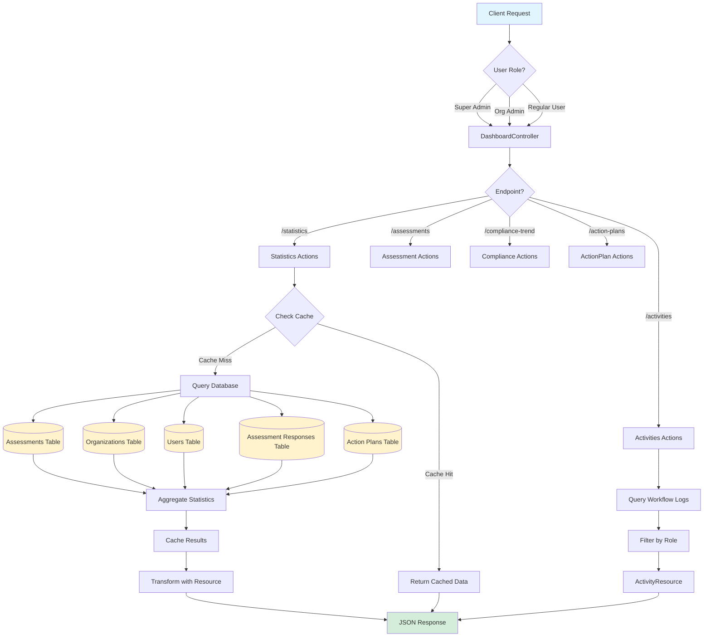
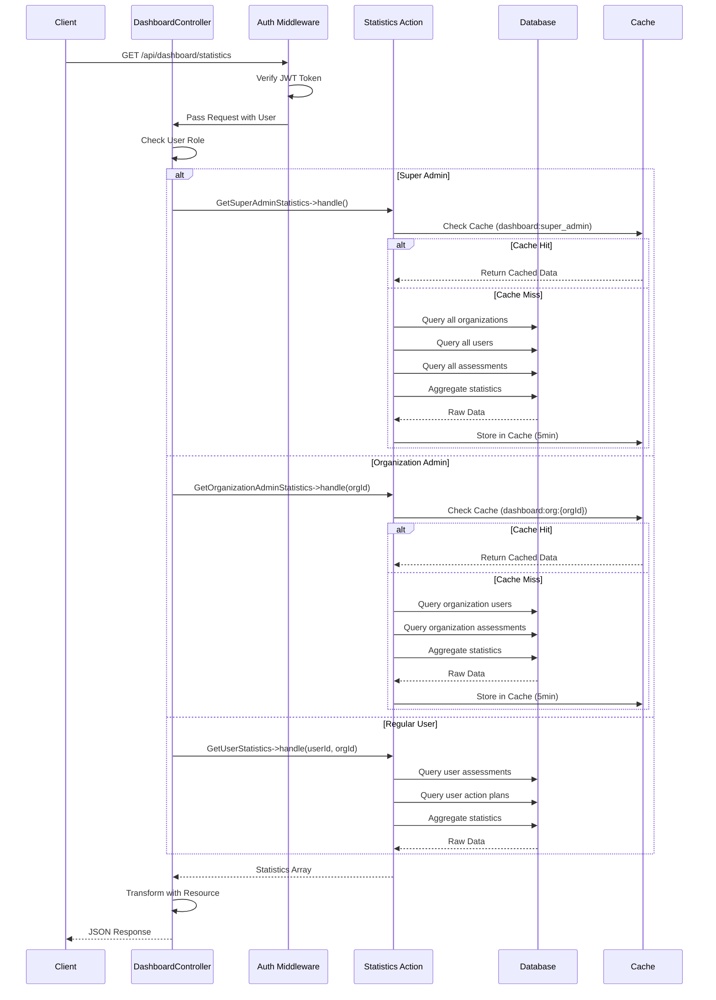

# Dashboard Domain

## Overview

Dashboard domain menyediakan API endpoints untuk menampilkan statistik dan metrik dashboard yang berbeda-beda tergantung pada peran pengguna. Domain ini mengagregasi data dari berbagai domain (Assessment, Organization, User) untuk memberikan insight real-time kepada pengguna.

## Business Rules

### 1. Statistics Aggregation

**Role-Based Statistics:**
- **Super Admin**: Melihat statistik system-wide (semua organisasi)
- **Organization Admin**: Melihat statistik organisasi mereka saja
- **Regular User**: Melihat statistik pribadi mereka saja
- **Reviewer**: Melihat statistik terkait review (pending, completed, rejected)

**Caching Strategy:**
- Statistics di-cache untuk 5 menit untuk mengurangi database load
- Cache invalidated ketika:
  - Assessment status berubah
  - Assessment baru dibuat
  - User baru dibuat
  - Organization baru dibuat

**Real-Time Considerations:**
- Recent activities tidak di-cache (harus real-time)
- Action plans tidak di-cache (harus real-time)
- Compliance trend di-cache per hari (data historis tidak berubah)

### 2. Recent Activities

**Activity Types:**
- `workflow`: Assessment status transition
- `response`: Requirement response submitted/reviewed
- `user`: User created/updated
- `organization`: Organization created/updated
- `action_plan`: Action plan created/updated

**Scoping Rules:**
- **Super Admin**: Melihat semua activities system-wide
- **Organization Admin**: Melihat activities dari organisasi mereka
- **Regular User**: Melihat activities yang terkait dengan mereka

**Pagination:**
- Default: 20 activities per page
- Maximum: 100 activities per page
- Sorted by `created_at` DESC

**Retention:**
- Activities disimpan selamanya untuk audit trail
- API hanya return 30 hari terakhir secara default

### 3. Multi-Organization Support (Super Admin)

**Super Admin Capabilities:**
- View statistics dari semua organisasi
- Filter statistics per organisasi
- Compare performance antar organisasi
- View activities dari semua organisasi
- Access semua assessment data system-wide

**Organization Switching:**
- Super Admin dapat switch view ke organisasi spesifik
- Default view: system-wide aggregate
- Optional query parameter: `?organization_id={uuid}`

**Data Isolation:**
- Organization users hanya bisa melihat data organisasi mereka
- Organization scoping diterapkan di Action layer
- Controller melakukan role check sebelum memanggil Action

## Structure

```
Dashboard/
├── Actions/                              # Single-responsibility business logic
│   ├── Statistics/
│   │   ├── GetSuperAdminStatistics.php
│   │   ├── GetOrganizationAdminStatistics.php
│   │   ├── GetReviewerStatistics.php
│   │   └── GetUserStatistics.php
│   ├── Activities/
│   │   ├── GetSystemActivities.php
│   │   └── GetOrganizationActivities.php
│   ├── Assessments/
│   │   ├── GetSystemAssessmentSummary.php
│   │   └── GetOrganizationAssessmentSummary.php
│   ├── Compliance/
│   │   ├── GetSystemComplianceTrend.php
│   │   └── GetOrganizationComplianceTrend.php
│   └── ActionPlans/
│       ├── GetSystemActionPlans.php
│       ├── GetOrganizationActionPlans.php
│       └── GetUserActionPlans.php
├── Controllers/
│   └── DashboardController.php           # HTTP request handlers
├── Resources/
│   ├── DashboardStatisticsResource.php   # Transform statistics response
│   ├── ActivityResource.php              # Transform activity response
│   ├── AssessmentSummaryResource.php     # Transform assessment summary
│   ├── ComplianceTrendResource.php       # Transform compliance trend
│   └── ActionPlanSummaryResource.php     # Transform action plans
├── Routes/
│   └── api.php                           # Route definitions
└── README.md                             # This file
```

## Endpoints

| Method | Endpoint | Description | Access Control |
|--------|----------|-------------|----------------|
| GET | /api/dashboard/statistics | Role-based statistics | auth:api |
| GET | /api/dashboard/activities | Recent activities | auth:api |
| GET | /api/dashboard/assessments | Assessment summary by status | auth:api |
| GET | /api/dashboard/compliance-trend | Compliance trend data | auth:api |
| GET | /api/dashboard/action-plans | Action plans needing attention | auth:api |

## Data Flow Diagram



## Component Structure

```mermaid
graph TB
    subgraph "Dashboard Domain"
        DC[DashboardController]

        subgraph "Statistics Actions"
            GSAS[GetSuperAdminStatistics]
            GOAS[GetOrganizationAdminStatistics]
            GRS[GetReviewerStatistics]
            GUS[GetUserStatistics]
        end

        subgraph "Activities Actions"
            GSA[GetSystemActivities]
            GOA[GetOrganizationActivities]
        end

        subgraph "Assessment Actions"
            GSASs[GetSystemAssessmentSummary]
            GOASs[GetOrganizationAssessmentSummary]
        end

        subgraph "Compliance Actions"
            GSCT[GetSystemComplianceTrend]
            GOCT[GetOrganizationComplianceTrend]
        end

        subgraph "ActionPlan Actions"
            GSAP[GetSystemActionPlans]
            GOAP[GetOrganizationActionPlans]
            GUAP[GetUserActionPlans]
        end

        subgraph "Resources"
            DSR[DashboardStatisticsResource]
            AR[ActivityResource]
            ASR[AssessmentSummaryResource]
            CTR[ComplianceTrendResource]
            APSR[ActionPlanSummaryResource]
        end
    end

    subgraph "External Dependencies"
        AM[Assessment Model]
        OM[Organization Model]
        UM[User Model]
        ARM[AssessmentResponse Model]
        APM[ActionPlan Model]
        WLM[WorkflowLog Model]
    end

    DC --> GSAS
    DC --> GOAS
    DC --> GRS
    DC --> GUS
    DC --> GSA
    DC --> GOA
    DC --> GSASs
    DC --> GOASs
    DC --> GSCT
    DC --> GOCT
    DC --> GSAP
    DC --> GOAP
    DC --> GUAP

    GSAS --> DSR
    GOAS --> DSR
    GRS --> DSR
    GUS --> DSR

    GSA --> AR
    GOA --> AR

    GSASs --> ASR
    GOASs --> ASR

    GSCT --> CTR
    GOCT --> CTR

    GSAP --> APSR
    GOAP --> APSR
    GUAP --> APSR

    GSAS -.-> AM
    GOAS -.-> AM
    GSA -.-> WLM
    GOA -.-> WLM
    GSAP -.-> APM
    GOAP -.-> APM
    GUAP -.-> APM

    style DC fill:#ff9999
    style DSR fill:#99ccff
    style AR fill:#99ccff
    style ASR fill:#99ccff
    style CTR fill:#99ccff
    style APSR fill:#99ccff
```



## Organization Scoping Flow



## Architecture Pattern

Domain ini mengikuti pola yang sama dengan domain lain di project:

### 1. Actions (Single Responsibility)
- Setiap Action memiliki satu tugas spesifik
- Action menerima input dan mengembalikan array data
- Action mengandung business logic yang kompleks
- Tidak bergantung pada HTTP context
- Injectable ke Controller
- Handle caching logic di dalam Action

### 2. Controller (Thin)
- Menginject Actions sebagai dependency di constructor
- Hanya handle HTTP request/response
- Tidak mengandung business logic
- Memanggil Action menggunakan `$this->actionName->handle()`
- Gunakan Resource untuk transformasi response
- Handle role-based routing

### 3. Resources
- Transform data dari Action ke format response
- Handle camelCase conversion
- Handle null/default values
- Consistent response structure
- Flatten nested arrays when appropriate

### 4. Response Format

```json
{
  "success": true,
  "data": { ... }
}
```

### 5. Caching Strategy

```php
// In Action class
public function handle(): array
{
    $cacheKey = 'dashboard:super_admin';

    return Cache::remember($cacheKey, 300, function () {
        // Query and aggregate data
        return [
            'totalOrganizations' => Organization::count(),
            'totalUsers' => User::count(),
            // ...
        ];
    });
}
```

## Role-Based Data

### Super Admin
- **Scope**: System-wide (all organizations)
- **Statistics**:
  - Total Organizations
  - Total Users
  - Active Assessments (system-wide)
  - Pending Reviews
  - Completion Rate (average across all orgs)
- **Activities**: All activities from all organizations
- **Assessments**: All assessments with system-wide summary
- **Compliance**: Aggregate compliance trend
- **Action Plans**: All action plans across system

### Organization Admin
- **Scope**: Organization-specific
- **Statistics**:
  - Organization Users
  - Active Assessments (org only)
  - Completion Rate (org average)
  - Pending Action Plans
  - Overdue Assessments
- **Activities**: Activities from their organization only
- **Assessments**: Organization assessments only
- **Compliance**: Organization compliance trend
- **Action Plans**: Organization action plans

### Reviewer (permission: review-assessments)
- **Scope**: Items assigned for review or within their org
- **Statistics**:
  - Pending Reviews
  - Reviewed This Month
  - Avg Review Time
  - Rejected Assessments
  - Approval Rate
- **Activities**: Review activities
- **Assessments**: Assessments in review status
- **Action Plans**: Action plans from reviewed assessments

### Regular User
- **Scope**: Personal data only
- **Statistics**:
  - My Assessments
  - Completion Progress
  - Pending Evidence
  - My Action Plans
  - Upcoming Deadlines
- **Activities**: Personal activities
- **Assessments**: My assessments
- **Action Plans**: My assigned action plans

## Example Response

### GET /api/dashboard/statistics (Super Admin)
```json
{
  "success": true,
  "data": {
    "superAdmin": {
      "totalOrganizations": 24,
      "totalUsers": 156,
      "activeAssessments": 42,
      "pendingReviews": 8,
      "completionRate": 68.5
    },
    "orgAdmin": null,
    "reviewer": null,
    "user": null
  }
}
```

### GET /api/dashboard/statistics (Organization Admin)
```json
{
  "success": true,
  "data": {
    "superAdmin": null,
    "orgAdmin": {
      "totalUsers": 12,
      "activeAssessments": 5,
      "pendingReviews": 2,
      "completionRate": 75.0,
      "pendingActionPlans": 8,
      "overdueAssessments": 1
    },
    "reviewer": null,
    "user": null
  }
}
```

### GET /api/dashboard/activities
```json
{
  "success": true,
  "data": [
    {
      "id": "01234567-89ab-cdef-0123-456789abcdef",
      "type": "workflow",
      "description": "Assessment status changed to 'pending_review'",
      "user": {
        "id": "uuid",
        "name": "John Doe",
        "email": "john@example.com"
      },
      "organization": {
        "id": "uuid",
        "name": "Acme Corp"
      },
      "assessment": {
        "id": "uuid",
        "name": "ISO 27001 Assessment 2025"
      },
      "createdAt": "2025-01-15T10:30:00Z"
    },
    {
      "id": "01234567-89ab-cdef-0123-456789abcdef",
      "type": "response",
      "description": "Requirement response submitted for review",
      "user": {
        "id": "uuid",
        "name": "Jane Smith",
        "email": "jane@example.com"
      },
      "organization": {
        "id": "uuid",
        "name": "Acme Corp"
      },
      "assessment": {
        "id": "uuid",
        "name": "ISO 27001 Assessment 2025"
      },
      "createdAt": "2025-01-15T09:15:00Z"
    }
  ]
}
```

### GET /api/dashboard/compliance-trend
```json
{
  "success": true,
  "data": [
    {
      "period": "2025-01",
      "fullyCompliant": 15,
      "partiallyCompliant": 8,
      "nonCompliant": 3,
      "notApplicable": 2,
      "total": 28
    },
    {
      "period": "2024-12",
      "fullyCompliant": 12,
      "partiallyCompliant": 10,
      "nonCompliant": 4,
      "notApplicable": 2,
      "total": 28
    }
  ]
}
```

## Available Actions

### Statistics Actions
| Action | Description | Scope |
|--------|-------------|-------|
| `GetSuperAdminStatistics` | Get system-wide statistics for Super Admin | All organizations |
| `GetOrganizationAdminStatistics` | Get organization statistics for Org Admin | Single organization |
| `GetReviewerStatistics` | Get review statistics for Reviewer | Org or system-wide |
| `GetUserStatistics` | Get personal statistics for Regular User | Single user |

### Activities Actions
| Action | Description | Cache |
|--------|-------------|-------|
| `GetSystemActivities` | Get system-wide recent activities | No (real-time) |
| `GetOrganizationActivities` | Get organization activities | No (real-time) |

### Assessments Actions
| Action | Description | Cache |
|--------|-------------|-------|
| `GetSystemAssessmentSummary` | Get system-wide assessment summary | Yes (5 min) |
| `GetOrganizationAssessmentSummary` | Get organization assessment summary | Yes (5 min) |

### Compliance Actions
| Action | Description | Cache |
|--------|-------------|-------|
| `GetSystemComplianceTrend` | Get system-wide compliance trend | Yes (1 day) |
| `GetOrganizationComplianceTrend` | Get organization compliance trend | Yes (1 day) |

### Action Plans Actions
| Action | Description | Cache |
|--------|-------------|-------|
| `GetSystemActionPlans` | Get system-wide action plans | No (real-time) |
| `GetOrganizationActionPlans` | Get organization action plans | No (real-time) |
| `GetUserActionPlans` | Get user action plans | No (real-time) |

## Controller Usage Example

```php
namespace App\Domain\Dashboard\Controllers;

use App\Application\Http\Controllers\Controller;
use Illuminate\Http\JsonResponse;
use Illuminate\Http\Request;
use App\Domain\Dashboard\Actions\Statistics\GetSuperAdminStatistics;
use App\Domain\Dashboard\Actions\Statistics\GetOrganizationAdminStatistics;
use App\Domain\Dashboard\Actions\Statistics\GetReviewerStatistics;
use App\Domain\Dashboard\Actions\Statistics\GetUserStatistics;
use App\Domain\Dashboard\Resources\DashboardStatisticsResource;

class DashboardController extends Controller
{
    public function __construct(
        protected GetSuperAdminStatistics $getSuperAdminStatistics,
        protected GetOrganizationAdminStatistics $getOrganizationAdminStatistics,
        protected GetReviewerStatistics $getReviewerStatistics,
        protected GetUserStatistics $getUserStatistics,
    ) {
    }

    public function statistics(Request $request): JsonResponse
    {
        $user = $request->user();
        $data = [];

        // Populate based on user roles
        if ($user->isSuperAdmin()) {
            $data['superAdmin'] = $this->getSuperAdminStatistics->handle();
        }

        if ($user->isOrganizationAdmin()) {
            $data['orgAdmin'] = $this->getOrganizationAdminStatistics->handle(
                $user->organization_id
            );
        }

        if ($user->can('review-assessments')) {
            $data['reviewer'] = $this->getReviewerStatistics->handle(
                $user->organization_id
            );
        }

        // All users get their personal stats
        $data['user'] = $this->getUserStatistics->handle(
            $user->id,
            $user->organization_id
        );

        return response()->json([
            'success' => true,
            'data' => new DashboardStatisticsResource($data),
        ]);
    }

    public function activities(Request $request): JsonResponse
    {
        $user = $request->user();
        $limit = min($request->query('limit', 20), 100);

        $activities = $user->isSuperAdmin()
            ? $this->getSystemActivities->handle($limit)
            : $this->getOrganizationActivities->handle($user->organization_id, $limit);

        return ActivityResource::collection($activities)
            ->response()
            ->setStatusCode(JsonResponse::HTTP_OK);
    }
}
```

## Cache Invalidation

Dashboard statistics harus di-invalidated ketika events berikut terjadi:

```php
// In AssessmentObserver
public function updated(Assessment $assessment): void
{
    if ($assessment->isDirty('status')) {
        // Invalidate dashboard stats cache
        Cache::forget("dashboard:super_admin");
        Cache::forget("dashboard:org:{$assessment->organization_id}");
    }
}

// In UserObserver
public function created(User $user): void
{
    Cache::forget("dashboard:super_admin");
    Cache::forget("dashboard:org:{$user->organization_id}");
}

// In OrganizationObserver
public function created(Organization $organization): void
{
    Cache::forget("dashboard:super_admin");
}
```

## Testing Strategy

### Unit Tests for Actions
- Test statistics aggregation logic
- Test role-based data scoping
- Test cache hit/miss scenarios
- Test date range filtering for activities

### Feature Tests for Endpoints
- Test authentication requirement
- Test role-based access control
- Test response structure
- Test pagination
- Test filtering and sorting

### Example Test
```php
// Pest test example
test('super admin can get system-wide statistics', function () {
    $superAdmin = User::factory()->superAdmin()->create();
    $orgs = Organization::factory()->count(3)->create();
    $users = User::factory()->count(10)->create();

    $response = $this->actingAs($superAdmin)
        ->getJson('/api/dashboard/statistics');

    $response->assertStatus(200)
        ->assertJsonPath('success', true)
        ->assertJsonPath('data.superAdmin.totalOrganizations', 3)
        ->assertJsonPath('data.superAdmin.totalUsers', 11); // 10 + 1 super admin
});
```

## Performance Considerations

### Database Optimization
- Use database indexes on frequently queried columns:
  - `assessments.status`
  - `assessments.organization_id`
  - `workflow_logs.created_at`
  - `assessment_responses.status`

- Use eager loading to prevent N+1 queries:
  ```php
  Assessment::with(['organization', 'responses'])->get();
  ```

- Use aggregate functions for counts instead of loading collections:
  ```php
  Assessment::where('status', 'active')->count();
  ```

### Query Optimization for Statistics
- Use single query with subqueries instead of multiple queries
- Use database aggregates (COUNT, AVG) instead of PHP calculations
- Consider using materialized views for complex historical data

### Caching Best Practices
- Cache statistics separately per role and organization
- Use cache tags for bulk invalidation
- Set appropriate TTL based on data volatility
- Consider using Redis for distributed caching in production

## Security Considerations

### Data Access Control
- Always verify user has access to requested organization data
- Never expose other organizations' data to regular users
- Use organization scoping at Action layer, not just Controller

### Input Validation
- Validate pagination limits (max 100)
- Validate date ranges for trend data
- Sanitize organization_id parameter to prevent injection

### Rate Limiting
- Apply rate limiting to dashboard endpoints
- Consider stricter limits for expensive queries (compliance trends)
- Implement exponential backoff for repeated requests

## Future Enhancements

### Planned Features
- Real-time updates using WebSockets
- Custom dashboard widgets per role
- Export dashboard data as CSV/PDF
- Scheduled email reports
- Advanced analytics and insights
- Benchmarking against industry standards

### Scalability Considerations
- Implement database read replicas for dashboard queries
- Use queue workers for expensive calculations
- Pre-calculate statistics periodically instead of on-demand
- Implement data archiving for old activities
