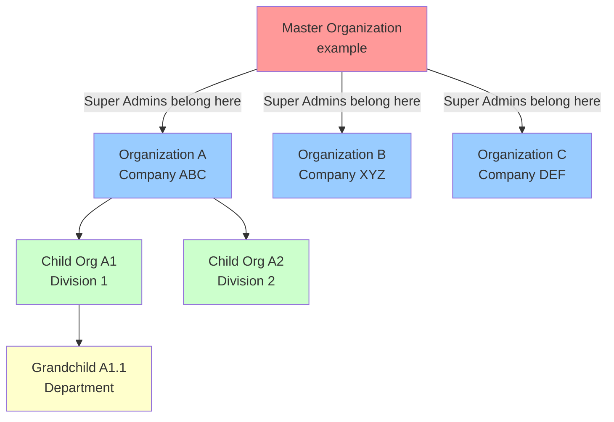

# Organization Domain

## Overview

The Organization Domain is the **foundation of multi-tenancy** in SelfAssess.id. It manages company/entity information and provides the fundamental boundary for data isolation, access control, and hierarchical relationships across the entire platform.

## Core Purpose

- **Multi-tenancy Boundary**: Organizations act as the primary data isolation unit
- **Data Scoping**: All tenant-specific data is scoped by `organization_id`
- **Access Control**: Role-based permissions are enforced at organization level
- **Hierarchical Structure**: Support for parent-child organization relationships
- **Master Organization**: Special system organization for Super Admins

---

## Entity Relationship Diagram

```mermaid
erDiagram
    Organization ||--o{ User : "has many"
    Organization ||--o{ Assessment : "has many"
    Organization ||--o{ Attachment : "has many"
    Organization ||--o{ Organization : "parent of"
    Organization {
        uuid id PK
        uuid parent_id FK
        string name UK
        text description
        boolean is_active
        timestamps
        soft_deletes
    }

    User {
        uuid id PK
        uuid organization_id FK
        string name
        string email UK
        timestamps
        soft_deletes
    }

    Assessment {
        uuid id PK
        uuid organization_id FK
        uuid standard_id FK
        string status
        date_period
        timestamps
        soft_deletes
    }

    Attachment {
        uuid id PK
        uuid organization_id FK
        string attachable_type
        uuid attachable_id
        string file_path
        timestamps
    }
```

---

## Organization Hierarchy



---

## Multi-Tenancy Business Rules

### 1. Organization as Multi-Tenant Boundary

**Core Principle**: All tenant-specific data MUST be scoped by `organization_id`.

**Scoped Entities:**
- **Users** - Each user belongs to exactly one organization
- **Assessments** - All assessments belong to an organization
- **Attachments** - File storage is organization-scoped
- **Future entities** - Any tenant-specific data MUST reference organization_id

**Implementation Pattern:**
```php
// Global scope for automatic data isolation
protected static function booted()
{
    static::addGlobalScope('organization', function (Builder $query) {
        if (auth()->check() && !auth()->user()->isSuperAdmin()) {
            $query->where('organization_id', auth()->user()->organization_id);
        }
    });
}
```

### 2. Master Organization

**Definition**: The master organization (config: `organization.master.name`, default: "example") is a special system organization with unique properties.

**Business Rules:**
- ✅ **Cannot be deleted** - Protected at model level
- ✅ **Cannot be renamed** - Name is used for identification
- ✅ **Contains Super Admins** - All Super Admin users belong here
- ✅ **No assessments** - Master org doesn't perform assessments
- ✅ **No regular users** - Only Super Admin role members

**Protection Mechanism:**
```php
// Organization model
public function isMaster(): bool
{
    return $this->name === config('organization.master.name');
}

protected static function boot()
{
    static::deleting(function ($organization) {
        if ($organization->isMaster()) {
            throw new \Exception('Cannot delete master organization');
        }
    });
}
```

### 3. Role-Based Access Control

#### **Super Admin** (Master Organization only)

**Capabilities:**
- ✅ Access ALL organizations (read/write)
- ✅ Create/Update/Delete any organization
- ✅ View all assessments across organizations
- ✅ Finalize assessments from any organization
- ✅ Cancel any assessment
- ✅ Review assessments from any organization

**Data Access:**
```php
// Super Admins bypass organization scoping
if (auth()->user()->isSuperAdmin()) {
    // Can access all organizations
    return Organization::all();
}
```

#### **Organization Admin** (Regular Organizations)

**Capabilities:**
- ✅ Full access to their organization only
- ✅ Manage users within their organization
- ✅ Create/Edit/Delete assessments (own org)
- ✅ Review assessment responses (own org)
- ✅ Request assessment finalization
- ❌ Cannot access other organizations
- ❌ Cannot delete organization

**Data Access:**
```php
// Automatically scoped to their organization
return Assessment::where('organization_id', auth()->user()->organization_id)->get();
```

#### **Organization User** (Regular Organizations)

**Capabilities:**
- ✅ View their organization's data only
- ✅ Fill assessment requirements
- ✅ Submit own responses for review
- ✅ View their organization's assessments
- ❌ Cannot manage users
- ❌ Cannot delete organization
- ❌ Cannot finalize assessments

**Data Access:**
```php
// Strict scoping - own organization only
$assessments = auth()->user()->organization->assessments;
```

### 4. Data Isolation Rules

**Strict Isolation:**
- Organization users **MUST NEVER** see data from other organizations
- All queries **MUST** include `organization_id` filter (except Super Admins)
- API responses **MUST NOT** leak organization data

**Validation Examples:**
```php
// Policy check example
public function view(User $user, Assessment $assessment)
{
    // Super Admin can see all
    if ($user->isSuperAdmin()) {
        return true;
    }

    // Regular users can only see their org's data
    return $assessment->organization_id === $user->organization_id;
}
```

### 5. Organization Deletion Rules

**Preconditions for Deletion:**
- ❌ Cannot delete master organization
- ❌ Cannot delete if has active users (`hasActiveMembers()`)
- ✅ Can delete if no active members (cascade deletes related data)

**Deletion Validation:**
```php
public function canBeDeleted(): bool
{
    return !$this->isMaster() && !$this->hasActiveMembers();
}
```

### 6. Hierarchy Rules

**Parent-Child Relationships:**
- `parent_id` is nullable (root organizations have null parent)
- Self-referencing foreign key with cascade delete
- No strict limit on hierarchy depth (recommend 2-3 levels)
- Children inherit deletion cascade from parent

**Query Patterns:**
```php
// Get all children
$children = $organization->children;

// Get parent
$parent = $organization->parent;

// Get root organizations
$roots = Organization::whereNull('parent_id')->get();
```

---

## Database Schema

### `organizations` Table

**Primary Key:** `uuid` (UUIDv7)

**Columns:**
| Column | Type | Attributes | Description |
|--------|------|------------|-------------|
| `id` | uuid | PK, UUIDv7 | Primary identifier |
| `parent_id` | uuid | FK, nullable | Self-referencing parent |
| `name` | string | unique, indexed | Organization name |
| `description` | text | nullable | Description |
| `is_active` | boolean | default: true, indexed | Active status |
| `created_at` | timestamp | | Creation time |
| `updated_at` | timestamp | | Last update |
| `deleted_at` | timestamp | nullable | Soft delete |

**Indexes:**
- Primary: `id`
- Unique: `name`
- Index: `is_active`
- Index: `parent_id`
- Index: `deleted_at`

**Relationships:**
- `parent_id` → `organizations.id` (self-referencing, cascade delete)

**Migration Files:**
- `0000_01_01_000000_create_organizations_table.php` - Base table
- `0007_01_01_000000_add_parent_id_to_organizations_table.php` - Hierarchy support

---

## Model Structure

### `Organization` Model

**Relationships:**
```php
// Self-referencing hierarchy
public function parent()
{
    return $this->belongsTo(Organization::class, 'parent_id');
}

public function children()
{
    return $this->hasMany(Organization::class, 'parent_id');
}

// Users
public function users()
{
    return $this->hasMany(User::class);
}

public function activeUsers()
{
    return $this->users()->active();
}

public function admins()
{
    return $this->users()->whereHas('roles', function ($q) {
        $q->where('name', 'organization_admin');
    });
}
```

**Helper Methods:**
```php
// Check if master organization
public function isMaster(): bool
{
    return $this->name === config('organization.master.name');
}

// Check if has active members
public function hasActiveMembers(): bool
{
    return $this->activeUsers()->exists();
}

// Validate deletion
public function canBeDeleted(): bool
{
    return !$this->isMaster() && !$this->hasActiveMembers();
}
```

**Traits Used:**
- `HasFactory` - Factory support
- `HasUuids` - UUIDv7 primary keys
- `SoftDeletes` - Soft deletion
- `Auditable` - Audit trail

---

## API Endpoints

### Public Endpoints (No Auth)
- `POST /api/organizations` - Create organization (initial setup only)

### Protected Endpoints (Auth Required)

#### Super Admin Only
- `GET /api/organizations` - List all organizations
- `POST /api/organizations` - Create new organization
- `GET /api/organizations/{id}` - Get organization details
- `PUT /api/organizations/{id}` - Update organization
- `DELETE /api/organizations/{id}` - Delete organization

#### Organization Admin & User
- `GET /api/organizations/current` - Get current user's organization
- `GET /api/organizations/{id}` - View own organization only

---

## Request Validation

### `StoreOrganizationRequest`

**Rules:**
```php
'name' => 'required|string|max:255|unique:organizations,name',
'description' => 'nullable|string',
'parent_id' => 'nullable|uuid|exists:organizations,id',
'is_active' => 'boolean',
```

**Additional Validation:**
- Parent organization must exist (if provided)
- Cannot set parent to master organization (if not Super Admin)
- Name must be unique across all organizations

### `UpdateOrganizationRequest`

**Rules:**
```php
'name' => 'sometimes|string|max:255|unique:organizations,name,{id}',
'description' => 'nullable|string',
'parent_id' => 'nullable|uuid|exists:organizations,id',
'is_active' => 'boolean',
```

**Additional Validation:**
- Cannot rename master organization
- Cannot change master organization's parent

---

## Resources

### `OrganizationResource`

**Output Structure:**
```json
{
  "id": "uuid",
  "name": "Organization Name",
  "description": "Description text",
  "is_active": true,
  "parent_id": "uuid|null",
  "parent": { "id": "uuid", "name": "Parent Name" }|null,
  "users_count": 42,
  "admins_count": 3,
  "has_active_members": true,
  "is_master": false,
  "created_at": "2024-01-01T00:00:00.000000Z",
  "updated_at": "2024-01-01T00:00:00.000000Z"
}
```

### `OrganizationCollection`

**Pagination:** Standard Laravel API resources pagination

**Includes:**
- Organization details
- Aggregate counts (users, admins)
- Hierarchy information (parent, children count)

---

## Configuration

### `config/organization.php`

```php
'master' => [
    'name' => env('MASTER_ORG_NAME', 'example'),
    'description' => env('MASTER_ORG_DESCRIPTION', 'Master organization for system administrators'),
    'email_domain' => env('MASTER_ORG_EMAIL_DOMAIN', 'example.com'),
],
```

**Environment Variables:**
- `MASTER_ORG_NAME` - Master organization name (default: "example")
- `MASTER_ORG_DESCRIPTION` - Description text
- `MASTER_ORG_EMAIL_DOMAIN` - Email domain for Super Admins

---

## Integration Points

### With User Domain

**Relationship:** `Organization hasMany Users`

**Key Interactions:**
- User creation requires valid organization_id
- Organization determines user's data access scope
- Organization Admins manage users within their organization
- Super Admins bypass organization scoping

**Policies:**
- Users can only see their organization members
- Org Admins can manage users in their organization
- Super Admins can manage all users across all organizations

### With Assessment Domain

**Relationship:** `Organization hasMany Assessments`

**Key Interactions:**
- All assessments must belong to an organization
- Assessment queries automatically scoped by organization
- Organization isolation enforced at query level

**Global Scope Pattern:**
```php
// Assessment model
protected static function booted()
{
    static::addGlobalScope('organization', function (Builder $query) {
        if (auth()->check() && !auth()->user()->isSuperAdmin()) {
            $query->where('organization_id', auth()->user()->organization_id);
        }
    });
}
```

### With Attachment Domain

**Relationship:** `Organization hasMany Attachments`

**Key Interactions:**
- File storage is organization-scoped
- Attachments have organization_id for isolation
- File access validation checks organization membership

**Security:**
- Users can only access files from their organization
- Super Admins can access all files
- File URLs are signed with organization context

---

## Best Practices

### 1. Always Check Organization Membership

```php
// Good - Explicit check
if ($assessment->organization_id !== auth()->user()->organization_id) {
    abort(403, 'Unauthorized');
}

// Better - Use policy
$this->authorize('view', $assessment);
```

### 2. Use Global Scopes for Automatic Scoping

```php
// Apply organization scope automatically
static::addGlobalScope('organization', function (Builder $query) {
    if (auth()->check() && !auth()->user()->isSuperAdmin()) {
        $query->where('organization_id', auth()->user()->organization_id);
    }
});
```

### 3. Validate Organization Ownership

```php
// In requests/actions
public function store(Request $request)
{
    $organization = Organization::findOrFail($request->organization_id);

    if (!auth()->user()->canAccessOrganization($organization->id)) {
        throw ValidationException::withMessages([
            'organization_id' => ['Invalid organization']
        ]);
    }
}
```

### 4. Handle Master Organization Carefully

```php
// Always check before operations
if ($organization->isMaster()) {
    throw new \Exception('Cannot modify master organization');
}
```

### 5. Use Soft Deletes

```php
// Preserve historical data
use SoftDeletes;

// Filter out deleted in queries
Organization::where('is_active', true)->get();
```

### 6. Keep Hierarchy Shallow

```php
// Recommend 2-3 levels max
Organization
├── Child Org (level 1)
│   └── Grandchild Org (level 2)
```

---

## Testing Considerations

### Test Scenarios

1. **Multi-Tenancy Isolation**
   - Verify users cannot access other organizations' data
   - Test Super Admin can access all organizations
   - Confirm queries are properly scoped

2. **Master Organization Protection**
   - Test master org cannot be deleted
   - Verify master org cannot be renamed
   - Confirm master org identification logic

3. **Hierarchy Operations**
   - Test parent-child relationships
   - Verify cascade delete behavior
   - Test orphan detection (parent deleted)

4. **Role-Based Access**
   - Test Org Admin permissions
   - Test regular User permissions
   - Test Super Admin global access

5. **Data Integrity**
   - Validate organization_id foreign keys
   - Test orphaned data prevention
   - Verify soft delete behavior

---

## Migration Reference

**Primary Migration:**
- `database/migrations/0000_01_01_000000_create_organizations_table.php`

**Hierarchy Support:**
- `database/migrations/0007_01_01_000000_add_parent_id_to_organizations_table.php`

**Database Resets:**
```bash
php artisan migrate:fresh --seed
```

**Important:** Never modify existing migrations. Edit original files if schema changes are needed.

---

## Related Documentation

- **Auth & Roles**: `/backend/app/Domain/Auth/README.md`
- **Assessment Domain**: `/backend/app/Domain/Assessment/README.md`
- **User Domain**: `/backend/app/Domain/User/README.md`

---

## Summary

The Organization Domain is the **cornerstone of multi-tenancy** in SelfAssess.id. All data isolation, access control, and hierarchical organization management flows through this domain. Understanding these business rules is critical for:

1. **Security**: Preventing data leaks between organizations
2. **Access Control**: Implementing proper role-based permissions
3. **Data Integrity**: Maintaining organization boundaries
4. **Scalability**: Supporting multiple tenants efficiently

**Key Takeaway**: Always consider organization scoping when implementing new features. If data belongs to a tenant, it MUST have an `organization_id`.
