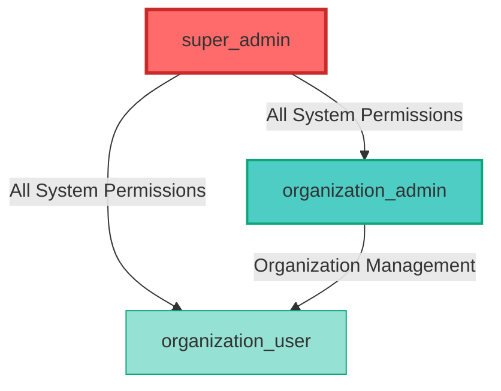
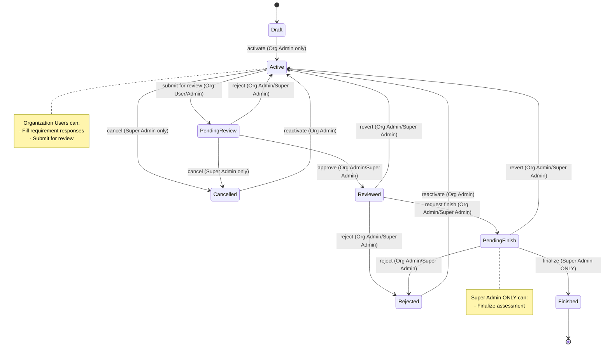
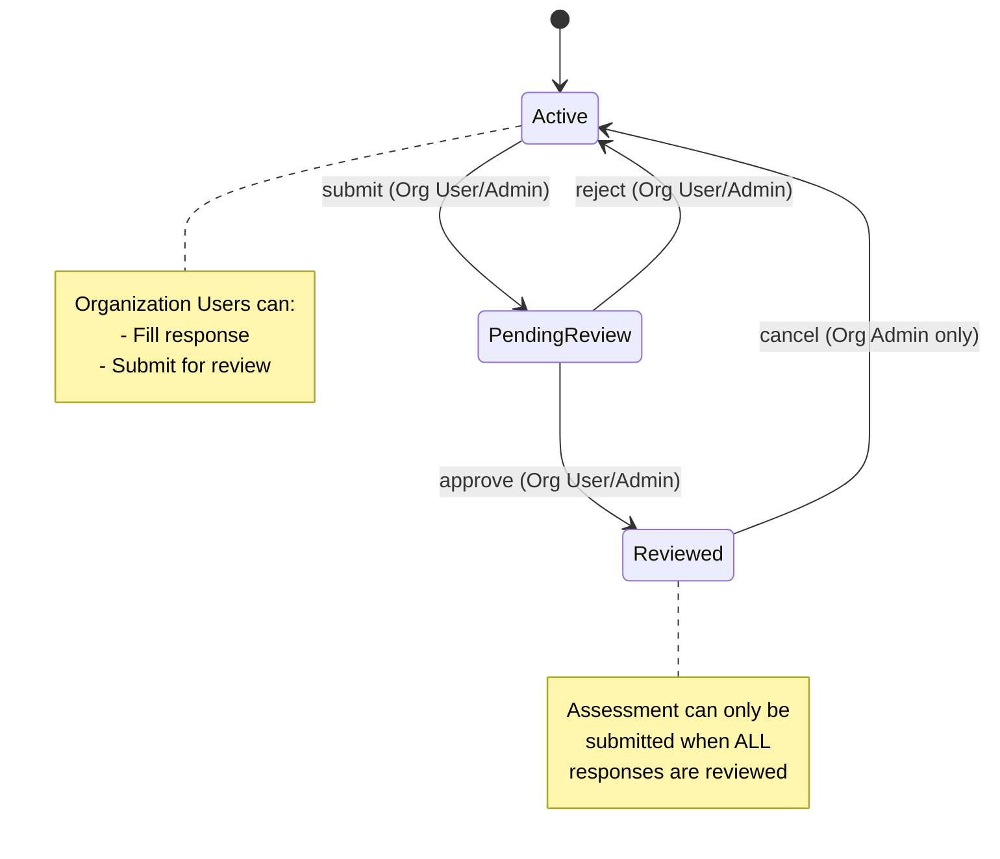
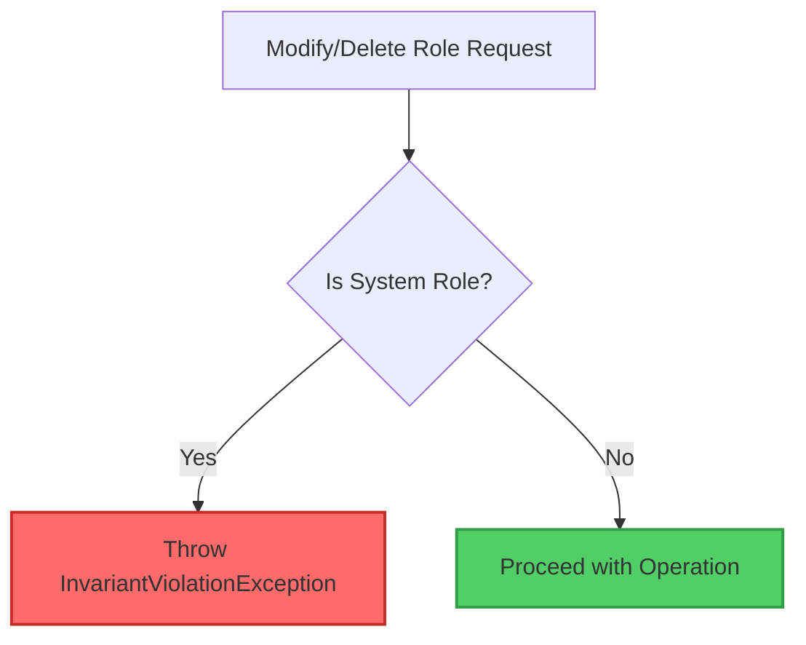
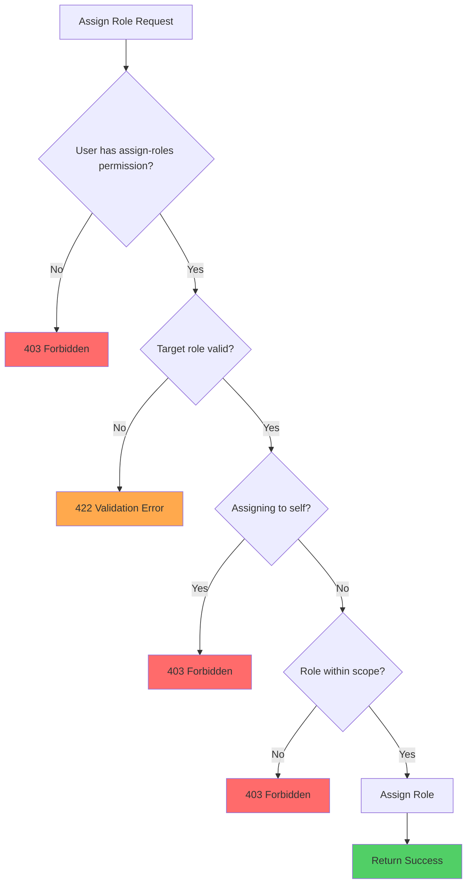
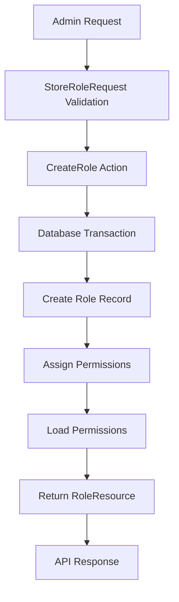
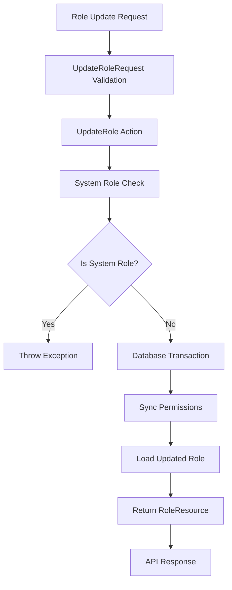
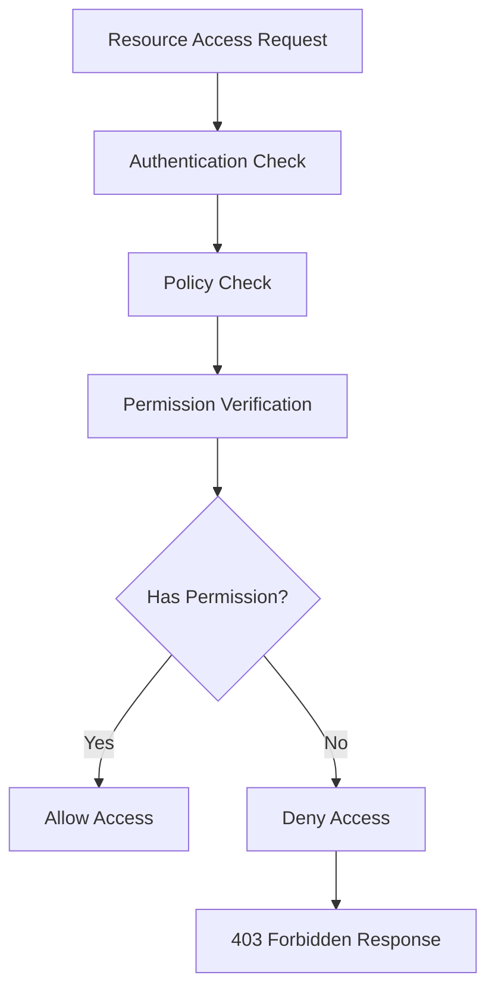

# Role Domain - Role-Based Access Control (RBAC)

## Table of Contents
1. [Domain Overview](#1-domain-overview)
2. [Business Rules](#2-business-rules)
3. [Role Hierarchy & Permissions](#3-role-hierarchy--permissions)
4. [Assessment Workflow Permissions](#4-assessment-workflow-permissions)
5. [Architecture Components](#5-architecture-components)
6. [API Documentation](#6-api-documentation)
7. [System vs Custom Roles](#7-system-vs-custom-roles)
8. [Permission System](#8-permission-system)
9. [Role Assignment Rules](#9-role-assignment-rules)
10. [Business Rules & Validation](#10-business-rules--validation)
11. [Data Flow](#11-data-flow)
12. [Dependencies & Integration](#12-dependencies--integration)
13. [Security Considerations](#13-security-considerations)
14. [Error Handling](#14-error-handling)
15. [Testing Guidelines](#15-testing-guidelines)
16. [Performance Considerations](#16-performance-considerations)
17. [Configuration](#17-configuration)
18. [Troubleshooting](#18-troubleshooting)

---

## 1. Domain Overview

The Role domain is responsible for managing Role-Based Access Control (RBAC) in the SelfAssess.id system. It provides a comprehensive framework for defining user roles, assigning granular permissions, and enforcing access control across all system domains.

### Purpose and Responsibilities
- **Role Management**: Create, update, and delete custom roles with specific permission sets
- **Permission Control**: Define granular permissions that control access to system resources
- **Access Enforcement**: Implement policies that ensure users can only access authorized resources
- **System Security**: Provide the foundational security layer for the entire application
- **Workflow Control**: Enforce assessment workflow transitions based on user roles

### Role in the RBAC System
The Role domain serves as the central authority for access control decisions throughout the SelfAssess.id system. It integrates with the Spatie Laravel Permission package to provide a robust, scalable RBAC implementation that:

- Separates access control logic from business logic
- Enables fine-grained permission management
- Supports hierarchical role structures
- Provides caching for optimal performance
- Enforces multi-level approval workflows

### Access Control Scope
The domain manages access control at multiple levels:
- **System Level**: Super Admin access to all resources across all organizations
- **Organization Level**: Organization Admin access to organization-specific resources
- **User Level**: Individual user permissions based on assigned roles
- **Workflow Level**: Role-based control over assessment status transitions

---

## 2. Business Rules

### Core RBAC Principles

1. **Spatie Laravel Permission Integration**
   - All role and permission management uses Spatie Laravel Permission package
   - Roles and permissions are stored in dedicated database tables
   - Automatic caching of permissions for performance optimization
   - Support for direct and wildcard permission checks

2. **Predefined System Roles**
   The system defines three predefined roles that cannot be modified or deleted:
   - `super_admin`: Full system access across all organizations
   - `organization_admin`: Organization-level management permissions
   - `organization_user`: Basic organization access permissions

3. **System Role Protection**
   - System roles are marked with `is_system = true` in the database
   - Cannot be modified, updated, or deleted through the API
   - Protected by business logic invariants in Actions
   - Enforced through Policy checks

4. **Custom Roles**
   - Super Admins can create custom roles with specific permission sets
   - Custom roles are marked with `is_system = false`
   - Can be modified and deleted by Super Admins
   - Flexible permission assignment for organizational needs

5. **Role Assignment Rules**
   - Only users with `assign-roles` permission can assign roles
   - Super Admins can assign any role within their organization
   - Organization Admins can assign organization-level roles only
   - Users cannot assign roles with higher privileges than their own

6. **Permission Naming Convention**
   - Permissions follow pattern: `<action>-<resource>`
   - Examples: `create-user`, `view-organizations`, `manage-roles`
   - All lowercase with hyphen separators
   - Consistent across all domains

### Multi-Tenancy Rules

1. **Organization Scoping**
   - Organization Admins can only manage users within their organization
   - Organization Users can only access their organization's data
   - Super Admins have cross-organization access

2. **Role Isolation**
   - Organization Admins cannot see or assign `super_admin` role
   - Custom roles are organization-specific by default
   - System roles are shared across all organizations

### Workflow Permission Rules

1. **Assessment Workflow Transitions**
   - Different roles can perform different status transitions
   - Some transitions require specific role permissions
   - Super Admins have override access to all transitions
   - Organization-level permissions scoped to organization data

2. **Two-Level Approval System**
   - Level 1: Individual requirement responses (Organization User → Organization Admin)
   - Level 2: Overall assessment (Organization Admin → Super Admin)
   - Assessment can only be submitted when ALL requirements are reviewed

---

## 3. Role Hierarchy & Permissions

### Role Hierarchy Diagram



### Permission Matrix

| Permission | super_admin | organization_admin | organization_user |
|------------|-------------|-------------------|-------------------|
| **User Management** |
| create-user | ✅ | ✅ | ❌ |
| view-users | ✅ | ✅ | ✅ |
| update-user | ✅ | ✅ | ❌ |
| delete-user | ✅ | ✅ | ❌ |
| transfer-user | ✅ | ❌ | ❌ |
| **Organization Management** |
| create-organization | ✅ | ❌ | ❌ |
| view-organizations | ✅ | ✅ | ✅ |
| update-organization | ✅ | ✅ | ❌ |
| delete-organization | ✅ | ❌ | ❌ |
| view-organization-members | ✅ | ✅ | ❌ |
| **Role Management** |
| manage-roles | ✅ | ❌ | ❌ |
| assign-roles | ✅ | ✅ | ❌ |
| view-roles | ✅ | ✅ | ✅ |
| view-permissions | ✅ | ✅ | ❌ |
| **Assessment Workflow** |
| activate-assessment | ✅ | ✅ | ❌ |
| submit-for-review | ✅ | ✅ | ✅ |
| approve-review | ✅ | ✅ | ❌ |
| request-finish | ✅ | ✅ | ❌ |
| finalize-assessment | ✅ | ❌ | ❌ |
| cancel-assessment | ✅ | ❌ | ❌ |
| **Cross-Organization Access** |
| access-all-organizations | ✅ | ❌ | ❌ |

### Role Capabilities Summary

#### super_admin
- **Scope**: System-wide, all organizations
- **Capabilities**:
  - Full CRUD on users, organizations, roles, permissions
  - All assessment workflow transitions including finalization
  - Cross-organization data access
  - System configuration management
- **Protection**: Cannot be assigned by Organization Admins

#### organization_admin
- **Scope**: Single organization
- **Capabilities**:
  - User management within organization
  - Organization profile updates
  - Role assignment (organization-level roles only)
  - Assessment workflow: activate, review, request finish
  - Cannot finalize assessments (requires Super Admin)
- **Limitations**: Cannot access other organizations' data

#### organization_user
- **Scope**: Single organization, read-mostly
- **Capabilities**:
  - View users and organization information
  - Fill assessment responses
  - Submit assessments for review
  - View roles and permissions
- **Limitations**: Cannot manage users, roles, or perform workflow transitions

---

## 4. Assessment Workflow Permissions

### Assessment Status Flow Diagram



### Workflow Transition Permissions

| Transition | From → To | Org User | Org Admin | Super Admin |
|-----------|-----------|----------|-----------|-------------|
| **activate** | draft → active | ❌ | ✅ | ✅ |
| **reactivate** | cancelled/rejected → active | ❌ | ✅ | ✅ |
| **submit** | active → pending_review | ✅ | ✅ | ✅ |
| **approve** | pending_review → reviewed | ❌ | ✅ | ✅ |
| **reject** | pending_review → active | ❌ | ✅ | ✅ |
| **revert from reviewed** | reviewed → active | ❌ | ✅ | ✅ |
| **request finish** | reviewed → pending_finish | ❌ | ✅ | ✅ |
| **finalize** | pending_finish → finished | ❌ | ❌ | ✅ **EXCLUSIVE** |
| **revert from pending_finish** | pending_finish → active | ❌ | ✅ | ✅ |
| **reject** | reviewed/pending_finish → rejected | ❌ | ✅ | ✅ |
| **cancel** | any → cancelled | ❌ | ❌ | ✅ |

### Assessment Response Status Flow



### Critical Workflow Rules

1. **Requirement Completion Rule**
   - Assessment can only be submitted to `pending_review` when **ALL** AssessmentResponse statuses are `reviewed`
   - Enforced at Action level before allowing transition

2. **Finalization Exclusivity**
   - Only Super Admin can finalize assessment (`pending_finish → finished`)
   - Organization Admins can only request finish, not complete it

3. **Reversion Rights**
   - Organization Admins can revert from `reviewed` or `pending_finish` back to `active`
   - Super Admins can revert from any state except `finished`

4. **Cancellation Authority**
   - Only Super Admins can cancel assessments
   - Cannot cancel `finished` assessments
   - Cancelled assessments can be reactivated by Org Admins

---

## 5. Architecture Components

The Role domain follows a clean architecture pattern with clear separation of concerns:

### Controller: AdminRoleController
The [`AdminRoleController`](/Users/bakhas/Herd/SelfAssess.id/backend/app/Domain/Role/Controllers/AdminRoleController.php) handles HTTP requests for role and permission management:

```php
class AdminRoleController extends Controller
{
    public function __construct(
        protected RoleQueryService $roleQueryService,
        protected CreateRole $createRole,
        protected UpdateRole $updateRole,
        protected DeleteRole $deleteRole
    ) {
        $this->authorizeResource(Role::class, 'role');
    }
}
```

**Key Features:**
- Resource-based authorization using Laravel's `authorizeResource`
- Dependency injection for all business logic components
- Standardized JSON response format
- Proper HTTP status codes for different operations

### Actions: SuperAdmin Operations
The Actions directory contains business logic for role management:

#### CreateRole
[`CreateRole`](/Users/bakhas/Herd/SelfAssess.id/backend/app/Domain/Role/Actions/SuperAdmin/CreateRole.php) handles the creation of new custom roles:

```php
public function execute(array $data): Role
{
    return DB::transaction(function () use ($data) {
        $role = Role::create([
            'name' => $data['name'],
            'guard_name' => $data['guardName'] ?? 'api',
        ]);

        if (!empty($data['permissions'])) {
            $role->givePermissionTo($data['permissions']);
        }

        return $role->load('permissions');
    });
}
```

#### UpdateRole
[`UpdateRole`](/Users/bakhas/Herd/SelfAssess.id/backend/app/Domain/Role/Actions/SuperAdmin/UpdateRole.php) manages role modifications with system role protection:

```php
public function execute(Role $role, array $data): Role
{
    // Guard against modifying system roles
    if ($role->is_system) {
        throw new InvariantViolationException('Cannot modify system roles');
    }
    // ... update logic
}
```

#### DeleteRole
[`DeleteRole`](/Users/bakhas/Herd/SelfAssess.id/backend/app/Domain/Role/Actions/SuperAdmin/DeleteRole.php) handles role deletion with protection for system roles:

```php
public function execute(Role $role): bool
{
    // Guard against deleting system roles
    if ($role->is_system) {
        throw new InvariantViolationException('Cannot delete system roles');
    }

    return $role->delete();
}
```

### Query Service: RoleQueryService
The [`RoleQueryService`](/Users/bakhas/Herd/SelfAssess.id/backend/app/Domain/Role/Queries/RoleQueryService.php) provides centralized data access with role-based scoping:

```php
public function getRolesForUser(User $user): Collection
{
    if ($user->isSuperAdmin()) {
        return Role::with('permissions')->get();
    }

    // Organization users can only see organization-level roles (not super_admin)
    return Role::with('permissions')
        ->where('is_system', true)
        ->where('name', '!=', 'super_admin')
        ->get();
}
```

**Key Methods:**
- `getRolesForUser()`: Returns roles scoped to user's access level
- `getOrganizationRoles()`: Returns organization-level roles (excludes super_admin)
- `getSystemRoles()`: Returns all system roles
- `getCustomRoles()`: Returns all custom (non-system) roles
- `getAllPermissions()`: Returns all available permissions

### Resources: Data Transformation
The Resources directory contains API response transformers:

#### RoleResource
[`RoleResource`](/Users/bakhas/Herd/SelfAssess.id/backend/app/Domain/Role/Resources/RoleResource.php) transforms role data for API responses:

```php
public function toArray($request): array
{
    return [
        'id' => $this->id,
        'name' => $this->name,
        'guardName' => $this->guard_name,
        'isSystem' => $this->is_system ?? false,
        'permissions' => $this->whenLoaded('permissions', fn () => $this->permissions->pluck('name')),
        'createdAt' => $this->created_at?->toIso8601String(),
        'updatedAt' => $this->updated_at?->toIso8601String(),
    ];
}
```

#### PermissionResource
[`PermissionResource`](/Users/bakhas/Herd/SelfAssess.id/backend/app/Domain/Role/Resources/PermissionResource.php) transforms permission data:

```php
public function toArray($request): array
{
    return [
        'id' => $this->id,
        'name' => $this->name,
        'guardName' => $this->guard_name,
        'createdAt' => $this->created_at?->toIso8601String(),
        'updatedAt' => $this->updated_at?->toIso8601String(),
    ];
}
```

### Policies: Authorization Logic
The [`RolePolicy`](/Users/bakhas/Herd/SelfAssess.id/backend/app/Domain/Role/Policies/RolePolicy.php) implements authorization rules:

```php
public function create(User $user): bool
{
    return $user->can('manage-roles') || $user->isSuperAdmin();
}

public function viewPermissions(User $user): bool
{
    return $user->isSuperAdmin();
}
```

**Authorization Rules:**
- Super Admins can perform all operations
- Organization Admins can view roles but not manage them
- Permission viewing is restricted to Super Admins only

---

## 6. API Documentation

### Base URL
```
/api/admin
```

### Authentication
All endpoints require authentication via the `auth:api` middleware.

### Endpoints

#### List Roles
```http
GET /api/admin/roles
```

**Description:** Retrieves all roles accessible to the authenticated user.

**Response:**
```json
{
  "data": [
    {
      "id": 1,
      "name": "super_admin",
      "guardName": "api",
      "isSystem": true,
      "permissions": ["create-user", "view-users", "manage-roles"],
      "createdAt": "2023-01-01T00:00:00.000Z",
      "updatedAt": "2023-01-01T00:00:00.000Z"
    }
  ]
}
```

**Authorization:**
- Super Admin: Can see all roles
- Organization Admin: Can see organization-level roles only

#### Get Role Details
```http
GET /api/admin/roles/{id}
```

**Description:** Retrieves detailed information about a specific role including its permissions.

**Response:**
```json
{
  "data": {
    "id": 1,
    "name": "organization_admin",
    "guardName": "api",
    "isSystem": true,
    "permissions": ["create-user", "view-users", "assign-roles"],
    "createdAt": "2023-01-01T00:00:00.000Z",
    "updatedAt": "2023-01-01T00:00:00.000Z"
  }
}
```

#### Create Role
```http
POST /api/admin/roles
```

**Description:** Creates a new custom role with specified permissions.

**Request Body:**
```json
{
  "name": "custom_role",
  "guardName": "api",
  "permissions": ["view-users", "view-organizations"]
}
```

**Response:**
```json
{
  "message": "Role created successfully",
  "data": {
    "id": 4,
    "name": "custom_role",
    "guardName": "api",
    "isSystem": false,
    "permissions": ["view-users", "view-organizations"],
    "createdAt": "2023-01-01T00:00:00.000Z",
    "updatedAt": "2023-01-01T00:00:00.000Z"
  }
}
```

**Authorization:** Super Admin only

#### Update Role
```http
PUT /api/admin/roles/{id}
```

**Description:** Updates an existing custom role's name or permissions.

**Request Body:**
```json
{
  "name": "updated_role_name",
  "permissions": ["view-users", "view-organizations", "assign-roles"]
}
```

**Response:**
```json
{
  "message": "Role updated successfully",
  "data": {
    "id": 4,
    "name": "updated_role_name",
    "guardName": "api",
    "isSystem": false,
    "permissions": ["view-users", "view-organizations", "assign-roles"],
    "createdAt": "2023-01-01T00:00:00.000Z",
    "updatedAt": "2023-01-02T00:00:00.000Z"
  }
}
```

**Authorization:** Super Admin only

#### Delete Role
```http
DELETE /api/admin/roles/{id}
```

**Description:** Deletes a custom role from the system.

**Response:**
```json
{
  "message": "Role deleted successfully"
}
```

**Authorization:** Super Admin only

#### List Permissions
```http
GET /api/admin/permissions
```

**Description:** Retrieves all available permissions in the system.

**Response:**
```json
{
  "data": [
    {
      "id": 1,
      "name": "create-user",
      "guardName": "api",
      "createdAt": "2023-01-01T00:00:00.000Z",
      "updatedAt": "2023-01-01T00:00:00.000Z"
    },
    {
      "id": 2,
      "name": "view-users",
      "guardName": "api",
      "createdAt": "2023-01-01T00:00:00.000Z",
      "updatedAt": "2023-01-01T00:00:00.000Z"
    }
  ]
}
```

**Authorization:** Super Admin only

### Error Response Format
All error responses follow a consistent format:

```json
{
  "message": "Error description",
  "errors": {
    "field": ["Error message for field"]
  }
}
```

### Common HTTP Status Codes
- `200 OK`: Successful GET request
- `201 Created`: Successful POST request
- `204 No Content`: Successful DELETE request
- `400 Bad Request`: Validation errors
- `401 Unauthorized`: Authentication required
- `403 Forbidden`: Insufficient permissions
- `404 Not Found`: Resource not found
- `422 Unprocessable Entity`: Validation failed

---

## 7. System vs Custom Roles

### System Roles

System roles are predefined roles that are essential for system operation:

1. **super_admin**: Full system access with all permissions
2. **organization_admin**: Organization-level management permissions
3. **organization_user**: Basic organization access permissions

**Characteristics:**
- Marked with `is_system = true` in the database
- Cannot be modified or deleted
- Created during system initialization via `RolePermissionSeeder`
- Protected by business logic invariants
- Shared across all organizations

### Custom Roles

Custom roles are user-defined roles for specific organizational needs:

**Characteristics:**
- Marked with `is_system = false` in the database
- Can be created, modified, and deleted by Super Admins
- Flexible permission assignment
- Organization-specific use cases
- Can be assigned any combination of existing permissions

### Role Type Comparison

| Feature | System Roles | Custom Roles |
|---------|-------------|--------------|
| Creation | Via seeder | Via API by Super Admin |
| Modification | ❌ Protected | ✅ Editable by Super Admin |
| Deletion | ❌ Protected | ✅ Deletable by Super Admin |
| `is_system` flag | `true` | `false` |
| Availability | All organizations | Organization-specific |
| Permission flexibility | Predefined | Fully customizable |

### Protected Role Constraints

System roles are protected by multiple layers of validation:

1. **Database Level**: `is_system` flag prevents direct deletion
2. **Application Level**: Invariant checks in Actions throw exceptions
3. **Policy Level**: Authorization checks in RolePolicy
4. **API Level**: Request validation prevents modification



---

## 8. Permission System

### Granular Permission Structure

The system implements a granular permission model with the following categories:

#### User Management Permissions
- `create-user`: Create new users
- `view-users`: View user lists and details
- `update-user`: Modify user information
- `delete-user`: Remove users from system
- `transfer-user`: Transfer users between organizations

#### Organization Management Permissions
- `create-organization`: Create new organizations
- `view-organizations`: View organization lists and details
- `update-organization`: Modify organization information
- `delete-organization`: Remove organizations
- `view-organization-members`: View organization member lists

#### Role Management Permissions
- `manage-roles`: Create, update, and delete custom roles
- `assign-roles`: Assign roles to users
- `view-roles`: View role lists and details
- `view-permissions`: View available permissions

### Permission Naming Conventions

Permissions follow a consistent naming pattern:
```
<action>-<resource>
```

Examples:
- `create-user`: Create action on user resource
- `view-organizations`: View action on organizations resource
- `manage-roles`: Manage action on roles resource

All permissions are:
- Lowercase
- Use hyphen separators
- Follow verb-noun pattern
- Consistent across all domains

### Dynamic Permission Assignment

Permissions can be dynamically assigned to roles:

```php
// Grant specific permissions
$role->givePermissionTo('create-user', 'view-users');

// Sync permissions (replaces existing)
$role->syncPermissions(['create-user', 'view-users', 'update-user']);

// Remove specific permissions
$role->revokePermissionTo('delete-user');
```

---

## 9. Role Assignment Rules

### Assignment Authority

Only users with the `assign-roles` permission can assign roles to other users.

```php
// User model must have HasRoles trait
class User extends Authenticatable
{
    use HasRoles;
}
```

### Role Assignment Constraints

1. **Self-Assignment Prevention**
   - Users cannot assign roles to themselves
   - Prevents privilege escalation

2. **Higher Privilege Prevention**
   - Organization Admins cannot assign `super_admin` role
   - Users cannot assign roles with more permissions than they have

3. **Organization Scoping**
   - Organization Admins can only assign roles within their organization
   - Super Admins can assign roles across all organizations

4. **Role Existence Validation**
   - Assigned role must exist in the system
   - System roles validated against predefined list

### Assignment Workflow Diagram



### Role Assignment Examples

```php
// Super Admin assigning any role
$superAdmin->assignRole('super_admin');
$user->assignRole('organization_admin');

// Organization Admin assigning organization-level role
$orgAdmin->assignRole('organization_admin');
$user->assignRole('organization_user');

// Error: Organization Admin trying to assign super_admin
$orgAdmin->assignRole('super_admin'); // ❌ throws exception
```

---

## 10. Business Rules & Validation

### Role Creation Constraints

1. **Unique Names**: Role names must be unique across the system
2. **Permission Validation**: All assigned permissions must exist in the system
3. **Guard Name**: Default guard is 'api' for API authentication
4. **System Role Protection**: Cannot create roles with system role names
5. **Transaction Safety**: Role creation wrapped in database transaction

### Permission Assignment Rules

1. **Existence Check**: Permissions must exist before assignment
2. **Guard Compatibility**: Permissions must match role's guard name
3. **Transaction Safety**: Permission assignments are wrapped in database transactions
4. **Bulk Assignment**: Multiple permissions can be assigned simultaneously

### System Role Protection

System roles are protected by multiple validation layers:

```php
// Invariant check in UpdateRole
if ($role->is_system) {
    throw new InvariantViolationException('Cannot modify system roles');
}

// Invariant check in DeleteRole
if ($role->is_system) {
    throw new InvariantViolationException('Cannot delete system roles');
}
```

### Role Deletion Constraints

1. **System Role Protection**: System roles cannot be deleted
2. **User Assignment Check**: Roles assigned to users cannot be deleted
3. **Dependency Check**: Roles referenced by other system components cannot be deleted

### Validation Rules

#### StoreRoleRequest
```php
public function rules(): array
{
    return [
        'name' => 'required|string|max:255|unique:roles,name',
        'guardName' => 'sometimes|string|default:api',
        'permissions' => 'sometimes|array',
        'permissions.*' => 'exists:permissions,name',
    ];
}
```

#### UpdateRoleRequest
```php
public function rules(): array
{
    $id = $this->route('id');

    return [
        'name' => 'sometimes|string|max:255|unique:roles,name,' . $id,
        'permissions' => 'sometimes|array',
        'permissions.*' => 'exists:permissions,name',
    ];
}
```

---

## 11. Data Flow

### Role Creation Flow



### Permission Assignment Flow



### Role Modification Flow

```mermaid
graph TD
    A[PUT /api/admin/roles/{id}] --> B[Authentication Check]
    B --> C[Authorization Check]
    C --> D[Request Validation]
    D --> E[UpdateRole Action]
    E --> F[Business Rule Validation]
    F --> G[Database Update]
    G --> H[Permission Sync]
    H --> I[Response Formatting]
    I --> J[JSON Response]
```

### Permission Checking Flow



---

## 12. Dependencies & Integration

### Integration with User Domain

The Role domain integrates with the User domain through:

1. **Role Assignment**: Users are assigned roles via the User domain
2. **Permission Inheritance**: Users inherit permissions from assigned roles
3. **Authorization Checks**: User domain methods check role-based permissions

```php
// User model integration
class User extends Authenticatable
{
    use HasRoles; // From Spatie package

    public function isSuperAdmin(): bool
    {
        return $this->hasRole('super_admin');
    }

    public function isOrganizationAdmin(): bool
    {
        return $this->hasRole('organization_admin');
    }
}
```

### Integration with Auth Domain

The Auth domain provides the foundation for role-based access:

1. **Authentication**: User authentication precedes authorization
2. **Token-based Access**: JWT tokens include role information
3. **Session Management**: Auth sessions maintain user context

### Spatie Laravel Permission Package Usage

The system leverages the Spatie Laravel Permission package for:

1. **Role-Permission Relationships**: Many-to-many relationships
2. **Permission Caching**: Automatic permission caching for performance
3. **Policy Integration**: Seamless integration with Laravel policies
4. **Database Structure**: Standardized database schema for RBAC

### Cross-Domain Permission Consistency

The Role domain ensures consistency across domains through:

1. **Centralized Permission Definitions**: Single source of truth for permissions
2. **Shared Policy Patterns**: Consistent authorization patterns
3. **Global Middleware**: System-wide permission enforcement
4. **Standardized API Responses**: Consistent error handling

### Integration with Assessment Domain

The Role domain works with the Assessment domain to enforce workflow permissions:

1. **Workflow Transitions**: Role-based control over assessment status changes
2. **Two-Level Approval**: Different roles for different approval levels
3. **Finalization Authorization**: Super Admin exclusive access to finalization
4. **Policy Enforcement**: Assessment policies check user roles

---

## 14. Error Handling

### Role Validation Errors

The system provides clear validation error messages:

```json
{
  "message": "The given data was invalid.",
  "errors": {
    "name": ["The name has already been taken."],
    "permissions.0": ["The selected permissions.0 is invalid."]
  }
}
```

### Permission Assignment Errors

Permission assignment failures are handled gracefully:

```php
// Invalid permission handling
if (!Permission::where('name', $permission)->exists()) {
    throw new ValidationException("Permission '{$permission}' does not exist");
}
```

### Authorization Failure Responses

Authorization failures return standardized responses:

```json
{
  "message": "This action is unauthorized.",
  "status": 403
}
```

### Constraint Violation Handling

Business rule violations throw specific exceptions:

```php
// System role protection
if ($role->is_system) {
    throw new InvariantViolationException('Cannot modify system roles');
}
```

### Exception Hierarchy

The domain uses a structured exception hierarchy:

1. `InvariantViolationException`: Business rule violations
2. `ValidationDomainException`: Domain-specific validation errors
3. `AuthorizationException`: Permission-based access denials
4. `DomainException`: General domain errors

---

## 15. Testing Guidelines

### Unit Testing Strategies for RBAC

#### Testing Role Creation
```php
public function test_can_create_custom_role()
{
    $superAdmin = User::factory()->create();
    $superAdmin->assignRole('super_admin');

    $response = $this->actingAs($superAdmin)
        ->postJson('/api/admin/roles', [
            'name' => 'test_role',
            'permissions' => ['view-users']
        ]);

    $response->assertStatus(201)
        ->assertJsonStructure([
            'message',
            'data' => [
                'id', 'name', 'guardName', 'isSystem', 'permissions'
            ]
        ]);
}
```

#### Testing System Role Protection
```php
public function test_cannot_modify_system_role()
{
    $superAdmin = User::factory()->create();
    $superAdmin->assignRole('super_admin');
    $systemRole = Role::where('name', 'organization_admin')->first();

    $response = $this->actingAs($superAdmin)
        ->putJson("/api/admin/roles/{$systemRole->id}", [
            'name' => 'modified_role'
        ]);

    $response->assertStatus(422)
        ->assertJsonFragment([
            'message' => 'Cannot modify system roles'
        ]);
}
```

### Integration Testing for Permissions

#### Testing Permission Enforcement
```php
public function test_permission_enforcement()
{
    $orgAdmin = User::factory()->create();
    $orgAdmin->assignRole('organization_admin');

    // Organization admin should not be able to view permissions
    $response = $this->actingAs($orgAdmin)
        ->getJson('/api/admin/permissions');

    $response->assertStatus(403);
}
```

### Security Testing Considerations

1. **Privilege Escalation Tests**: Verify users cannot elevate their privileges
2. **Cross-tenant Data Access**: Ensure data isolation between organizations
3. **Authentication Bypass**: Test for unauthorized access attempts
4. **Input Validation**: Verify all inputs are properly sanitized

### Role-Based Access Testing

#### Testing Role Scoping
```php
public function test_role_data_scoping()
{
    $orgAdmin = User::factory()->create();
    $orgAdmin->assignRole('organization_admin');

    $response = $this->actingAs($orgAdmin)
        ->getJson('/api/admin/roles');

    $response->assertStatus(200)
        ->assertJsonMissing(['name' => 'super_admin']);
}
```

---

## 16. Performance Considerations

### Permission Caching Strategies

The system implements efficient permission caching:

1. **Automatic Cache Invalidation**: Cache clears on permission changes
2. **24-hour Cache Duration**: Balances performance and freshness
3. **Memory-efficient Storage**: Optimized cache structure

```php
// Cache configuration from config/permission.php
'cache' => [
    'expiration_time' => \DateInterval::createFromDateString('24 hours'),
    'key' => 'spatie.permission.cache',
    'store' => 'default',
],
```

### Role Resolution Optimization

Role resolution is optimized through:

1. **Eager Loading**: Permissions are loaded with roles to prevent N+1 queries
2. **Database Indexing**: Proper indexes on role and permission tables
3. **Query Optimization**: Efficient database queries for role lookups

```php
// Eager loading example
return Role::with('permissions')->get();
```

### Bulk Permission Operations

The system supports efficient bulk operations:

1. **Transaction Wrapping**: Bulk operations are atomic
2. **Batch Processing**: Large permission sets are processed efficiently
3. **Memory Management**: Optimized memory usage for large datasets

### Query Optimization

Database queries are optimized for performance:

1. **Indexed Columns**: Frequently queried columns are indexed
2. **Query Scoping**: Queries are scoped to minimize data retrieval
3. **Connection Pooling**: Database connections are efficiently managed

---

## 17. Configuration

### RBAC Configuration Settings

The Spatie Laravel Permission package is configured in [`config/permission.php`](/Users/bakhas/Herd/SelfAssess.id/backend/config/permission.php):

```php
return [
    'models' => [
        'permission' => Spatie\Permission\Models\Permission::class,
        'role' => Spatie\Permission\Models\Role::class,
    ],
    'table_names' => [
        'roles' => 'roles',
        'permissions' => 'permissions',
        'model_has_permissions' => 'model_has_permissions',
        'model_has_roles' => 'model_has_roles',
        'role_has_permissions' => 'role_has_permissions',
    ],
    // ... other configuration
];
```

### Permission Definitions

System permissions are defined in the database seeder:

```php
// From database/seeders/RolePermissionSeeder.php
$permissions = [
    'create-user',
    'view-users',
    'update-user',
    'delete-user',
    'transfer-user',
    'create-organization',
    'view-organizations',
    'update-organization',
    'delete-organization',
    'view-organization-members',
    'manage-roles',
    'assign-roles',
    'view-roles',
    'view-permissions',
];
```

### Environment Variables

No specific environment variables are required for the Role domain, but it depends on:

1. `DB_CONNECTION`: Database connection for role/permission storage
2. `CACHE_DRIVER`: Cache driver for permission caching
3. `AUTH_GUARD`: Authentication guard configuration

### Package Configuration

The Spatie Laravel Permission package provides additional configuration options:

1. **Wildcard Permissions**: Enable wildcard permission matching
2. **Teams Feature**: Multi-tenant role support (disabled in this implementation)
3. **Event System**: Enable role/permission change events
4. **Cache Settings**: Configure permission caching behavior

---

## 18. Troubleshooting

### Common RBAC Issues

#### Permission Not Working
**Symptoms:** User with correct role cannot access protected resource

**Solutions:**
1. Clear permission cache: `php artisan cache:clear`
2. Verify role assignment: Check user has the expected role
3. Verify permission assignment: Check role has the expected permission
4. Check policy implementation: Verify policy methods return correct values

#### Role Changes Not Taking Effect
**Symptoms:** Modified role permissions don't apply immediately

**Solutions:**
1. Clear permission cache: `php artisan permission:cache-reset`
2. Restart application: Clear any in-memory caches
3. Verify database changes: Check role_has_permissions table
4. Check for middleware caching: Ensure no middleware caches permissions

### Permission Resolution Problems

#### Inconsistent Permission Checks
**Symptoms:** Permission checks return different results in different contexts

**Solutions:**
1. Check guard names: Ensure consistent guard usage
2. Verify user authentication: Ensure user is properly authenticated
3. Check policy registration: Verify policies are registered
4. Review middleware order: Ensure authorization middleware is correctly ordered

### Role Assignment Debugging

#### Role Not Assigned to User
**Symptoms:** User doesn't have expected role after assignment

**Solutions:**
1. Check database: Verify model_has_roles table entry
2. Verify role existence: Ensure role exists in roles table
3. Check for exceptions: Review logs for assignment errors
4. Validate user model: Ensure user model uses HasRoles trait

### Performance Tuning Tips

#### Slow Permission Checks
**Symptoms:** Permission checks are slow, especially with many roles/permissions

**Solutions:**
1. Enable permission caching: Configure cache in permission.php
2. Optimize database queries: Add indexes to frequently queried columns
3. Use eager loading: Load permissions with roles when possible
4. Consider permission grouping: Group related permissions for bulk checks

#### Memory Usage Issues
**Symptoms:** High memory usage when loading roles/permissions

**Solutions:**
1. Implement pagination: For large role/permission lists
2. Use selective loading: Only load needed permissions
3. Optimize cache configuration: Adjust cache size and duration
4. Profile queries: Identify and optimize expensive queries

---

## Version Information

**Last Updated:** February 7, 2026
**Version:** 2.0.0
**Laravel Version:** 12.x
**Spatie Laravel Permission Version:** 6.x

**Changelog:**
- **v2.0.0** (Feb 2026): Added comprehensive business rules, mermaid diagrams for role hierarchy and assessment workflow, role assignment rules, updated for Laravel 12
- **v1.0.0** (Dec 2023): Initial RBAC implementation with Spatie Laravel Permission

---

## Additional Resources

- [Spatie Laravel Permission Documentation](https://spatie.be/docs/laravel-permission/v6/introduction)
- [Laravel Authorization Documentation](https://laravel.com/docs/12.x/authorization)
- [Laravel Policies Documentation](https://laravel.com/docs/12.x/authorization#creating-policies)
- [Assessment Workflow Documentation](/Users/bakhas/Herd/SelfAssess.id/backend/app/Domain/Assessment/README.md)
- [Application Flow Guide](/Users/bakhas/Herd/SelfAssess.id/docs/APPLICATION_FLOW.md)

---

## Quick Reference

### Role Helper Methods

```php
// Check if user has specific role
$user->hasRole('super_admin');

// Check if user has any of the given roles
$user->hasAnyRole(['super_admin', 'organization_admin']);

// Check if user has all roles
$user->hasAllRoles(['organization_admin', 'organization_user']);

// Check if user has specific permission
$user->hasPermissionTo('create-user');

// Assign role to user
$user->assignRole('organization_admin');

// Remove role from user
$user->removeRole('organization_user');

// Sync user roles (removes all existing, adds new)
$user->syncRoles(['organization_admin']);
```

### Permission Helper Methods

```php
// Give permission to role
$role->givePermissionTo('create-user');

// Sync permissions (replaces existing)
$role->syncPermissions(['create-user', 'view-users']);

// Revoke specific permission
$role->revokePermissionTo('delete-user');

// Check if role has permission
$role->hasPermissionTo('create-user');
```

### Common Patterns

```php
// Super Admin check in policies
public function before(User $user)
{
    if ($user->isSuperAdmin()) {
        return true;
    }
}

// Organization access check
public function canAccessOrganization(string $organizationId): bool
{
    return $this->isSuperAdmin() || $this->organization_id === $organizationId;
}

// Workflow transition check
public function transition(User $user, Assessment $assessment, string $toStatus): bool
{
    if ($user->isSuperAdmin()) {
        return true;
    }

    return match ($toStatus) {
        AssessmentStatus::ACTIVE->value => $this->canActivate($user, $assessment),
        AssessmentStatus::PENDING_REVIEW->value => $this->canSubmitForReview($user, $assessment),
        // ... other transitions
        default => false,
    };
}
```