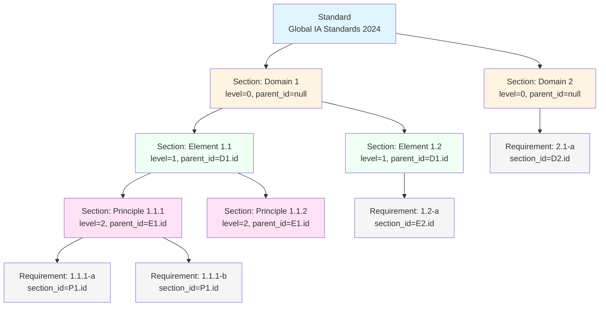

# Standard Domain

## Overview

The Standard Domain manages quality standards, frameworks, and body of knowledge that organizations use for assessments. It provides a **flexible 3-level hierarchical structure** to represent any standard's organization.

## Business Rules

### 1. Standard as Master Template

- **Standards are master templates** that define assessment criteria
- Organizations create **Assessments** based on **Standards**
- Each Assessment references exactly ONE Standard
- Standard is **immutable during active assessment** (cannot modify while in use)
- Multiple versions of same standard can exist (e.g., "ISO 9001:2015", "ISO 9001:2025")

### 2. Three-Level Hierarchy

The standard uses a flexible tree structure:

```
Standard (e.g., "Global Internal Audit Standards 2024")
└── Standard Section (Level 0: Domain)
    └── Standard Section (Level 1: Element)
        └── Standard Section (Level 2: Principle) [optional]
            └── Standard Requirement (Assessable item)
```

**Key Rules:**
- **Standard** is the root entity (name, version, type)
- **StandardSection** is a recursive tree node (can have unlimited nesting)
- **StandardRequirement** is the leaf node (actual assessable criteria)
- Only requirements can be assessed, sections provide organization

### 3. Standard Types

Five main categories with examples:

| Type | Description | Examples |
|------|-------------|----------|
| **internal** | Organization-specific policies and frameworks | Company policies, internal SOPs |
| **regulatory** | Government or regulatory body mandated standards | SOX, GDPR, HIPAA, Basel III, MiFID II |
| **standard** | International standards and certifications | ISO 9001, ISO 27001, ISO 31000, ISO 20000 |
| **bestPractice** | Industry best practices and body of knowledge | ITIL, COBIT, TOGAF, PMBOK, DAMA-BOK, BABOK, NIST CSF, COSO |
| **other** | Uncategorized standards | Custom frameworks, proprietary standards |

### 4. Access Control & Permissions

**Super Admin (Platform Administrator):**
- ✅ Create, update, delete standards
- ✅ Create, update, delete sections
- ✅ Create, update, delete requirements
- ✅ View all standards (active and inactive)
- ✅ Manage attachments for requirements

**Organization Admin:**
- ✅ View all **active** standards
- ✅ Create assessments based on standards
- ❌ Cannot modify standard templates
- ❌ Cannot view inactive standards

**Organization User:**
- ✅ View all **active** standards
- ✅ Fill assessments based on standards
- ❌ Cannot modify standard templates

### 5. Standard Versioning

- Each standard has a **version** field (e.g., "2024", "2025")
- Multiple versions can coexist in the system
- Older versions remain accessible for historical assessments
- New assessments should use the latest active version
- Version format is flexible (string field)

### 6. Section Self-Referencing

**StandardSection** uses recursive self-relationship:
- `parent_id` references another StandardSection (nullable)
- `level` field tracks hierarchy depth (0 = root, 1 = child, etc.)
- Automatic level calculation on create via model boot event
- Unlimited nesting depth supported
- Each section can have multiple children sections OR multiple requirements

### 7. Section Types (Flexible)

The `type` field in StandardSection is **optional and flexible**:
- Used to categorize sections (domain, element, principle, chapter, etc.)
- Not enforced by database schema (free text)
- Examples: "domain", "element", "principle", "chapter", "part"
- Each standard can define its own section type taxonomy

## Entity Relationships

### Entity Relationship Diagram

```mermaid
erDiagram
    STANDARD ||--o{ STANDARD_SECTION : "has (root sections)"
    STANDARD_SECTION ||--o{ STANDARD_SECTION : "has (children)"
    STANDARD_SECTION ||--o{ STANDARD_REQUIREMENT : "contains"
    STANDARD_REQUIREMENT ||--o{ ASSESSMENT_RESPONSE : "assessed by"
    STANDARD_REQUIREMENT }o--o{ ATTACHMENT : "reference docs"
    STANDARD ||--o{ ASSESSMENT : "used in"

    STANDARD {
        uuid id PK
        string name
        string version
        string type
        text description
        boolean is_active
        timestamps
    }

    STANDARD_SECTION {
        uuid id PK
        uuid standard_id FK
        uuid parent_id FK "self-reference"
        string type "optional"
        string code
        string title
        integer level
        text description
        timestamps
    }

    STANDARD_REQUIREMENT {
        uuid id PK
        uuid standard_section_id FK
        string display_code
        string title
        text description
        text evidence_hint
        timestamps
    }

    ASSESSMENT {
        uuid id PK
        uuid standard_id FK
        uuid organization_id FK
        string status
        date start_date
        date end_date
    }

    ASSESSMENT_RESPONSE {
        uuid id PK
        uuid assessment_id FK
        uuid standard_requirement_id FK
        string status
        string compliance_status
    }

    ATTACHMENT {
        uuid id PK
        string filename
        string file_path
        string mime_type
    }
```

### Section Hierarchy Structure



## Database Schema

### Tables

#### `standards`

Master template for quality standards.

| Column | Type | Description |
|--------|------|-------------|
| `id` | uuid | Primary key (UUIDv7) |
| `name` | string(255) | Standard name (e.g., "Global Internal Audit Standards") |
| `version` | string(255) | Version identifier (e.g., "2024") |
| `type` | string(255) | Classification: internal, regulatory, standard, bestPractice, other |
| `description` | text | Detailed description (nullable) |
| `is_active` | boolean | Whether the standard is currently active (default: true) |
| `created_at` | timestamp | Creation timestamp |
| `updated_at` | timestamp | Last update timestamp |
| `deleted_at` | timestamp | Soft delete timestamp (nullable) |

**Indexes:**
- Primary key on `id`

#### `standard_sections`

Recursive tree structure for organizing standard content.

| Column | Type | Description |
|--------|------|-------------|
| `id` | uuid | Primary key (UUIDv7) |
| `standard_id` | uuid (FK) | Parent standard (references standards.id) |
| `parent_id` | uuid (FK) | Self-referencing for tree structure (nullable) |
| `type` | string(255) | Section type: domain, element, principle, etc. (nullable) |
| `code` | string(50) | Display code (e.g., "Domain 1", "1.1") |
| `title` | string(255) | Section title |
| `level` | integer | Hierarchy depth (0 = root, auto-calculated) |
| `description` | text | Detailed description (nullable) |
| `created_at` | timestamp | Creation timestamp |
| `updated_at` | timestamp | Last update timestamp |
| `deleted_at` | timestamp | Soft delete timestamp (nullable) |

**Indexes:**
- Primary key on `id`
- Composite index on `(standard_id, parent_id)`
- Index on `level`

**Constraints:**
- Foreign key: `standard_id` → `standards.id` (CASCADE DELETE)
- Foreign key: `parent_id` → `standard_sections.id` (no action)

#### `standard_requirements`

Specific requirements that organizations must assess.

| Column | Type | Description |
|--------|------|-------------|
| `id` | uuid | Primary key (UUIDv7) |
| `standard_section_id` | uuid (FK) | Parent section (references standard_sections.id) |
| `display_code` | string(255) | Requirement code for display (e.g., "1.1.1-a") |
| `title` | string(255) | Requirement title |
| `description` | text | Detailed requirement description (nullable) |
| `evidence_hint` | text | Guidance on what evidence is needed (nullable) |
| `created_at` | timestamp | Creation timestamp |
| `updated_at` | timestamp | Last update timestamp |
| `deleted_at` | timestamp | Soft delete timestamp (nullable) |

**Indexes:**
- Primary key on `id`
- Index on `standard_section_id`

**Constraints:**
- Foreign key: `standard_section_id` → `standard_sections.id` (CASCADE DELETE)

## Architecture

### Models

#### `Standard` (app/Domain/Standard/Models/Standard.php)

Main standard entity representing a quality framework.

**Relationships:**
- `sections()` - HasMany root sections (whereNull parent_id)
- `allSections()` - HasMany all sections regardless of nesting level

**Key Methods:**
```php
// Get only root level sections (level = 0)
$standard->sections;

// Get all sections including nested
$standard->allSections;
```

#### `StandardSection` (app/Domain/Standard/Models/StandardSection.php)

Tree node for hierarchical organization with self-referencing structure.

**Relationships:**
- `standard()` - BelongsTo Standard
- `parent()` - BelongsTo self (parent section)
- `children()` - HasMany self (child sections)
- `requirements()` - HasMany StandardRequirement

**Auto-calculated Fields:**
- `level` - Automatically set via model boot event on creation
  - If `parent_id` is null: `level = 0`
  - If `parent_id` exists: `level = parent.level + 1`

**Key Methods:**
```php
// Navigate up the tree
$section->parent;           // Get parent section
$section->parent->parent;   // Get grandparent

// Navigate down the tree
$section->children;         // Get immediate children
$section->requirements;     // Get requirements in this section

// Get full subtree
$section->load('children.children.requirements');
```

#### `StandardRequirement` (app/Domain/Standard/Models/StandardRequirement.php)

Assessable requirement - the leaf node of the standard tree.

**Relationships:**
- `section()` - BelongsTo StandardSection
- `assessmentResponses()` - HasMany AssessmentResponse (from Assessment domain)
- `attachments()` - BelongsToMany Attachment via `standard_attachments` bridge table

**Key Methods:**
```php
// Get all assessments that evaluated this requirement
$requirement->assessmentResponses;

// Get reference documents for this requirement
$requirement->attachments;
```

### Request Classes (Organized by Entity)

**Standards:**
- `Requests/Standards/StoreStandardRequest` - Validation for creating standards
- `Requests/Standards/UpdateStandardRequest` - Validation for updating standards

**Sections:**
- `Requests/Sections/StoreStandardSectionRequest` - Validation for creating sections
- `Requests/Sections/UpdateStandardSectionRequest` - Validation for updating sections

**Requirements:**
- `Requests/Requirements/StoreStandardRequirementRequest` - Validation for creating requirements
- `Requests/Requirements/UpdateStandardRequirementRequest` - Validation for updating requirements

### Resources

**Standard Resources:**
- `StandardResource` - Standard basic details
- `StandardCollection` - Collection of standards

**Section Resources:**
- `StandardSectionResource` - Section with optional nested structure
- `StandardSectionCollection` - Collection of sections
- `StandardTreeNodeResource` - Flattened tree representation
- `StandardDomainResource` / `StandardElementCollection` - Domain-specific resources

**Requirement Resources:**
- `StandardRequirementResource` - Requirement details with section info
- `StandardRequirementCollection` - Collection of requirements

### Controllers

- `StandardController` - CRUD for standards + tree endpoint
- `StandardSectionController` - CRUD for sections
- `StandardRequirementController` - CRUD for requirements

### Actions

Business logic operations for Standard management (future):
- `CreateStandard` - Create new standard with validation
- `DuplicateStandard` - Clone standard for new version
- `PublishStandard` - Mark standard as active
- `ArchiveStandard` - Soft delete standard
- `BuildStandardTree` - Construct hierarchical tree structure

### Policies

Authorization logic using Spatie Laravel Permission:

- `StandardPolicy` - Authorize standard operations
- `StandardSectionPolicy` - Authorize section operations
- `StandardRequirementPolicy` - Authorize requirement operations

**Abilities:**
- `view any` - All authenticated users (active standards only)
- `view` - All authenticated users (active standards only)
- `create` - Super Admin only
- `update` - Super Admin only
- `delete` - Super Admin only
- `restore` - Super Admin only (soft delete restore)
- `forceDelete` - Super Admin only

## Integration Points

### With Assessment Domain

**Standard → Assessment:**
- One Standard can be used in multiple Assessments
- Assessment has `standard_id` foreign key
- Organization selects a standard when creating an assessment
- Standard is **read-only** during active assessment

**StandardRequirement → AssessmentResponse:**
- One StandardRequirement can have many AssessmentResponses
- AssessmentResponse has `standard_requirement_id` foreign key
- Each requirement is evaluated once per assessment
- Compliance status is stored in AssessmentResponse, NOT in StandardRequirement

### With Attachment Domain

**StandardRequirement ↔ Attachment (Many-to-Many):**
- Requirements can have reference attachments (guidance documents, templates)
- Bridge table: `standard_attachments`
- Fields: `standard_requirement_id`, `attachment_id`, `timestamps`
- Used to provide evidence examples or implementation guidance

## API Endpoints

### Standards

| Method | Endpoint | Description | Auth |
|--------|----------|-------------|------|
| GET | `/api/standards` | List all active standards | All users |
| POST | `/api/standards` | Create new standard | Super Admin |
| GET | `/api/standards/{id}` | Get standard details | All users |
| PUT | `/api/standards/{id}` | Update standard | Super Admin |
| DELETE | `/api/standards/{id}` | Soft delete standard | Super Admin |
| GET | `/api/standards/{id}/tree` | Get full hierarchical tree | All users |

**Response Example (Standard):**
```json
{
  "id": "01234567-89ab-cdef-0123-456789abcdef",
  "name": "Global Internal Audit Standards",
  "version": "2024",
  "type": "bestPractice",
  "description": "International standards for internal auditing",
  "is_active": true,
  "created_at": "2024-01-01T00:00:00.000000Z",
  "updated_at": "2024-01-01T00:00:00.000000Z"
}
```

**Response Example (Tree Endpoint):**
The `/tree` endpoint returns a **flattened** representation with hierarchy info:

```json
{
  "standard": {
    "id": "...",
    "name": "Global Internal Audit Standards 2024"
  },
  "tree": [
    {
      "id": "section-1",
      "type": "section",
      "code": "Domain 1",
      "title": "Governance",
      "level": 0,
      "parent_id": null
    },
    {
      "id": "section-2",
      "type": "section",
      "code": "1.1",
      "title": "Structure",
      "level": 1,
      "parent_id": "section-1"
    },
    {
      "id": "req-1",
      "type": "requirement",
      "display_code": "1.1.1",
      "title": "Chief Audit Executive reports to board",
      "level": 2,
      "parent_id": "section-2"
    }
  ]
}
```

### Sections

| Method | Endpoint | Description | Auth |
|--------|----------|-------------|------|
| GET | `/api/standard-sections` | List all sections | Super Admin |
| POST | `/api/standard-sections` | Create new section | Super Admin |
| GET | `/api/standard-sections/{id}` | Get section details | Super Admin |
| PUT | `/api/standard-sections/{id}` | Update section | Super Admin |
| DELETE | `/api/standard-sections/{id}` | Soft delete section | Super Admin |

**Request Example (Create Section):**
```json
{
  "standard_id": "01234567-89ab-cdef-0123-456789abcdef",
  "parent_id": "parent-section-id-or-null",
  "type": "domain",
  "code": "Domain 1",
  "title": "Governance",
  "description": "Governance requirements"
}
```

### Requirements

| Method | Endpoint | Description | Auth |
|--------|----------|-------------|------|
| GET | `/api/standard-requirements` | List all requirements | Super Admin |
| POST | `/api/standard-requirements` | Create requirement | Super Admin |
| GET | `/api/standard-requirements/{id}` | Get requirement details | Super Admin |
| PUT | `/api/standard-requirements/{id}` | Update requirement | Super Admin |
| DELETE | `/api/standard-requirements/{id}` | Soft delete requirement | Super Admin |

**Request Example (Create Requirement):**
```json
{
  "standard_section_id": "section-uuid",
  "display_code": "1.1.1",
  "title": "Chief Audit Executive reports to board",
  "description": "The CAE must report functionally to the board...",
  "evidence_hint": "Organizational chart, board meeting minutes, reporting lines documentation"
}
```

## Common Query Patterns

### Get all root sections of a standard

```php
$standard = Standard::find($uuid);
$rootSections = $standard->sections; // Automatically whereNull('parent_id')
```

### Get full tree with all nested levels

```php
$standard = Standard::with(['sections.children.requirements'])->find($uuid);
// This loads 3 levels: root sections → their children → requirements
```

### Get all requirements for a section (direct only)

```php
$section = StandardSection::find($uuid);
$requirements = $section->requirements; // Only direct requirements
```

### Get all requirements in a section subtree (recursive)

```php
$section = StandardSection::with(['children.requirements', 'requirements'])->find($uuid);
// This gets both direct requirements + nested section requirements
```

### Navigate tree from requirement to standard

```php
$requirement = StandardRequirement::find($uuid);
$section = $requirement->section;           // Parent section
$standard = $section->standard;              // Root standard
$parentSection = $section->parent;           // Grandparent section (if exists)
```

### Get section hierarchy path

```php
$section = StandardSection::find($uuid);
$path = [];
$current = $section;

while ($current) {
    array_unshift($path, $current);
    $current = $current->parent;
}

// Path: [Standard, Domain 1, Element 1.1, Principle 1.1.1]
```

## Best Practices

### 1. Tree Structure Management

- **Always validate parent_id** belongs to the same standard
- **Use the level field** for ordering and display logic
- **Avoid circular references** by checking parent hierarchy
- **Consider query performance** when loading deep trees (use eager loading)

### 2. Coding Consistency

- Use consistent coding schemes within a standard
- Examples: "1.1.1", "Domain 1", "Part A - Chapter 1"
- Make codes **human-readable** for assessors
- Include codes in API responses for easy reference

### 3. Evidence Hints

- Provide **specific, actionable** guidance in `evidence_hint`
- Include examples of acceptable evidence
- Reference templates or checklists when available
- Keep hints concise but comprehensive

### 4. Soft Deletes

- All entities use soft deletes to preserve **historical assessments**
- Never hard delete a standard used in assessments
- Use `withTrashed()` for admin queries when needed
- Consider implementing **archival** workflow instead of deletion

### 5. Performance Optimization

- Use **eager loading** for tree queries to avoid N+1 problems
- Consider **caching** full standard tree (changes infrequently)
- Index `standard_id` and `parent_id` for fast lookups
- Use the `level` field to limit query depth when appropriate

### 6. Version Management

- Create new standard entry for major version changes
- Keep older versions **active** for ongoing assessments
- Mark old versions as inactive when fully deprecated
- Document breaking changes between versions

## Migration Reference

**File:** `database/migrations/0006_01_01_000000_create_standards_tables.php`

This migration creates:
1. `standards` table
2. `standard_sections` table (with self-referencing foreign key)
3. `standard_requirements` table

**Related Migration:**
- `0006_01_01_000004_create_standard_attachments_table.php` - Many-to-many bridge for requirement attachments

## Traversal Examples

### Example 1: Building Complete Standard Tree

```php
use App\Domain\Standard\Models\Standard;

$standard = Standard::with(['sections.children.children.requirements'])
    ->where('is_active', true)
    ->findOrFail($uuid);

// Recursive function to build nested array
function buildTree($sections) {
    return $sections->map(function ($section) {
        $node = [
            'id' => $section->id,
            'code' => $section->code,
            'title' => $section->title,
            'level' => $section->level,
            'type' => $section->type,
        ];

        if ($section->children->isNotEmpty()) {
            $node['children'] = buildTree($section->children);
        }

        if ($section->requirements->isNotEmpty()) {
            $node['requirements'] = $section->requirements->map(function ($req) {
                return [
                    'id' => $req->id,
                    'code' => $req->display_code,
                    'title' => $req->title,
                    'description' => $req->description,
                ];
            });
        }

        return $node;
    });
}

$tree = buildTree($standard->sections);
```

### Example 2: Finding All Requirements in Standard

```php
use App\Domain\Standard\Models\Standard;

$standard = Standard::findOrFail($uuid);

// Get all requirements regardless of section nesting
$allRequirements = $standard->allSections()
    ->with('requirements')
    ->get()
    ->pluck('requirements')
    ->flatten()
    ->sortBy('display_code');

// Count total requirements
$totalRequirements = $allRequirements->count();
```

### Example 3: Validating Section Hierarchy

```php
use App\Domain\Standard\Models\StandardSection;

function validateSectionHierarchy(StandardSection $section): bool
{
    // Check if parent_id belongs to same standard
    if ($section->parent_id) {
        $parent = StandardSection::find($section->parent_id);

        if (!$parent || $parent->standard_id !== $section->standard_id) {
            return false;
        }

        // Check for circular reference
        if ($parent->parent_id === $section->id) {
            return false;
        }
    }

    return true;
}
```

## Testing Considerations

When testing Standard domain:

1. **Tree Structure Tests:**
   - Verify parent-child relationships
   - Test circular reference prevention
   - Validate automatic level calculation

2. **Permission Tests:**
   - Super Admin can CRUD all entities
   - Organization users can only view active standards
   - Inactive standards hidden from non-superadmins

3. **Integration Tests:**
   - Standard deletion cascades to sections and requirements
   - Assessment can be created from active standard
   - Standard used in assessment cannot be modified

4. **Performance Tests:**
   - Query large standard trees (100+ sections)
   - Test eager loading vs. lazy loading performance
   - Benchmark tree traversal algorithms

## Future Enhancements

Potential improvements to consider:

1. **Standard Versioning System:**
   - Implement proper version control (semver)
   - Track changes between versions
   - Diff viewer for standard updates

2. **Standard Import/Export:**
   - Import standards from Excel/CSV
   - Export standard template for documentation
   - Bulk create sections and requirements

3. **Standard Clone/Duplicate:**
   - Quickly create new version from existing
   - Copy entire tree structure
   - Batch update codes/titles

4. **Advanced Tree Queries:**
   - Get subtree from any node
   - Find path from root to node
   - Get all siblings at same level

5. **Standard Workflow:**
   - Draft → Review → Published status
   - Approval workflow for new standards
   - Change log and version history
