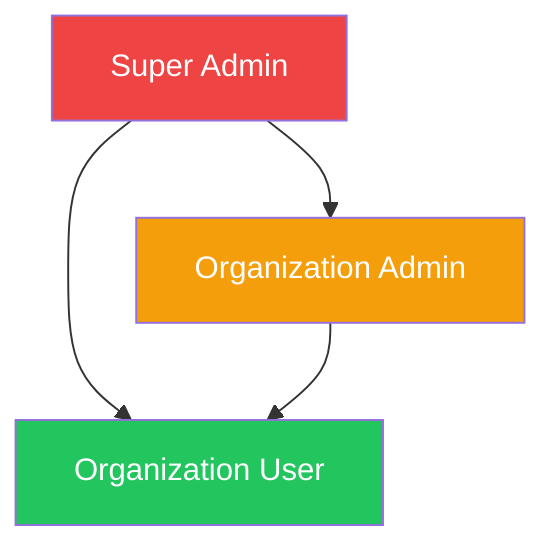
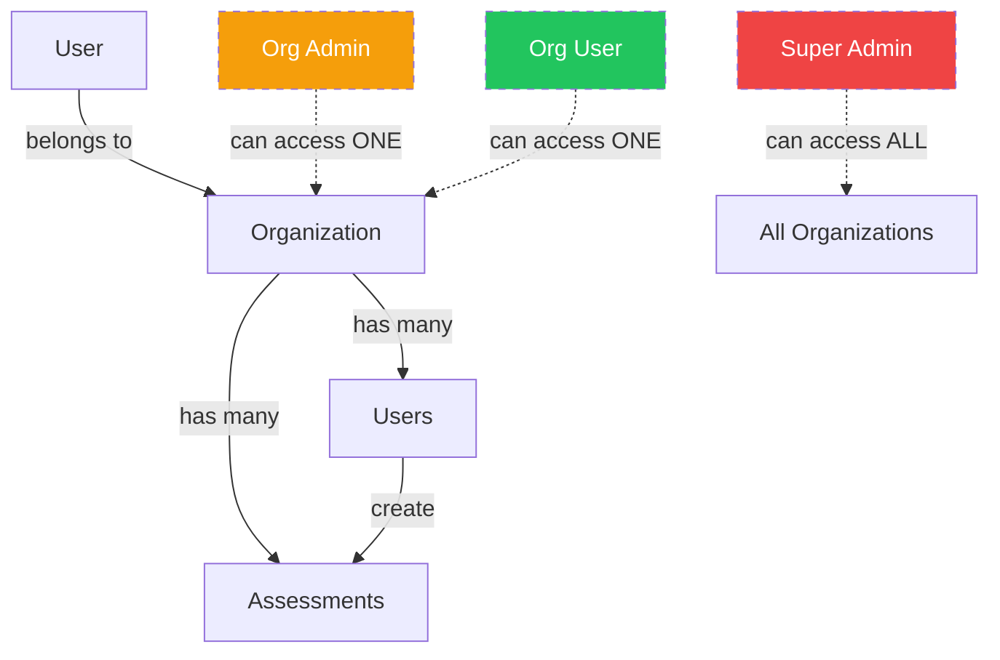
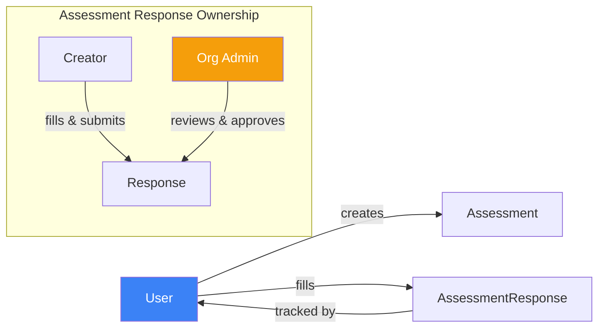
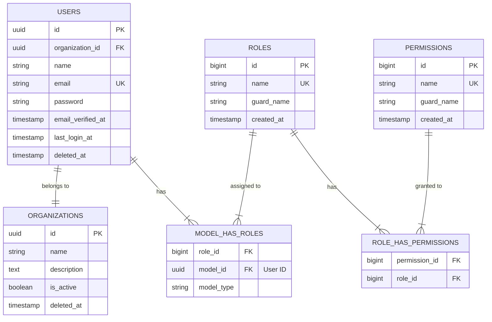

# User Domain

## Overview

The User Domain manages user accounts, authentication, and role-based access control (RBAC) for the SelfAssess.id multi-tenant platform. Users are associated with organizations and granted specific roles using Spatie Laravel Permission package.

## Business Rules

### 1. Organization Membership
- Every user **MUST** belong to an organization
- A user can only belong to **ONE** organization at a time
- Organization determines data scope (multi-tenancy)

### 2. Role-Based Access Control
- Users are assigned roles using **Spatie Laravel Permission**
- A user can have **multiple roles** (flexible permission system)
- Roles determine what actions a user can perform
- Permissions are granular (e.g., `create-user`, `view-users`, `manage-roles`)

### 3. Role Hierarchy

The platform uses a hierarchical role system with three core roles:



**Super Admin (super_admin)**
- Platform-level administrator
- Full access to all organizations and data
- Can manage standards, templates, and global configurations
- Can finalize assessments (exclusive permission)
- **Organization:** Master organization (special org for platform admins)

**Organization Admin (organization_admin)**
- Organization-level administrator
- Can manage users within their organization
- Can review assessments and approve submissions
- Can manage organization settings
- **Scope:** Limited to their organization only

**Organization User (organization_user)**
- Regular user with limited permissions
- Can create assessments and submit responses
- Can upload evidence and fill requirements
- Cannot review or approve assessments
- **Scope:** Limited to their organization only

### 4. Multi-Tenancy Data Access



**Data Scoping Rules:**
- **Organization User & Org Admin:** Can only access data from their own organization
- **Super Admin:** Can access data from ALL organizations (bypasses scoping)
- Use `canAccessOrganization($organizationId)` helper to validate access

### 5. User Ownership & Workflow

Users own the content they create within the assessment workflow:



**Ownership Rules:**
- Users create `Assessment` and `AssessmentResponse` records
- `AssessmentResponse.user_id` tracks who filled the requirement
- Workflow logs track which user performed each status transition
- Org Admins can review any response within their organization (not just their own)

---

## Database Schema

### Entity Relationship Diagram



### Tables

#### `users`

Main user entity with UUIDv7 primary key.

| Column | Type | Description |
|--------|------|-------------|
| `id` | UUIDv7 | Primary key |
| `organization_id` | UUID FK | Reference to organizations table |
| `name` | string | User's full name |
| `email` | string | Unique email (used for login) |
| `password` | string | Hashed password (bcrypt) |
| `email_verified_at` | timestamp | Email verification timestamp |
| `last_login_at` | timestamp | Last successful login |
| `deleted_at` | timestamp | Soft delete timestamp |

**Indexes:**
- Primary: `id`
- Unique: `email`
- Foreign: `organization_id` → `organizations.id`

#### `roles` (Spatie)

System roles managed by Spatie Laravel Permission.

| Column | Type | Description |
|--------|------|-------------|
| `id` | bigint | Primary key (auto-increment) |
| `name` | string | Role name (e.g., "super_admin") |
| `guard_name` | string | Auth guard (always "api") |

**Predefined Roles:**
- `super_admin` - Platform administrator
- `organization_admin` - Organization administrator
- `organization_user` - Regular organization user

#### `permissions` (Spatie)

Granular permissions managed by Spatie Laravel Permission.

| Column | Type | Description |
|--------|------|-------------|
| `id` | bigint | Primary key (auto-increment) |
| `name` | string | Permission name (e.g., "create-user") |
| `guard_name` | string | Auth guard (always "api") |

**Available Permissions:**
- `create-user`, `view-users`, `update-user`, `delete-user`, `transfer-user`
- `create-organization`, `view-organizations`, `update-organization`, `delete-organization`
- `view-organization-members`
- `manage-roles`, `assign-roles`, `view-roles`, `view-permissions`

#### `model_has_roles` (Spatie)

Pivot table for user-role assignments (many-to-many).

| Column | Type | Description |
|--------|------|-------------|
| `role_id` | bigint FK | Reference to roles |
| `model_id` | UUID FK | User ID (polymorphic) |
| `model_type` | string | Class name (App\Domain\User\Models\User) |

---

## Architecture

### Models

#### `User`

Main user entity extending Laravel's `Authenticatable` class.

**Key Features:**
- UUIDv7 primary key using `HasUuids` trait
- Soft deletes using `SoftDeletes` trait
- Role management using `HasRoles` trait (Spatie)
- JWT authentication via `JWTSubject` interface
- Auditable using custom `Auditable` trait

**Relationships:**
```php
// Belongs to Organization
$user->organization;

// Has roles (Spatie)
$user->roles;
$user->permissions;

// Has assessments (through Assessment domain)
$user->assessments;

// Has assessment responses (tracked via workflow logs)
$user->assessmentResponses;
```

**Helper Methods:**
```php
// Check if user is super admin
$user->isSuperAdmin(): bool

// Check if user is organization admin
$user->isOrganizationAdmin(): bool

// Check if user can access specific organization
$user->canAccessOrganization(string $organizationId): bool
```

**Query Scopes:**
```php
// Only active users (not soft deleted)
User::active()->get();

// Users in specific organization
User::inOrganization($orgId)->get();
```

### Controllers

#### `AuthController`

Handles authentication operations (in `Auth` subdomain).

- `login()` - Authenticate user and return JWT token
- `logout()` - Invalidate JWT token
- `refresh()` - Refresh JWT token
- `me()` - Get current authenticated user details
- `register()` - Register new user (if public registration enabled)

#### `UserController`

CRUD operations for user management.

- `index()` - List users (scoped to organization)
- `store()` - Create new user (requires permission)
- `show()` - Get user details
- `update()` - Update user profile
- `destroy()` - Soft delete user
- `changePassword()` - Admin password reset

### Request Classes

**Validation Rules:**

| Request | Purpose | Key Validation |
|---------|---------|----------------|
| `StoreUserRequest` | Create user | Unique email, valid organization, required roles |
| `UpdateUserRequest` | Update user | Unique email (except self), valid roles |
| `ChangePasswordRequest` | Password change | Strong password, current password verification |
| `UpdateProfileRequest` | Self update | Name, email only |

### Resources

#### `UserResource`

API response transformer for user data.

**Fields:**
```json
{
  "id": "uuid",
  "organization_id": "uuid",
  "name": "string",
  "email": "string",
  "roles": ["role_names"],
  "email_verified_at": "timestamp",
  "last_login_at": "timestamp",
  "created_at": "timestamp"
}
```

**Note:** Password and sensitive fields are always hidden.

---

## Role Permissions Matrix

### User Management

| Permission | Super Admin | Org Admin | Org User |
|------------|-------------|-----------|----------|
| create-user | ✅ | ✅ (org only) | ❌ |
| view-users | ✅ | ✅ (org only) | ✅ (org only) |
| update-user | ✅ | ✅ (org only) | ❌ |
| delete-user | ✅ | ✅ (org only) | ❌ |
| transfer-user | ✅ | ❌ | ❌ |

### Organization Management

| Permission | Super Admin | Org Admin | Org User |
|------------|-------------|-----------|----------|
| create-organization | ✅ | ❌ | ❌ |
| view-organizations | ✅ | ✅ (self) | ✅ (self) |
| update-organization | ✅ | ✅ (self) | ❌ |
| delete-organization | ✅ | ❌ | ❌ |
| view-organization-members | ✅ | ✅ (self) | ✅ (self) |

### Role & Permission Management

| Permission | Super Admin | Org Admin | Org User |
|------------|-------------|-----------|----------|
| manage-roles | ✅ | ❌ | ❌ |
| assign-roles | ✅ | ✅ (org roles) | ❌ |
| view-roles | ✅ | ✅ | ✅ |
| view-permissions | ✅ | ✅ | ✅ |

### Assessment Workflow

| Action | Org User | Org Admin | Super Admin |
|--------|----------|-----------|-------------|
| Create assessment | ✅ | ✅ | ❌ |
| Fill requirements | ✅ | ✅ | ❌ |
| Submit for review | ✅ | ✅ | ✅ |
| Review assessment | ❌ | ✅ | ✅ |
| Approve/reject | ❌ | ✅ | ✅ |
| Finalize assessment | ❌ | ❌ | ✅ |
| Cancel assessment | ❌ | ❌ | ✅ |

---

## API Endpoints

### Authentication

| Method | Endpoint | Description | Auth Required |
|--------|----------|-------------|---------------|
| POST | `/api/register` | Register new user | ❌ |
| POST | `/api/login` | Login & get token | ❌ |
| POST | `/api/logout` | Invalidate token | ✅ |
| POST | `/api/refresh` | Refresh JWT token | ✅ |
| GET | `/api/me` | Get current user | ✅ |

### User Management

| Method | Endpoint | Description | Permission |
|--------|----------|-------------|------------|
| GET | `/api/users` | List users (paginated) | `view-users` |
| POST | `/api/users` | Create new user | `create-user` |
| GET | `/api/users/{id}` | Get user details | `view-users` |
| PUT/PATCH | `/api/users/{id}` | Update user | `update-user` |
| DELETE | `/api/users/{id}` | Delete user | `delete-user` |
| POST | `/api/users/{id}/change-password` | Reset password | `update-user` |

### Self Management

| Method | Endpoint | Description | Auth Required |
|--------|----------|-------------|---------------|
| PATCH | `/api/me/profile` | Update own profile | ✅ |
| PATCH | `/api/me/password` | Change own password | ✅ |

### Role Management

| Method | Endpoint | Description | Permission |
|--------|----------|-------------|------------|
| GET | `/api/roles` | List all roles | `view-roles` |
| POST | `/api/users/{id}/roles` | Assign role to user | `assign-roles` |
| DELETE | `/api/users/{id}/roles/{roleId}` | Remove role from user | `assign-roles` |

---

## Common Patterns

### Check User Role in Code

```php
// In controllers or actions
if ($user->isSuperAdmin()) {
    // Allow access to all organizations
}

if ($user->isOrganizationAdmin()) {
    // Allow org-level operations
}

// Check specific role
if ($user->hasRole('organization_admin')) {
    // ...
}

// Check permission (Spatie)
if ($user->can('create-user')) {
    // ...
}
```

### Multi-Tenancy Data Scoping

```php
// In queries
public function index(Request $request)
{
    $user = auth()->user();

    $users = User::query()
        ->when(!$user->isSuperAdmin(), function ($query) use ($user) {
            // Scope to user's organization
            return $query->where('organization_id', $user->organization_id);
        })
        ->paginate();

    return UserResource::collection($users);
}

// Using helper method
if (!$user->canAccessOrganization($organizationId)) {
    abort(403, 'Unauthorized access to organization');
}
```

### Policy Authorization

```php
// In UserPolicy
public function update(User $currentUser, User $targetUser)
{
    // Super admins can update anyone
    if ($currentUser->isSuperAdmin()) {
        return true;
    }

    // Org admins can update users in same organization
    if ($currentUser->isOrganizationAdmin() &&
        $currentUser->organization_id === $targetUser->organization_id) {
        return true;
    }

    return false;
}

// In controller
$this->authorize('update', $user);
```

### Track User Actions in Workflow

```php
// In assessment workflow actions
$assessment->workflowLogs()->create([
    'from_status' => $oldStatus,
    'to_status' => $newStatus,
    'user_id' => auth()->id(), // Track who performed action
    'note' => $request->input('note'),
]);
```

---

## Integration Points

### With Organization Domain

```php
// User belongs to organization
$user->organization()->belongsTo(Organization::class);

// Organization has many users
$organization->users()->hasMany(User::class);

// Get organization admins
$organization->users()
    ->whereHas('roles', fn($q) => $q->where('name', 'organization_admin'))
    ->get();
```

### With Assessment Domain

```php
// User creates assessments
$user->assessments()->hasMany(Assessment::class);

// User fills responses (tracked via workflow logs)
$assessmentResponse->workflowLogs()->where('user_id', $userId);

// Check if user can review assessment
$user->isOrganizationAdmin() || $user->isSuperAdmin();
```

### With Attachment Domain

```php
// User uploads files
$attachment->uploaded_by()->belongsTo(User::class);

// Scope attachments by organization (via user)
$attachments = Attachment::whereHas('uploader', function ($query) use ($user) {
    if (!$user->isSuperAdmin()) {
        $query->where('organization_id', $user->organization_id);
    }
})->get();
```

---

## Best Practices

### 1. Always Use Helper Methods

```php
// ✅ GOOD
if ($user->isSuperAdmin()) { ... }

// ❌ BAD
if ($user->hasRole('super_admin')) { ... }
```

### 2. Check Organization Access

```php
// ✅ GOOD
if (!$user->canAccessOrganization($assessment->organization_id)) {
    abort(403);
}

// ❌ BAD (super admin can't access other orgs)
if ($user->organization_id !== $assessment->organization_id) {
    abort(403);
}
```

### 3. Use Policies for Authorization

```php
// ✅ GOOD
$this->authorize('update', $user);

// ❌ BAD (repeated logic)
if (!auth()->user()->can('update-user')) {
    abort(403);
}
```

### 4. Soft Delete Instead of Hard Delete

```php
// ✅ GOOD
$user->delete(); // Soft delete (sets deleted_at)

// ❌ BAD
User::destroy($id); // Hard delete (permanent)
```

### 5. Validate Role Assignments

```php
// ✅ GOOD (prevent privilege escalation)
if ($user->isOrganizationAdmin() && $role->name === 'super_admin') {
    throw ValidationException::withMessages([
        'role_id' => ['Organization admins cannot assign super admin role']
    ]);
}

// ❌ BAD (no validation)
$user->assignRole($role);
```

---

## Security Considerations

### 1. Password Security
- Always hash passwords using Laravel's `Hash` facade
- Enforce strong password requirements (min 8 chars, mixed case, numbers)
- Never return password in API responses

### 2. JWT Token Management
- Set reasonable token expiration (e.g., 1 hour)
- Implement refresh token rotation
- Invalidate tokens on logout
- Include `organization_id` in JWT custom claims for scoping

### 3. Role Validation
- Validate role assignments based on current user's role
- Prevent privilege escalation (org users cannot assign admin roles)
- Log all role changes for audit trail

### 4. Email Verification
- Consider requiring email verification for new users
- Use `email_verified_at` timestamp to check verification status
- Allow re-sending verification emails

### 5. Rate Limiting
- Apply rate limiting to authentication endpoints
- Limit password reset attempts
- Implement brute force protection

---

## Troubleshooting

### User Cannot Access Organization Data

**Problem:** User gets 403 error when accessing organization data.

**Solutions:**
1. Check user's `organization_id` matches target organization
2. Verify user has correct role assigned
3. Confirm data is scoped using query scoping logic
4. For super admins, ensure `isSuperAdmin()` check bypasses scoping

### Role Not Working

**Problem:** User has role but permission check fails.

**Solutions:**
1. Clear Spatie permission cache: `php artisan cache:clear`
2. Verify guard name is `api` in both roles and permissions
3. Check role has permission assigned: `Role::findByName('org_admin')->permissions`
4. Ensure user actually has role: `$user->roles`

### JWT Token Issues

**Problem:** Token invalid or expired errors.

**Solutions:**
1. Run `php artisan jwt:secret` to generate JWT secret
2. Check `.env` file has correct `JWT_SECRET`
3. Verify token is sent in `Authorization: Bearer {token}` header
4. Check token expiration in `config/jwt.php`

---

## Migration Reference

- **Users Table:** `/database/migrations/0001_01_01_000001_create_users_table.php`
- **Role & Permission Seeder:** `/database/seeders/RolePermissionSeeder.php`
- **User Seeder:** `/database/seeders/UserSeeder.php`

---

## Related Documentation

- **Organization Domain:** `/backend/app/Domain/Organization/README.md`
- **Role Domain:** `/backend/app/Domain/Role/README.md`
- **Auth Domain:** `/backend/app/Domain/Auth/README.md`
- **Spatie Laravel Permission:** https://spatie.be/docs/laravel-permission/v6.0
- **JWT Authentication:** https://github.com/PHPOpenSourceSaver/jwt-auth
