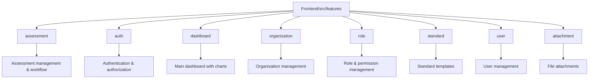
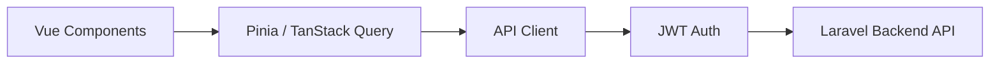

# SelfAssess.id Frontend

## Overview

Vue 3 SPA for SelfAssess.id platform - a multi-standard quality assessment system. Provides intuitive interface for creating assessments, managing compliance workflows, and tracking improvement actions across ISO, IIA, and regulatory standards.

## Tech Stack

- **Vue 3.5** - Progressive JavaScript framework
- **TypeScript** - Type-safe development
- **Vite** - Fast build tool and dev server
- **Tailwind CSS v4** - Utility-first CSS framework
- **shadcn-vue** - Accessible component library
- **Pinia** - State management
- **TanStack Query** - Server state management
- **Vue Router** - Client-side routing
- **Chart.js** - Data visualization
- **Tiptap** - Rich text editor

## Architecture

### Feature-Based Structure

Code organized by business domain under `src/features/{FeatureName}/`:



Each feature contains: `api/`, `components/`, `composables/`, `pages/`, `stores/`, `types/`

### Data Flow



## Quick Start

```bash
npm install              # Install dependencies
cp .env.example .env     # Setup environment variables
npm run dev             # Start dev server (http://localhost:5173)
```

## Key Features

- JWT authentication with auto-refresh token rotation
- Role-based access control (Super Admin, Org Admin, Org User)
- Data tables with server-side pagination, sorting, and filtering
- Rich text editor with Tiptap for evidence documentation
- Dashboard with Chart.js visualizations (compliance metrics, trends)
- Multi-tenant organization support with data isolation
- 2-level approval workflow (requirement → assessment)
- File attachment management with upload progress

## Component Patterns

### DataTable Pattern

Standardized implementation using TanStack Vue Table:

**Location**: `src/features/{Feature}/components/data-table/`

**Components**:

- `DataTable.vue` - Main table with sorting/pagination
- `columns.ts` - Column definitions
- `DataTableToolbar.vue` - Search and filters
- `DataTableRowActions.vue` - Row action dropdown

**Features**:

- Debounced search (300ms)
- Server-side pagination, sorting, filtering
- Loading skeletons and empty states
- shadcn-vue Table components integration

## Routing

Modular route definitions in `src/router/routes/`:

- `authRoutes` - Login, logout
- `dashboardRoutes` - Main dashboard
- `userRoutes` - User management
- `organizationRoutes` - Organization CRUD
- `roleRoutes` - Role & permission management
- `assessmentRoutes` - Assessment workflow
- `standardRoutes` - Standard template library
- `attachmentRoutes` - File uploads

**Guards**:

- Authentication required for all routes except auth
- Permission-based route protection using `can()` middleware
- Organization data isolation

## State Management

### Pinia Stores

- **Auth Store** - User session, JWT token, permissions
- **Organization Store** - Current organization context
- Feature-specific stores as needed

### TanStack Query

Server state with automatic caching and revalidation:

- **Stale Time**: 5 minutes
- **Retry**: 1 attempt on failure
- **Cache Keys**: Hierarchical (e.g., `['assessments', id]`)

## Naming Conventions

- **Variables/Functions**: `camelCase` (assessmentId, fetchAssessments)
- **Components/Types**: `PascalCase` (DataTable, AssessmentStatus)
- **Constants**: `UPPER_SNAKE_CASE` (API_BASE_URL)
- **Files**: `kebab-case` (assessment-api.ts, data-table.vue)

## API Integration

**Location**: `src/api/` and `src/features/{Feature}/api/`

- Centralized Axios instance with interceptors
- Automatic JWT injection and refresh handling
- Error handling with user-friendly messages
- Type-safe API responses using TypeScript interfaces

## Build

```bash
npm run build           # Production build to dist/
npm run preview         # Preview production build
```

**Environment Variables** (`.env`):

```
VITE_API_BASE_URL=http://localhost:8000
VITE_APP_NAME=SelfAssess.id
```

## Component Library

Use shadcn-vue CLI to add components:

```bash
npx shadcn-vue@latest add [component-name]
```

Available components: Button, Input, Label, Select, Dialog, Table, and more.

## TypeScript

Strict mode enabled with path aliases:

- `@/` → `src/`
- `@/components/` → `src/components/`
- `@/features/` → `src/features/`

Types organized in `src/features/{Feature}/types/` matching API responses (camelCase).

## Development Notes

- Use composables for reusable logic (`composables/useAssessment.ts`)
- Integrate TanStack Query for server state in composables
- Follow Vue 3 Composition API patterns
- Maintain type safety with TypeScript interfaces
- Database fields: `snake_case`, API/Types: `camelCase`

## Troubleshooting

**Build errors**: Run `npm install` and check TypeScript types
**API errors**: Verify JWT token and backend connection
**Route issues**: Check authentication guards and permissions
